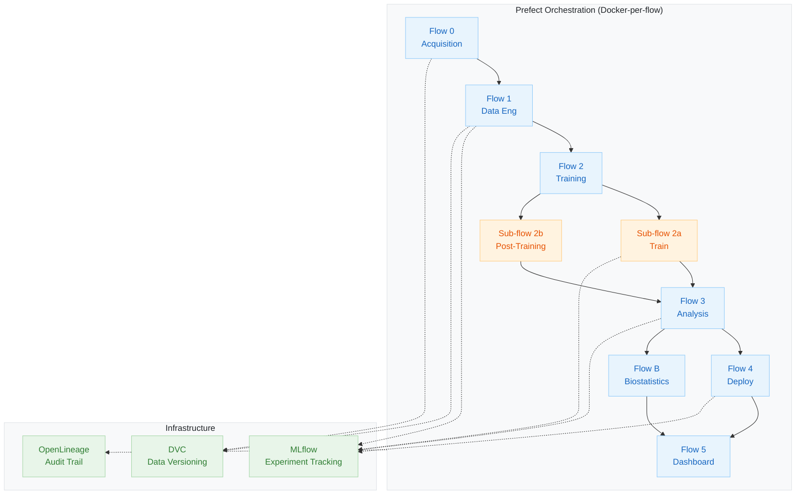
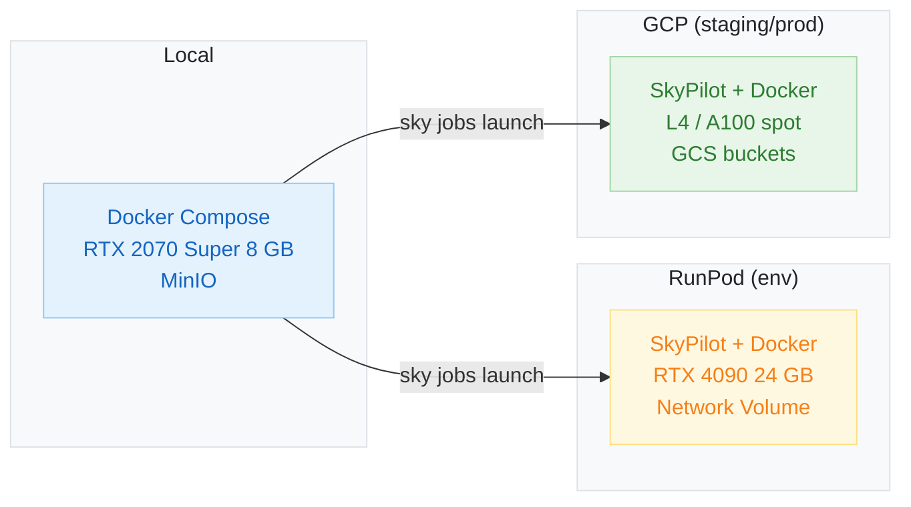
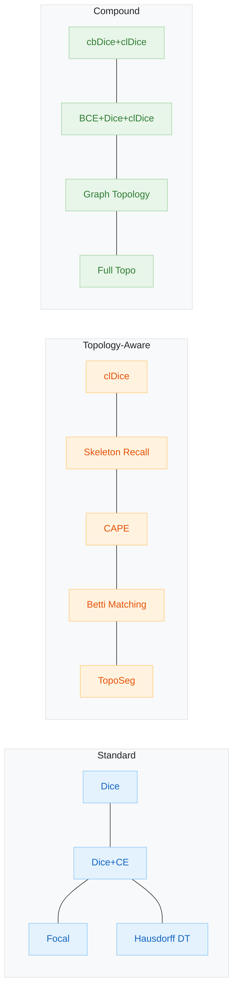
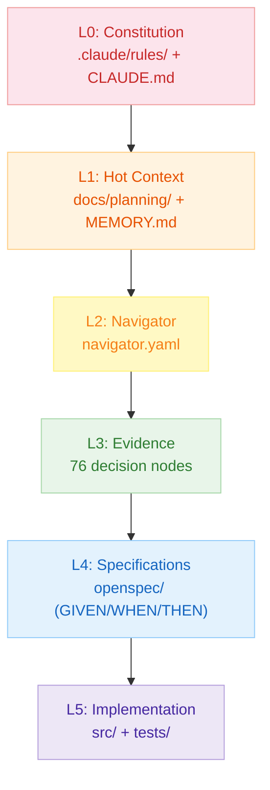

# VASCADIA

> **A [MONAI](https://monai.io/)-based MLOps scaffold for reproducible vasculature segmentation**

[](https://www.python.org/)
[](https://docs.astral.sh/uv/)
[](https://www.docker.com/)
[](https://monai.io/)
[](https://skypilot.readthedocs.io/)
[](LICENSE)
[]()

A model-agnostic biomedical segmentation MLOps platform extending the
[MONAI](https://monai.io/) ecosystem. VASCADIA provides
[Docker](https://www.docker.com/)-per-flow isolation,
[SkyPilot](https://skypilot.readthedocs.io/) intercloud compute,
[Prefect](https://www.prefect.io/) orchestration, and a config-driven
architecture where adding a new model, dataset, or pipeline flow requires
editing one [YAML](https://yaml.org/) file -- not code. The companion
manuscript targets *[Nature Protocols](https://www.nature.com/nprot/)*.

The platform architecture aligns with the four pillars of the **MedMLOps framework**
([de Almeida et al., 2025](https://link.springer.com/article/10.1007/s00330-025-11654-6)):
(1) availability via containerised reproducible infrastructure,
(2) continuous monitoring and validation via drift detection and [OpenLineage](https://openlineage.io/) lineage,
(3) data protection via [DVC](https://dvc.org/) versioning and opt-in multi-site pooling, and
(4) ease of use via zero-config defaults for PhD researchers.

Built on the dataset published in: Charissa Poon, Petteri Teikari *et al.* (2023),
"A dataset of rodent cerebrovasculature from in vivo multiphoton fluorescence
microscopy imaging," *Scientific Data* 10, 141 --
doi: [10.1038/s41597-023-02048-8](https://doi.org/10.1038/s41597-023-02048-8)

---

## Key Features

- **6 model families** behind a single `ModelAdapter` ABC:
  [DynUNet](https://docs.monai.io/en/stable/networks.html#dynunet) (CNN baseline),
  [MambaVesselNet++](https://doi.org/10.1145/3757324) ([Mamba](https://github.com/state-spaces/mamba) SSM hybrid),
  [SAM3](https://github.com/facebookresearch/sam3) Vanilla / TopoLoRA / Hybrid (foundation model variants),
  [VesselFM](https://arxiv.org/abs/2411.17386) (vessel-specific foundation model)
- **22 loss functions** -- from standard ([Dice](https://docs.monai.io/en/stable/losses.html)+[CE](https://pytorch.org/docs/stable/generated/torch.nn.CrossEntropyLoss.html)) to topology-aware
  ([clDice](https://arxiv.org/abs/2003.07311),
  [CAPE](https://arxiv.org/abs/2504.00753),
  [Betti matching](https://arxiv.org/abs/2211.15272),
  [skeleton recall](https://arxiv.org/abs/2404.03010),
  [TopoSeg](https://arxiv.org/abs/2503.04656)) to graph-constrained (compound graph topology)
- **15 [Prefect](https://www.prefect.io/) flows** with Docker-per-flow isolation, spanning the full ML lifecycle
- **[SkyPilot](https://skypilot.readthedocs.io/) intercloud broker**
  ([Yang et al., NSDI'23](https://www.usenix.org/conference/nsdi23/presentation/yang-zongheng)) --
  one command to launch GPU jobs on [RunPod](https://www.runpod.io/) or [GCP](https://cloud.google.com/)
- **[OpenLineage](https://openlineage.io/) ([Marquez](https://marquezproject.ai/)) data lineage** for
  [IEC 62304](https://www.iso.org/standard/38421.html) traceability
- **[Evidently](https://www.evidentlyai.com/) drift detection** +
  [whylogs](https://whylogs.readthedocs.io/) profiling +
  [Prometheus](https://prometheus.io/)/[Grafana](https://grafana.com/) monitoring
- **[BentoML](https://www.bentoml.com/) + [ONNX Runtime](https://onnxruntime.ai/) serving** with
  champion model discovery and [Gradio](https://www.gradio.app/) demo UI
- **[MetricsReloaded](https://doi.org/10.1038/s41592-023-02151-z) evaluation** --
  [clDice](https://arxiv.org/abs/2003.07311) (trusted),
  [MASD](https://doi.org/10.1038/s41592-023-02151-z) (trusted),
  [DSC](https://en.wikipedia.org/wiki/S%C3%B8rensen%E2%80%93Dice_coefficient) (foil)
- **3-fold cross-validation** (seed=42) with [bootstrap](https://en.wikipedia.org/wiki/Bootstrapping_(statistics)) confidence intervals and paired statistical tests
- **Conformal uncertainty quantification** -- 5 methods
  (split [conformal prediction](https://en.wikipedia.org/wiki/Conformal_prediction),
  morphological, distance transform, [risk-controlling](https://arxiv.org/abs/2101.02703),
  [MAPIE](https://mapie.readthedocs.io/))
- **Post-training plugins** -- 7 config-driven enhancements
  (checkpoint averaging, subsampled ensemble,
  [SWAG](https://arxiv.org/abs/1902.02476) ([Maddox et al. 2019](https://arxiv.org/abs/1902.02476)),
  model merging, calibration, CRC conformal, ConSeCo FP control)
- **Knowledge graph** -- 76 [Bayesian](https://en.wikipedia.org/wiki/Bayesian_network) decision nodes across 6 layers,
  driving spec-driven development
- **Experiment monitoring** -- anomaly detection with kill switches, budget alarms, and
  historical failure replay for autonomous [SkyPilot](https://skypilot.readthedocs.io/) job management
- **[FDA](https://www.fda.gov/medical-devices/digital-health-center-excellence/software-medical-device-samd)-ready
  audit infrastructure** -- AuditTrail, compliance module, PCCP-compatible factorial design,
  [CycloneDX](https://cyclonedx.org/) SBOM (planned)

---

## Architecture Overview

### Pipeline Architecture



### Two-Tier Orchestration

| Tier | Framework | Scope | Determinism |
|------|-----------|-------|-------------|
| **Macro-orchestration** | [Prefect](https://www.prefect.io/) 3.x | Pipeline flows (DAG) | Fully deterministic |
| **Micro-orchestration** | [Pydantic AI](https://ai.pydantic.dev/) | Tasks within flows | LLM-assisted, optional |

[Prefect](https://www.prefect.io/) flows execute the deterministic ML pipeline.
Within individual flows, [Pydantic AI](https://ai.pydantic.dev/) agents provide
LLM-assisted capabilities that are *additive, optional, and auditable* via
[Langfuse](https://langfuse.com/) tracing. See
[ADR-0007](docs/adr/0007-pydantic-ai-over-langgraph.md) for the rationale.

### Three-Environment Model



### Docker Three-Tier Hierarchy

| Tier | Base Image | Flows | Size |
|------|-----------|-------|------|
| **A** (GPU) | [`nvidia/cuda:12.6.3`](https://hub.docker.com/r/nvidia/cuda) | train, HPO, post-training, analysis, deploy | ~8-12 GB |
| **B** (CPU) | [`python:3.13-slim`](https://hub.docker.com/_/python) | biostatistics | ~1.5-2.5 GB |
| **C** (Light) | [`python:3.13-slim`](https://hub.docker.com/_/python) | dashboard, pipeline | ~1.0-1.5 GB |

Each tier uses a **two-stage builder-runner** pattern (multi-stage [Docker](https://docs.docker.com/build/building/multi-stage/) builds).
Flow Dockerfiles are thin -- only `COPY`, `ENV`, `CMD`.

---

## Model Families

Six model families for the *[Nature Protocols](https://www.nature.com/nprot/)* comparison:

| Model | Family | Training Strategy | VRAM |
|-------|--------|-------------------|------|
| **[DynUNet](https://docs.monai.io/en/stable/networks.html#dynunet)** | [CNN](https://en.wikipedia.org/wiki/Convolutional_neural_network) baseline | Full training (50 epochs, 3 folds) | ~3.5 GB |
| **[MambaVesselNet++](https://doi.org/10.1145/3757324)** | [SSM](https://en.wikipedia.org/wiki/State-space_model) hybrid | Full training | TBD |
| **[SAM3](https://github.com/facebookresearch/sam3) Vanilla** | Foundation (frozen) | Zero-shot or decoder fine-tune | ~2.9 GB |
| **[SAM3](https://github.com/facebookresearch/sam3) TopoLoRA** | Foundation ([LoRA](https://arxiv.org/abs/2106.09685)) | [LoRA](https://arxiv.org/abs/2106.09685) fine-tune (rank=16, alpha=32) | ~16 GB |
| **[SAM3](https://github.com/facebookresearch/sam3) Hybrid** | Foundation (fusion) | SAM3 features + DynUNet 3D decoder | ~6 GB |
| **[VesselFM](https://arxiv.org/abs/2411.17386)** | Foundation (pretrained) | Zero-shot + fine-tune | TBD |

Every model implements the `ModelAdapter` ABC. Adding a new model = one new file
+ one YAML config.

---

## Loss Functions (22)



| Category | Losses | References |
|----------|--------|------------|
| **Standard** | [Dice](https://docs.monai.io/en/stable/losses.html), Dice+[CE](https://pytorch.org/docs/stable/generated/torch.nn.CrossEntropyLoss.html), [Focal](https://arxiv.org/abs/1708.02002), [Hausdorff DT](https://docs.monai.io/en/stable/losses.html), Log-Hausdorff DT | [MONAI losses](https://docs.monai.io/en/stable/losses.html) |
| **Topology-aware** | [clDice](https://arxiv.org/abs/2003.07311), [skeleton recall](https://arxiv.org/abs/2404.03010), [CAPE](https://arxiv.org/abs/2504.00753), [Betti matching](https://arxiv.org/abs/2211.15272), [TopoSeg](https://arxiv.org/abs/2503.04656), [SPW](https://arxiv.org/abs/2503.04656), [CoLeTra](https://arxiv.org/abs/2401.16008) (warp+topo) | Topology-preserving segmentation |
| **Class-balanced** | [cbDice](https://arxiv.org/abs/2303.10894), class-balanced Dice, centerline CE | Imbalanced vessel segmentation |
| **Compound** | cbDice+clDice, BCE+Dice+0.5clDice, Dice+CE+clDice, full-topo, graph topology | Multi-objective combinations |
| **Calibration** | [HL1-ACE](https://arxiv.org/abs/1706.04599) (auxiliary calibration loss) | [Guo et al. 2017](https://arxiv.org/abs/1706.04599) |

---

## Cloud Execution

All cloud compute is managed through [SkyPilot](https://skypilot.readthedocs.io/) --
an intercloud broker ([Yang et al., NSDI'23](https://www.usenix.org/conference/nsdi23/presentation/yang-zongheng))
that operates like [Slurm](https://slurm.schedmd.com/) for multi-cloud environments.

| Provider | Environment | Role | Region | Data Storage |
|----------|------------|------|--------|--------------|
| **[RunPod](https://www.runpod.io/)** | env (dev) | Quick GPU experiments | Global | Network Volume |
| **[GCP](https://cloud.google.com/)** | staging + prod | Production runs, [Pulumi](https://www.pulumi.com/) IaC | us-central1 | [GCS](https://cloud.google.com/storage) (`gs://minivess-mlops-dvc-data`) |

Cloud configuration flows through [Hydra](https://hydra.cc/) config groups
(`configs/cloud/`, `configs/registry/`). Research groups with different cloud
providers override via `configs/lab/lab_name.yaml` -- zero code changes.

### GPU Fallback System

The [YAML contract](configs/cloud/yaml_contract.yaml) governs allowed GPU types with
ordered fallback: [L4](https://cloud.google.com/compute/docs/gpus) (primary, [$0.22/hr spot](https://cloud.google.com/compute/gpus-pricing))
-> [A100](https://www.nvidia.com/en-us/data-center/a100/) (fallback, $1.10/hr)
-> A100-80GB ($1.38/hr). [T4 is banned](https://en.wikipedia.org/wiki/Turing_(microarchitecture))
(no [BF16](https://en.wikipedia.org/wiki/Bfloat16_floating-point_format) -> [FP16](https://en.wikipedia.org/wiki/Half-precision_floating-point_format) overflow).
Per-model [spot](https://cloud.google.com/compute/docs/instances/spot)/on-demand
override: [SAM3](https://github.com/facebookresearch/sam3) uses on-demand
(80% preemption rate on 25+ min jobs makes spot economically irrational).

### Experiment Monitoring

The monitoring infrastructure prevents undetected failures (10h+ PENDING, 12h stuck jobs):

| Component | Purpose |
|-----------|---------|
| **JobManifest** | Per-job metadata, budget caps, kill-switch thresholds |
| **SkyQueueParser** | Parses `sky jobs queue` output into structured data |
| **AnomalyDetector** | PENDING timeout, duration overrun, cascading failure kill switch, budget alarms |

---

## Regulatory Readiness

While VASCADIA is a **preclinical research platform** (rodent cerebrovasculature),
its architecture supports future
[FDA SaMD](https://www.fda.gov/medical-devices/digital-health-center-excellence/software-medical-device-samd)
and [EU MDR](https://eur-lex.europa.eu/legal-content/EN/TXT/?uri=CELEX:32017R0745)/[IVDR](https://eur-lex.europa.eu/legal-content/EN/TXT/?uri=CELEX:32017R0746) pathways.

| Component | Status | [IEC 62304](https://www.iso.org/standard/38421.html) Relevance |
|-----------|--------|------------------------|
| **[OpenLineage](https://openlineage.io/) ([Marquez](https://marquezproject.ai/))** | Implemented | Configuration management |
| **AuditTrail** | Implemented | Test set access logging |
| **[DVC](https://dvc.org/) data versioning** | Active | Data provenance |
| **[CycloneDX](https://cyclonedx.org/) SBOM** | Planned | [FDA Section 524B](https://www.fda.gov/regulatory-information/search-fda-guidance-documents/cybersecurity-medical-devices-quality-system-considerations-and-content-premarket-submissions) |
| **[Evidently](https://www.evidentlyai.com/) drift detection** | Implemented | Postmarket surveillance |

### PCCP-Compatible Factorial Design

The 4-layer factorial experiment design is architecturally equivalent to an FDA
**Predetermined Change Control Plan** ([PCCP](https://www.fda.gov/regulatory-information/search-fda-guidance-documents/marketing-submission-recommendations-predetermined-change-control-plan-artificial)):

| Layer | Factors | Execution |
|-------|---------|-----------|
| **A: Training** | 4 models x 4 losses x 2 aux_calib = 32 cells | Cloud GPU ([SkyPilot](https://skypilot.readthedocs.io/)) |
| **B: Post-Training** | {none, [SWAG](https://arxiv.org/abs/1902.02476)} x 2 recalibration = 4 methods | Same GPU job |
| **C: Analysis** | 5 ensemble strategies | Local CPU |
| **D: Biostatistics** | [ANOVA](https://en.wikipedia.org/wiki/Analysis_of_variance), [bootstrap](https://en.wikipedia.org/wiki/Bootstrapping_(statistics)) CIs, paired tests | Local CPU |

---

## Knowledge Graph

76 [Bayesian](https://en.wikipedia.org/wiki/Bayesian_network) decision nodes across
a 6-layer architecture:



Entry point: [`knowledge-graph/navigator.yaml`](knowledge-graph/navigator.yaml)

---

## Technology Stack

| Layer | Tool | Role |
|-------|------|------|
| Language | [Python](https://www.python.org/) 3.12+ | Runtime |
| Package Manager | [uv](https://docs.astral.sh/uv/) | Dependency management (exclusively) |
| ML Framework | [PyTorch](https://pytorch.org/) + [MONAI](https://monai.io/) + [TorchIO](https://torchio.readthedocs.io/) | Training, augmentation, inference |
| Orchestration | [Prefect](https://www.prefect.io/) 3.x | Deterministic pipeline orchestration |
| Agent Framework | [Pydantic AI](https://ai.pydantic.dev/) | LLM-assisted micro-orchestration ([ADR-0007](docs/adr/0007-pydantic-ai-over-langgraph.md)) |
| Config (train) | [Hydra-zen](https://mit-ll-responsible-ai.github.io/hydra-zen/) | Experiment configs with [Pydantic](https://docs.pydantic.dev/) v2 validation |
| Config (deploy) | [Dynaconf](https://www.dynaconf.com/) | Environment-layered deployment settings |
| Data Validation | [Pydantic](https://docs.pydantic.dev/) v2 + [Pandera](https://pandera.readthedocs.io/) + [Great Expectations](https://greatexpectations.io/) | Schema, DataFrame, batch quality |
| Experiment Tracking | [MLflow](https://mlflow.org/) + [DuckDB](https://duckdb.org/) | Run tracking, model registry, SQL analytics |
| HPO | [Optuna](https://optuna.org/) + [ASHA](https://arxiv.org/abs/1810.05934) | Multi-objective hyperparameter optimisation |
| Serving | [BentoML](https://www.bentoml.com/) + [ONNX Runtime](https://onnxruntime.ai/) + [Gradio](https://www.gradio.app/) | Model serving and demo UI |
| Data Lineage | [OpenLineage](https://openlineage.io/) ([Marquez](https://marquezproject.ai/)) | [IEC 62304](https://www.iso.org/standard/38421.html) traceability |
| Drift Detection | [Evidently](https://www.evidentlyai.com/) | [KS test](https://en.wikipedia.org/wiki/Kolmogorov%E2%80%93Smirnov_test), [PSI](https://en.wikipedia.org/wiki/Population_stability_index), kernel [MMD](https://en.wikipedia.org/wiki/Kernel_embedding_of_distributions) |
| Data Profiling | [whylogs](https://whylogs.readthedocs.io/) | Lightweight statistical profiling |
| Monitoring | [Prometheus](https://prometheus.io/) + [Grafana](https://grafana.com/) | Dashboards, alerting |
| Data Versioning | [DVC](https://dvc.org/) | Dataset versioning and cloud sync |
| Compute | [SkyPilot](https://skypilot.readthedocs.io/) | Intercloud broker ([RunPod](https://www.runpod.io/) + [GCP](https://cloud.google.com/)) |
| Infrastructure | [Docker Compose](https://docs.docker.com/compose/) + [Pulumi](https://www.pulumi.com/) | Local dev stack, GCP IaC |
| Linter/Formatter | [Ruff](https://docs.astral.sh/ruff/) | Linting and formatting |
| Type Checker | [mypy](https://mypy.readthedocs.io/) | Static type analysis |
| Tests | [pytest](https://docs.pytest.org/) + [Hypothesis](https://hypothesis.readthedocs.io/) | Unit, integration, property-based |
| Topology | [GUDHI](https://gudhi.inria.fr/) + [NetworkX](https://networkx.org/) + [SciPy](https://scipy.org/) | [Persistent homology](https://en.wikipedia.org/wiki/Persistent_homology), graph analysis |
| XAI | [Captum](https://captum.ai/) + [SHAP](https://shap.readthedocs.io/) + [Quantus](https://github.com/understandable-machine-intelligence-lab/Quantus) | Explainability and meta-evaluation |
| LLM Observability | [Langfuse](https://langfuse.com/) + [Braintrust](https://www.braintrust.dev/) + [LiteLLM](https://docs.litellm.ai/) | Agent tracing, evals, provider flexibility |
| Compliance | AuditTrail + [IEC 62304](https://www.iso.org/standard/38421.html) framework + [CycloneDX](https://cyclonedx.org/) (planned) | [FDA](https://www.fda.gov/medical-devices/digital-health-center-excellence/software-medical-device-samd)/[MDR](https://eur-lex.europa.eu/legal-content/EN/TXT/?uri=CELEX:32017R0745) readiness |

---

## Quick Start

### Prerequisites

- [Python](https://www.python.org/) 3.12+ and [uv](https://docs.astral.sh/uv/) (the **only** supported package manager)
- [Docker](https://www.docker.com/) and [Docker Compose](https://docs.docker.com/compose/) V2
- [NVIDIA](https://www.nvidia.com/) GPU with [CUDA](https://developer.nvidia.com/cuda-toolkit) (optional for local dev; required for training)

### Install and Verify

```bash
# Clone and install (--all-extras is REQUIRED for development)
git clone https://github.com/petteriTeikari/vascadia.git
cd vascadia
uv sync --all-extras

# Run the staging test suite (fast, no model loading, <3 min)
make test-staging

# Three-gate verification: tests + lint + types
make test-staging && uv run ruff check src/ tests/ && uv run mypy src/
```

### Docker Infrastructure

```bash
cp .env.example .env        # Configure environment
docker network create minivess-network
docker compose -f deployment/docker-compose.yml --profile dev up -d

# Run a training flow
docker compose --env-file .env -f deployment/docker-compose.flows.yml run --rm \
  --shm-size 8g -e EXPERIMENT=dynunet_e2e_debug train
```

---

## Testing

### Three-Tier Strategy

| Tier | Command | What Runs | Target Time |
|------|---------|-----------|-------------|
| **Staging** | `make test-staging` | No model loading, no slow, no integration | < 3 min |
| **Prod** | `make test-prod` | Everything except GPU instance tests | 5-10 min |
| **GPU** | `make test-gpu` | [SAM3](https://github.com/facebookresearch/sam3) + GPU-heavy (external GPU only) | GPU instance |

[Pre-commit](https://pre-commit.com/) hooks enforce formatting, trailing whitespace,
[YAML](https://yaml.org/) validation, knowledge graph link integrity, and bibliography
citation integrity.

---

## Directory Structure

```
vascadia/
|-- src/minivess/                  Main package
|   |-- adapters/                  ModelAdapter ABC + 6 model families
|   |-- pipeline/                  Training, evaluation, metrics, 22 losses
|   |-- ensemble/                  Ensembling, UQ, calibration, conformal
|   |-- orchestration/flows/       15 Prefect 3.x flows
|   |-- compute/                   SkyPilot monitoring, anomaly detection
|   |-- config/                    Pydantic v2 config models
|   |-- data/                      Data loading, profiling, DVC, downloaders
|   |-- serving/                   BentoML, ONNX, Gradio, champion selection
|   |-- observability/             MLflow tracking, OpenLineage, DuckDB analytics
|   |-- agents/                    Pydantic AI micro-orchestration (ADR-0007)
|   |-- compliance/                IEC 62304 audit trail, model cards, regulatory
|   +-- validation/                Pandera, Great Expectations, drift detection
|
|-- tests/                         Unit, integration, and E2E test suites
|-- configs/                       Hydra experiment configs, model profiles, splits
|-- deployment/                    Docker, SkyPilot, Pulumi, Grafana, Prometheus
|-- knowledge-graph/               76 Bayesian decision nodes across 11 domains
|-- docs/                          ADRs, planning documents, research reports
+-- openspec/                      Spec-driven development (GIVEN/WHEN/THEN)
```

---

## Contributing

1. **[uv](https://docs.astral.sh/uv/) only** -- never use [pip](https://pip.pypa.io/), [conda](https://docs.conda.io/), or [Poetry](https://python-poetry.org/). Install with `uv sync --all-extras`.
2. **TDD mandatory** -- write failing tests first, then implement.
3. **[Pre-commit](https://pre-commit.com/) hooks** -- all changes must pass before commit.
4. **Three-gate verification** -- `make test-staging && uv run ruff check src/ tests/ && uv run mypy src/`
5. **Library-first** -- search for existing implementations before writing custom code.
6. **[Docker](https://www.docker.com/) is the execution model** -- all pipeline execution goes through [Prefect](https://www.prefect.io/) flows in Docker containers.
7. **Config-driven** -- tasks, models, losses, and metrics are [YAML](https://yaml.org/) config instantiations, not code branches.

### Architecture Decision Records

| ADR | Decision |
|-----|----------|
| [0001](docs/adr/0001-model-adapter-abc.md) | Model Adapter Abstract Base Class |
| [0002](docs/adr/0002-dual-config-system.md) | Dual Configuration ([Hydra-zen](https://mit-ll-responsible-ai.github.io/hydra-zen/) + [Dynaconf](https://www.dynaconf.com/)) |
| [0003](docs/adr/0003-validation-onion.md) | Multi-Layer Validation ("Validation Onion") |
| [0004](docs/adr/0004-local-first-observability.md) | Local-First Observability Stack |
| [0005](docs/adr/0005-tdd-mandatory.md) | Mandatory Test-Driven Development |
| [0006](docs/adr/0006-sam3-variant-architecture.md) | [SAM3](https://github.com/facebookresearch/sam3) Variant Architecture |
| [0007](docs/adr/0007-pydantic-ai-over-langgraph.md) | [Pydantic AI](https://ai.pydantic.dev/) over [LangGraph](https://langchain-ai.github.io/langgraph/) |

---

## Datasets

| Dataset | Role | Volumes | Modality | Acquisition |
|---------|------|---------|----------|-------------|
| **[MiniVess](https://doi.org/10.1038/s41597-023-02048-8)** | Train/Val (primary) | 70 | [Multiphoton](https://en.wikipedia.org/wiki/Two-photon_excitation_microscopy) | Manual ([EBRAINS](https://ebrains.eu/)) |
| **[DeepVess](https://ecommons.cornell.edu/items/a79bb6d8-77cf-4917-8e26-f2716a6ac2a3)** | External test | ~7 | Multiphoton | Automated ([httpx](https://www.python-httpx.org/)) |
| **[VesselNN](https://github.com/petteriTeikari/vesselNN)** | Drift detection ONLY | 12 | Two-photon | Automated ([git clone](https://git-scm.com/)) |

Splits: 3-fold seed=42, `configs/splits/3fold_seed42.json` (47 train / 23 val).

---

## Citation

If you use this platform, please cite the underlying dataset:

> Charissa Poon, Petteri Teikari *et al.* (2023). "A dataset of rodent
> cerebrovasculature from in vivo multiphoton fluorescence microscopy imaging."
> *Scientific Data* 10, 141. doi: [10.1038/s41597-023-02048-8](https://doi.org/10.1038/s41597-023-02048-8)

---

## Further Reading

- [Knowledge Graph Navigator](knowledge-graph/navigator.yaml) -- entry point for architectural decisions
- [FDA Readiness Report](docs/planning/v0-2_archive/original_docs/regops-fda-regulation-reporting-qms-samd-iec62304-mlops-report.md) -- compliance gap analysis
- [FDA Insights Second Pass](docs/planning/v0-2_archive/original_docs/fda-insights-second-pass.md) -- SBOM, SecOps, QMSR, PCCP
- [SAM3 Literature Report](docs/planning/v0-2_archive/original_docs/sam3-literature-research-report.md) -- foundation model survey
- [GCP Setup Tutorial](docs/planning/v0-2_archive/original_docs/gcp-setup-tutorial.md) -- step-by-step cloud setup
- [Context Management Upgrade](.claude/context-management-upgrade-plan.md) -- 5-phase knowledge compounding

---

## License

[Apache-2.0](https://www.apache.org/licenses/LICENSE-2.0) (license review pending for non-commercial academic use)
