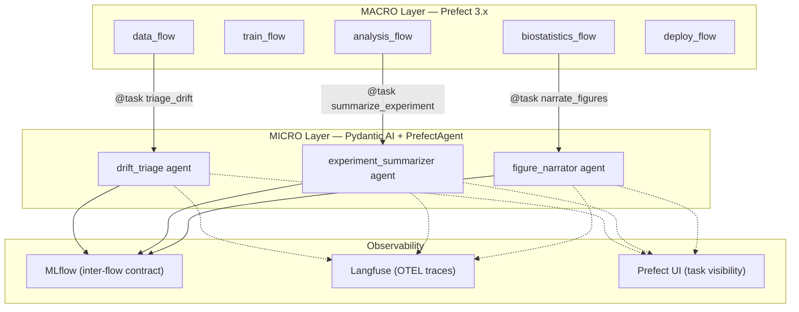
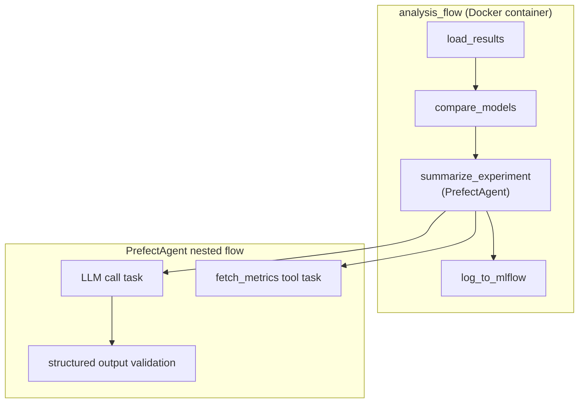

# LangGraph/Pydantic AI Micro-Orchestration: Advanced Plan

**Issue**: #341 — Fine-grained Prefect Sub-Flows/Tasks + LangGraph Agent Integration
**Date**: 2026-03-08
**Status**: Plan (ready for review)
**Supersedes**: `docs/planning/langgraph-agents-plan.md` (original draft)

---

## Executive Summary

Replace the existing LangGraph stub agents (`src/minivess/agents/`) and deterministic
decision stubs (`src/minivess/orchestration/agent_interface.py`) with **Pydantic AI
agents wrapped in PrefectAgent** for durable execution. This is the officially supported
integration pattern from both Prefect and Pydantic teams (2025-2026).

**Key architectural decision**: Pydantic AI is the sole agent framework. LangGraph
is deprecated from this codebase — the existing `graph.py` and `comparison.py` are
config-only stubs with placeholder logic, and Pydantic AI provides a cleaner, more
type-safe replacement with first-class Prefect integration.

---

## 1. Architecture: Two-Layer Orchestration



```
MACRO layer (Prefect 3.x)
  Scheduling, retries, Docker-per-flow isolation, caching, observability
  Each @flow runs in its own container via run_deployment()

MICRO layer (Pydantic AI + PrefectAgent)
  LLM-powered decisions INSIDE specific @task functions
  Each agent.run() becomes a nested Prefect flow
  LLM calls and tool invocations = retryable/cacheable Prefect tasks
  Automatic resume-from-failure (durable execution)

MLflow = inter-flow contract (unchanged)
```

### Why NOT LangGraph

| Criterion | LangGraph | Pydantic AI + PrefectAgent |
|-----------|-----------|---------------------------|
| Prefect integration | None (graph opaque to Prefect) | First-class (PrefectAgent) |
| LLM call retry/caching | Manual | Automatic per-task |
| Type safety | Partial (TypedDict) | Full (Pydantic models) |
| Resume from failure | Manual checkpointing | Automatic via Prefect cache |
| Learning curve | Steep (graph DSL) | Gentle (Python functions + decorators) |
| Provider flexibility | Via LangChain | Native multi-provider (Anthropic, OpenAI, Ollama) |
| Prefect team endorsement | No | Yes (official blog + docs) |

LangGraph remains excellent for complex multi-agent systems with cycles, but our
decision points are simple single-agent tasks — Pydantic AI is the right tool.

### Integration Pattern (from Pydantic AI docs)

```python
from pydantic_ai import Agent
from pydantic_ai.durable_exec.prefect import PrefectAgent, TaskConfig

# 1. Define agent with typed output
agent = Agent(
    "anthropic:claude-sonnet-4-6",
    output_type=ExperimentSummary,   # Pydantic model
    deps_type=AnalysisContext,       # Typed dependencies
    tools=[fetch_metrics, compare_runs],
    name="experiment-summarizer",
)

# 2. Wrap for durable execution
prefect_agent = PrefectAgent(
    agent,
    model_task_config=TaskConfig(retries=3, retry_delay_seconds=[1, 2, 4]),
    tool_task_config=TaskConfig(retries=2, retry_delay_seconds=[0.5, 1]),
)

# 3. Call inside a Prefect @task — agent.run() becomes a nested flow
@task(name="summarize-experiment")
async def summarize_experiment_task(context: dict) -> dict:
    result = await prefect_agent.run(
        f"Summarize this experiment: {context['experiment_name']}",
        deps=AnalysisContext(**context),
    )
    return result.output.model_dump()
```

**What happens at runtime**:
- `prefect_agent.run()` creates a nested Prefect flow
- Each LLM API call = a Prefect task (retryable, cacheable)
- Each tool invocation = a Prefect task (retryable, cacheable)
- If the flow fails at step 4, retry loads steps 1-3 from cache
- Full visibility in Prefect UI: which LLM calls happened, latency, retries

---

## 2. Current State Audit

### Deterministic Stubs (to be replaced)

| Stub Class | Location | Flow | Decision |
|------------|----------|------|----------|
| `DeterministicExperimentSummary` | `agent_interface.py` | analysis_flow | Experiment summarization |
| `DeterministicDriftTriage` | `agent_interface.py` | data_flow | Drift score triage |
| `DeterministicFigureNarration` | `agent_interface.py` | biostatistics_flow | Figure caption generation |
| `DeterministicPromotionDecision` | `agent_interface.py` | deploy_flow | Model promotion (Phase 2) |
| `DeterministicQATriage` | `agent_interface.py` | qa_flow | QA anomaly triage (Phase 2) |

### LangGraph Stubs (to be deprecated)

| Module | Content | Action |
|--------|---------|--------|
| `agents/graph.py` | Training pipeline StateGraph (placeholder nodes) | Delete — training is a Prefect flow, not a graph |
| `agents/comparison.py` | Experiment comparison StateGraph | Replace with Pydantic AI agent |
| `agents/llm.py` | LiteLLM call_llm() wrapper | Delete — Pydantic AI handles providers natively |
| `agents/tracing.py` | Langfuse traced_graph_run() | Replace with Pydantic AI + Langfuse integration |
| `agents/evaluation.py` | Braintrust eval suite stubs | Keep (orthogonal — eval framework, not agents) |

---

## 3. LLM Provider Strategy

**Decision**: Use Pydantic AI's native provider system. Drop the custom LiteLLM wrapper.

```python
# Provider configured via environment or explicit param
# Default: Anthropic (ANTHROPIC_API_KEY env var)
# Local dev: Ollama (OLLAMA_BASE_URL=http://localhost:11434/v1)
# CI: Mock provider (pydantic_ai.models.test.TestModel)

from pydantic_ai import Agent

# Production
agent = Agent("anthropic:claude-sonnet-4-6", ...)

# Local development with Ollama
agent = Agent("ollama:qwen2.5-coder:14b", ...)

# Testing (no LLM calls)
from pydantic_ai.models.test import TestModel
agent = Agent(TestModel(), ...)
```

**Configuration hierarchy** (Dynaconf):
```yaml
# configs/agents/default.yaml
agent:
  model: "anthropic:claude-sonnet-4-6"
  temperature: 0.0
  retry_config:
    retries: 3
    delay_seconds: [1.0, 2.0, 4.0]
    timeout_seconds: 30.0
```

Environment override: `MINIVESS_AGENT__MODEL=ollama:qwen2.5-coder:14b`

---

## 4. Implementation Phases

### Phase 0: Infrastructure (T-0.x)

#### T-0.1: Add pydantic-ai[prefect] dependency

**File**: `pyproject.toml`

Add `pydantic-ai[prefect]>=1.60,<2.0` to the `agents` optional deps group.
Remove `litellm` from required deps (Pydantic AI handles providers).
Keep `langfuse` (orthogonal tracing) and `braintrust` (eval framework).

**Test**: `test_pydantic_ai_importable` — verify `from pydantic_ai import Agent` works.

#### T-0.2: Agent configuration module

**File**: `src/minivess/agents/config.py`

```python
from pydantic import BaseModel

class AgentConfig(BaseModel):
    """Configuration for Pydantic AI agents in this project."""
    model: str = "anthropic:claude-sonnet-4-6"
    temperature: float = 0.0
    retries: int = 3
    retry_delay_seconds: list[float] = [1.0, 2.0, 4.0]
    timeout_seconds: float = 30.0
    tool_retries: int = 2
    tool_retry_delay_seconds: list[float] = [0.5, 1.0]
```

Loaded from Dynaconf or env vars. Fallback to defaults for zero-config start.

**Tests**:
- `test_agent_config_defaults` — sensible defaults
- `test_agent_config_env_override` — `MINIVESS_AGENT__MODEL` overrides

#### T-0.3: Agent factory with TaskConfig wiring

**File**: `src/minivess/agents/factory.py`

```python
from pydantic_ai import Agent
from pydantic_ai.durable_exec.prefect import PrefectAgent, TaskConfig

def make_prefect_agent(agent: Agent, config: AgentConfig | None = None) -> PrefectAgent:
    """Wrap a Pydantic AI agent for durable Prefect execution."""
    ...
```

Single factory function. All agents in the project use this to get consistent
retry/timeout behavior.

**Tests**:
- `test_make_prefect_agent_returns_prefect_agent`
- `test_make_prefect_agent_applies_retry_config`

### Phase 1: First Agent — Experiment Summary (T-1.x)

Priority: Low risk (informational output, doesn't affect pipeline decisions).

#### T-1.1: Define ExperimentSummary output model

**File**: `src/minivess/agents/models.py`

```python
from pydantic import BaseModel, Field

class ExperimentSummary(BaseModel):
    """Structured experiment summary from LLM analysis."""
    narrative: str = Field(description="2-3 sentence natural-language summary")
    best_model: str = Field(description="Best performing model identifier")
    best_metric_value: float = Field(description="Best metric value achieved")
    key_findings: list[str] = Field(description="3-5 key findings", min_length=1, max_length=5)
    recommendations: list[str] = Field(description="1-3 actionable recommendations", max_length=3)
```

**Tests**:
- `test_experiment_summary_validates` — valid data passes
- `test_experiment_summary_rejects_empty_findings` — min_length enforced

#### T-1.2: Experiment summarizer agent

**File**: `src/minivess/agents/experiment_summarizer.py`

```python
from pydantic_ai import Agent, RunContext

agent = Agent(
    "anthropic:claude-sonnet-4-6",
    output_type=ExperimentSummary,
    deps_type=AnalysisContext,
    name="experiment-summarizer",
    system_prompt="You are an ML experiment analyst. ...",
    tools=[fetch_run_metrics],
)
```

Tool function `fetch_run_metrics` reads from MLflow (the context carries
tracking_uri and experiment_name).

**Tests** (using `TestModel` — no real LLM calls):
- `test_experiment_summarizer_returns_summary` — returns ExperimentSummary
- `test_experiment_summarizer_uses_tools` — tool is called
- `test_experiment_summarizer_handles_empty_runs` — graceful when no runs

#### T-1.3: Wire into analysis_flow

**File**: `src/minivess/orchestration/flows/analysis_flow.py`

Replace `DeterministicExperimentSummary().decide(context)` with
`await prefect_agent.run(prompt, deps=context)` inside the existing
`summarize_experiment` @task.

The `AgentDecisionPoint` protocol is preserved — the Pydantic AI agent
returns a dict matching the same `{action, reasoning, summary}` contract.

**Fallback**: If `pydantic-ai` is not installed (agents extra not enabled),
fall back to the deterministic stub. This keeps the base install lightweight.

```python
@task(name="summarize-experiment")
async def summarize_experiment(context: dict) -> dict:
    try:
        from minivess.agents.experiment_summarizer import create_summarizer
        agent = create_summarizer()
        result = await agent.run(prompt, deps=AnalysisContext(**context))
        return {"action": "summarize", "reasoning": result.output.narrative, "summary": result.output.model_dump()}
    except ImportError:
        from minivess.orchestration.agent_interface import DeterministicExperimentSummary
        return DeterministicExperimentSummary().decide(context)
```

**Tests**:
- `test_analysis_flow_with_agent` — PrefectAgent path (mocked TestModel)
- `test_analysis_flow_without_agent` — fallback to deterministic stub
- `test_analysis_flow_agent_output_matches_contract` — same dict keys

### Phase 2: Drift Triage Agent (T-2.x)

Priority: Medium risk — decides whether to retrain. Needs confidence scoring.

#### T-2.1: Define DriftTriageResult output model

**File**: `src/minivess/agents/models.py` (append)

```python
class DriftTriageResult(BaseModel):
    """Structured drift triage decision."""
    action: Literal["monitor", "retrain", "investigate"]
    confidence: float = Field(ge=0.0, le=1.0, description="Decision confidence")
    reasoning: str = Field(description="Explanation of the triage decision")
    affected_features: list[str] = Field(default_factory=list)
    severity: Literal["low", "medium", "high"]
```

#### T-2.2: Drift triage agent

**File**: `src/minivess/agents/drift_triage.py`

Agent with tools:
- `get_drift_report` — reads drift scores from whylogs/Evidently output
- `get_historical_drift` — reads past drift trends from MLflow tags
- `get_retraining_cost` — estimates compute cost for retraining

The agent weighs drift severity against retraining cost and historical patterns.

#### T-2.3: Wire into data_flow

Replace `DeterministicDriftTriage` in data_flow. Same ImportError fallback pattern.

### Phase 3: Figure Narration Agent (T-3.x)

Priority: Low risk — editorial captions, human reviews before publication.

#### T-3.1: Define FigureCaption output model

```python
class FigureCaption(BaseModel):
    """Paper-quality figure caption."""
    caption: str = Field(description="Publication-ready caption (1-3 sentences)")
    alt_text: str = Field(description="Accessibility alt text")
    statistical_note: str | None = Field(default=None, description="Statistical test details if applicable")
```

#### T-3.2: Figure narration agent

**File**: `src/minivess/agents/figure_narrator.py`

Agent with tools:
- `get_figure_metadata` — reads figure type, axes, data ranges
- `get_statistical_context` — reads p-values, effect sizes from biostatistics results

#### T-3.3: Wire into biostatistics_flow

Replace `DeterministicFigureNarration`. Same fallback pattern.

### Phase 4: Deprecate LangGraph Code (T-4.x)

#### T-4.1: Move LangGraph stubs to `_deprecated/`

Move `agents/graph.py`, `agents/comparison.py`, `agents/llm.py`, `agents/tracing.py`
to `agents/_deprecated/` with a deprecation notice. Keep `agents/evaluation.py`
(Braintrust eval suites — orthogonal to the agent framework swap).

#### T-4.2: Remove langgraph from core dependencies

Move `langgraph>=0.4,<1.0` from main deps to `agents` optional (or remove entirely
if nothing uses it after migration). Keep it only if `_deprecated/` stubs are retained
for reference.

#### T-4.3: Update agents/__init__.py

Export new Pydantic AI agents instead of LangGraph graph builders.

### Phase 5: Testing & Observability (T-5.x)

#### T-5.1: TestModel-based agent tests

All agent tests use `pydantic_ai.models.test.TestModel` — zero real LLM calls.
TestModel returns deterministic responses matching the output Pydantic models.

```python
from pydantic_ai.models.test import TestModel

def test_experiment_summarizer():
    agent = create_summarizer(model=TestModel())
    result = agent.run_sync("Summarize experiment X", deps=mock_context)
    assert isinstance(result.output, ExperimentSummary)
    assert len(result.output.key_findings) >= 1
```

#### T-5.2: Langfuse tracing (optional)

Pydantic AI supports Langfuse natively. If `LANGFUSE_SECRET_KEY` is set,
traces are automatically captured. No custom `traced_graph_run()` needed.

```python
from pydantic_ai.providers.anthropic import AnthropicProvider
from langfuse.pydantic_ai import LangfuseInstrumentor

# Auto-instrument all Pydantic AI agents
LangfuseInstrumentor().instrument()
```

#### T-5.3: Prefect UI observability verification

Manual verification that agent runs appear as nested flows in Prefect UI with:
- Individual LLM call tasks (with latency, tokens, retries)
- Tool invocation tasks (with inputs/outputs)
- Cache hits on retry (marked with cache indicator)

### Phase 6: Documentation & Portfolio (T-6.x)

#### T-6.1: ADR — Why Pydantic AI over LangGraph

`docs/adr/ADR-NNN-pydantic-ai-over-langgraph.md`

Decision record documenting the framework choice with evidence from this plan.

#### T-6.2: Mermaid architecture diagram

Update the Prefect flow diagrams to show agent decision points:



#### T-6.3: Update CLAUDE.md observability table

Add Pydantic AI to the observability stack table. Remove LangGraph reference
or mark as deprecated.

---

## 5. Execution Order

```
Phase 0: Infrastructure
  T-0.1 (deps) → T-0.2 (config) → T-0.3 (factory)

Phase 1: Experiment Summary Agent
  T-1.1 (models) → T-1.2 (agent) → T-1.3 (wire into flow)

Phase 2: Drift Triage Agent
  T-2.1 (models) → T-2.2 (agent) → T-2.3 (wire into flow)

Phase 3: Figure Narration Agent
  T-3.1 (models) → T-3.2 (agent) → T-3.3 (wire into flow)

Phase 4: Deprecate LangGraph
  T-4.1 (move stubs) → T-4.2 (deps cleanup) → T-4.3 (exports)

Phase 5: Testing & Observability
  T-5.1 (tests) → T-5.2 (langfuse) → T-5.3 (prefect UI)

Phase 6: Documentation
  T-6.1 (ADR) → T-6.2 (diagrams) → T-6.3 (CLAUDE.md)
```

**Parallelizable**: Phases 1, 2, 3 are independent after Phase 0.
Phase 4 can start after Phase 1.

---

## 6. Risk Assessment

| Risk | Mitigation |
|------|-----------|
| LLM API costs in CI | All tests use `TestModel` (zero API calls) |
| LLM hallucination in summaries | Output validated by Pydantic models (structured, bounded) |
| Pydantic AI breaking changes | Pin `>=1.60,<2.0`, version policy is semver |
| Agent dependency bloat | Agents are optional (`[agents]` extra), base install unaffected |
| Deterministic behavior regression | ImportError fallback preserves current deterministic stubs |
| Prefect version compatibility | PrefectAgent requires Prefect 3.x (already our version) |

---

## 7. Reviewer Verification Checklist

These claims were verified against official documentation (March 2026):

- [x] `PrefectAgent` exists at `pydantic_ai.durable_exec.prefect` (verified via [Pydantic AI docs](https://ai.pydantic.dev/durable_execution/prefect/))
- [x] `PrefectAgent.run()` wraps agent execution as Prefect flow with LLM/tool tasks (verified via [Prefect blog](https://www.prefect.io/blog/prefect-pydantic-integration))
- [x] `TaskConfig` supports `retries`, `retry_delay_seconds`, `timeout_seconds`, `cache_policy` (verified via [Pydantic AI API docs](https://ai.pydantic.dev/durable_execution/prefect/))
- [x] `pydantic_ai.models.test.TestModel` exists for testing without LLM calls (verified via [Pydantic AI docs](https://ai.pydantic.dev/))
- [x] Pydantic AI supports Anthropic, OpenAI, Ollama natively (verified via [provider docs](https://ai.pydantic.dev/models/overview/))
- [x] `pydantic-ai[prefect]` is the correct install extra (verified via [install docs](https://ai.pydantic.dev/install/))
- [x] ControlFlow archived, merged into Marvin 3.0 (verified via [GitHub discussion](https://github.com/PrefectHQ/marvin/discussions/1106))
- [x] `langchain-prefect` archived (March 2025) — no official LangGraph+Prefect integration
- [x] Pydantic AI v1.67.0 is latest (March 2026) with Python >=3.10

---

## 8. Dependencies

### New
- `pydantic-ai[prefect]>=1.60,<2.0` (in `[agents]` optional group)

### Removed
- `litellm>=1.56,<2.0` (Pydantic AI handles providers natively)

### Kept (unchanged)
- `langfuse>=2.56,<3.0` (tracing — works with Pydantic AI via LangfuseInstrumentor)
- `braintrust>=0.0.180,<1.0` (eval framework — orthogonal)
- `langgraph>=0.4,<1.0` (moved to optional or removed in T-4.2)

---

## 9. Success Criteria

1. Three agent decision points (experiment summary, drift triage, figure narration)
   are powered by Pydantic AI + PrefectAgent
2. All agent tests pass with `TestModel` (zero LLM API calls in CI)
3. Deterministic fallback works when `[agents]` extra is not installed
4. Agent runs visible as nested flows in Prefect UI
5. LangGraph code deprecated (moved to `_deprecated/`, not imported at runtime)
6. No increase in base install dependencies (agents are optional)
7. `AgentDecisionPoint` protocol preserved for backward compatibility

---

## References

- [Pydantic AI + Prefect Durable Execution](https://ai.pydantic.dev/durable_execution/prefect/)
- [Prefect Blog: Build AI Agents That Resume from Failure](https://www.prefect.io/blog/prefect-pydantic-integration)
- [Prefect Docs: AI Data Analyst Example](https://docs.prefect.io/v3/examples/ai-data-analyst-with-pydantic-ai)
- [Pydantic AI Provider Overview](https://ai.pydantic.dev/models/overview/)
- [Pydantic AI GitHub](https://github.com/pydantic/pydantic-ai)
- [Marvin 3.0 / ControlFlow Discussion](https://github.com/PrefectHQ/marvin/discussions/1106)
- [LangGraph vs Pydantic AI Comparison (ZenML)](https://www.zenml.io/blog/pydantic-ai-vs-langgraph)
- [Langfuse AI Agent Framework Comparison](https://langfuse.com/blog/2025-03-19-ai-agent-comparison)
