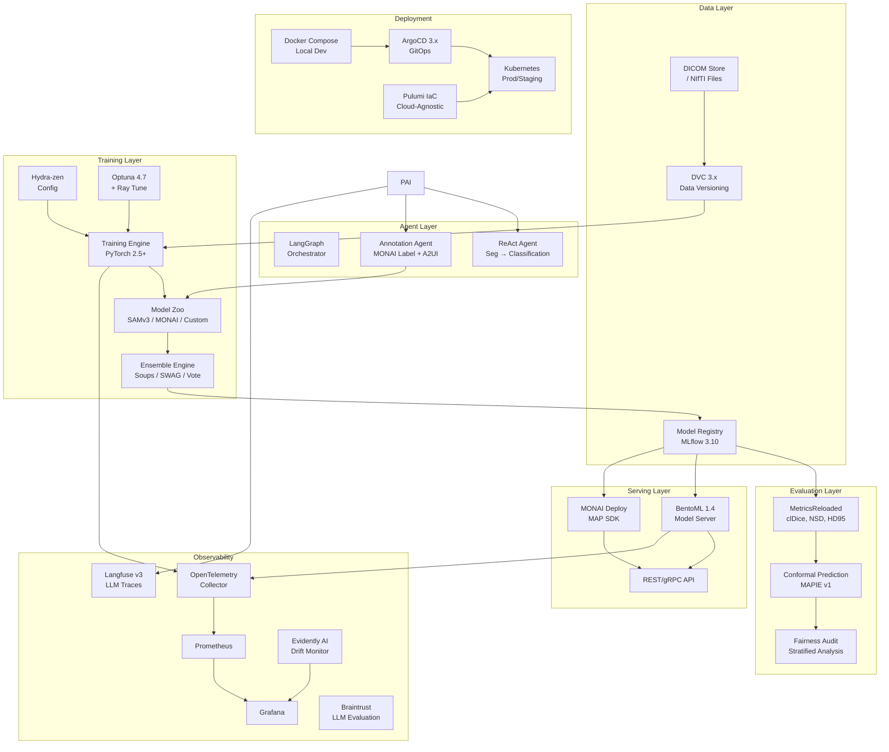
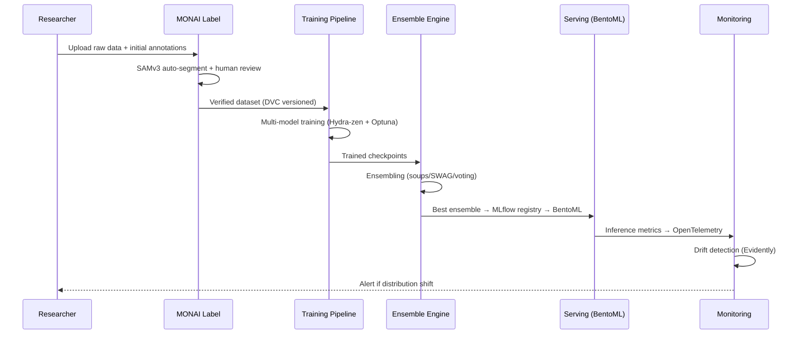
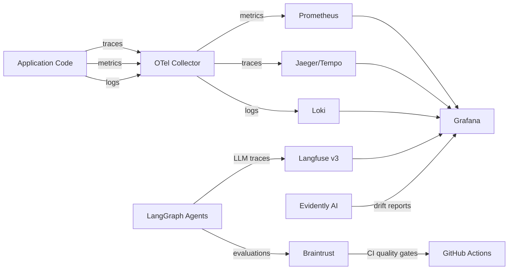

# MinIVess MLOps v2 — Comprehensive Modernization Plan

> **Status:** Draft v3 (expanded tool stack) — 2026-02-23
> **Scope:** Clean rewrite from v0.1-alpha to production-grade, model-agnostic biomedical segmentation platform
> **Targets:** Portfolio project (ICEYE, Cohere, Curio) + dual manuscript (STAR Protocols + Medical Image Analysis)

---

## Table of Contents

1. [Executive Summary](#1-executive-summary)
2. [Current State Analysis (v0.1-alpha)](#2-current-state-analysis-v01-alpha)
3. [Vision & Requirements](#3-vision--requirements)
4. [Architecture Overview](#4-architecture-overview)
5. [Technology Stack](#5-technology-stack)
6. [Phased Implementation Roadmap](#6-phased-implementation-roadmap)
7. [Model Strategy](#7-model-strategy)
8. [Ensembling & Uncertainty](#8-ensembling--uncertainty)
9. [MLOps Infrastructure](#9-mlops-infrastructure)
10. [Observability & Compliance](#10-observability--compliance)
11. [Agent Layer](#11-agent-layer)
12. [Deployment Architecture](#12-deployment-architecture)
13. [Testing Strategy](#13-testing-strategy)
14. [Manuscript Plan](#14-manuscript-plan)
15. [Risk Matrix](#15-risk-matrix)
16. [Reviewer Convergence — Post-Review Amendments](#16-reviewer-convergence--post-review-amendments)
17. [Expanded Tool Stack (Self-Learning Edition)](#17-expanded-tool-stack-self-learning-edition)
18. [Appendix: CHANGELOG v0.1-alpha](#appendix-a-changelog-v01-alpha)

---

## 1. Executive Summary

MinIVess MLOps v2 is a **clean rewrite** of the existing vascular segmentation pipeline into a production-grade, **model-agnostic** MLOps/FMOps platform for biomedical image segmentation. The current codebase (tagged v0.1-alpha) demonstrated core concepts but uses outdated tooling (Python 3.8, Poetry, OmegaConf→Hydra, MONAI 1.2). The v2 rewrite modernizes every layer:

**What changes:**
- Python 3.8 → **3.12+** with **uv** package manager
- Poetry → **uv** lock files, **bun** for any TS/JS tooling
- Hydra → **Hydra-zen** (experiment configs) + **Dynaconf** (deployment configs)
- MONAI 1.2 → **MONAI 1.4+** with VISTA-3D, plus **SAMv3** adapter
- Single-model → **model-agnostic pipeline** with heterogeneous ensembling
- EC2 MLflow → **local Docker Compose** (zero API tokens) with cloud-agnostic escape hatches
- Manual deployment → **ArgoCD** GitOps with canary promotions
- No observability → **OpenTelemetry + Prometheus + Grafana + Langfuse**
- No compliance → **SaMD-principled** from Day 1 (IEC 62304 lifecycle, audit trails)
- No agents → **LangGraph** orchestration + **Braintrust** evaluation for segmentation→classification demo

**What stays (concepts, not code):**
- MONAI-based 3D segmentation as one model family
- MetricsReloaded evaluation (clDice, NSD)
- Multi-model ensembling philosophy
- DVC for data versioning (upgraded to 3.x)
- MLflow as primary experiment tracker (upgraded to 3.10)
- BentoML for model serving (upgraded to 1.4)
- Docker-first development
- GitHub Actions CI/CD

---

## 2. Current State Analysis (v0.1-alpha)

### 2.1 Repository Statistics
- **Commits:** 21 (semantically squashed from 232 original)
- **Python files:** ~60 across `src/`
- **Test files:** 14 in `tests/`
- **Config files:** Hydra YAML in `configs/`
- **Docker:** Multi-stage Dockerfile + docker-compose.yml
- **CI/CD:** 5 GitHub Actions workflows

### 2.2 Current Tech Stack

| Layer | Current (v0.1-alpha) | Target (v2) |
|-------|---------------------|-------------|
| Python | 3.8.18 | 3.12+ |
| Package mgr | Poetry | uv |
| ML Framework | PyTorch 2.0 + MONAI 1.2 | PyTorch 2.5+ + MONAI 1.4+ |
| Models | Unet, SegResNet | SAMv3, VISTA-3D, SegResNet, SwinUNETR, any |
| Config | Hydra | Hydra-zen (train) + Dynaconf (deploy) |
| Experiment | MLflow (EC2) + W&B | MLflow 3.10 (local-first) |
| Data | DVC + S3 | DVC 3.66 (local → S3/GCS) |
| Serving | BentoML (early) | BentoML 1.4 + TorchServe option |
| Container | Docker + Compose | Docker Compose (dev) → K8s (prod) |
| CI/CD | GitHub Actions | GH Actions → ArgoCD GitOps |
| IaC | None | Pulumi (Python) |
| Observability | None | OpenTelemetry + Prometheus + Grafana |
| LLM Tracing | None | Langfuse v3 (self-hosted) |
| LLM Evaluation | None | Braintrust (hybrid deployment) |
| Drift | None | Evidently AI 0.7 |
| Agents | None | LangGraph (orchestration) |
| Compliance | None | SaMD-principled (IEC 62304) |
| Validation | Pydantic (none) | Pydantic v2 everywhere |

### 2.3 What to Preserve
- **MetricsReloaded integration** — validated metric computation (clDice, NSD, Hausdorff95)
- **Ensemble-first design** — even single model treated as 1-member ensemble
- **Multi-level logging** — epochs → repeats → folds → averaged → ensemble
- **Run modes** — debug/test_data/test_dataload/test_train patterns

### 2.4 What to Discard
- All source code (clean rewrite with modern patterns)
- Python 3.8 constraints
- Poetry lock files
- EC2-hardcoded service URIs
- Manual S3 mount patterns
- Paperspace-specific Docker images

---

## 3. Vision & Requirements

### 3.1 Design Principles

1. **Model-agnostic pipeline** — The pipeline is the product, not the model. Any segmentation model (SAMv3, SAMv4, MONAI, custom) plugs in via a standard adapter interface.
2. **Local-first, cloud-ready** — `docker compose up` gives you everything with zero API tokens. Same configs deploy to any cloud.
3. **SaMD-principled** — Even for preclinical research, follow IEC 62304 software lifecycle and ISO 13485 QMS patterns. Test set lockout, audit trails, SBOM.
4. **Observable from Day 1** — Every model call, every agent step, every data transformation is traced.
5. **Reproducible by default** — Deterministic seeds, versioned data, versioned configs, versioned models, versioned environments.

### 3.2 Portfolio Positioning

| Target Role | Demonstrated Competency |
|-------------|------------------------|
| **ICEYE Forward Deployed AI** | Air-gapped Docker/K8s deployment, MCP integrations, agentic workflows, secure environments |
| **Cohere Applied AI Engineer** | Production agents (LangGraph), evaluation frameworks (Braintrust), LLM observability (Langfuse), enterprise-grade reliability |
| **Curio MLOps SME** | End-to-end MLOps curriculum: versioning, CI/CD, orchestration, monitoring, deployment, testing |

---

## 4. Architecture Overview

### 4.1 System Architecture (Mermaid)



### 4.2 Data Flow



---

## 5. Technology Stack

### 5.1 Core Dependencies

```toml
# pyproject.toml (managed by uv)
[project]
name = "minivess-mlops"
requires-python = ">=3.12"

[project.dependencies]
# ML Core
torch = ">=2.5"
monai = ">=1.4"
segment-anything-3 = "*"  # SAMv3 from facebookresearch/sam3
peft = ">=0.14"  # LoRA for SAMv3 fine-tuning
torchio = ">=0.20"  # Medical image transforms with built-in QC
torchmetrics = ">=1.6"  # GPU-accelerated metrics during training

# Config & Validation
hydra-zen = ">=0.13"
dynaconf = ">=3.2"
pydantic = ">=2.10"

# Experiment Tracking
mlflow = ">=3.10"
dvc = {version = ">=3.66", extras = ["s3", "gs"]}
optuna = ">=4.7"
duckdb = ">=1.2"  # In-process analytics over MLflow runs

# Evaluation
MetricsReloaded = "*"  # from Project-MONAI
mapie = ">=1.0"  # conformal prediction

# Serving
bentoml = ">=1.4"

# Observability
opentelemetry-api = ">=1.29"
opentelemetry-sdk = ">=1.29"
evidently = ">=0.7"

# Agent Orchestration
langgraph = ">=0.4"

# Code Quality
ruff = ">=0.9"

[project.optional-dependencies]
eval = [
    "deepchecks[vision]>=0.18",  # Vision-specific data + model validation
    "weightwatcher>=0.7",  # Spectral model diagnostics
    "captum>=0.7",  # PyTorch model interpretability (3D-compatible)
    "shap>=0.46",  # SHAP for tabular meta-decisions only
    "netcal>=1.3",  # Calibration: temperature scaling, isotonic, ECE
    "mapie>=1.0",  # Conformal prediction
    "quantus>=0.5",  # Meta-evaluation of XAI methods (Phase 4)
]
quality = [
    "pandera>=0.22",  # DataFrame/dataset schema validation
    "great-expectations>=1.3",  # Batch data quality for tabular metadata
    "cleanlab>=2.7",  # Label error detection in segmentation masks
    "whylogs>=1.5",  # Lightweight data profiling
]
dev = [
    "hypothesis>=6.115",  # Property-based testing
    "ruff>=0.9",
    "mypy>=1.14",
    "pre-commit>=4.0",
]
agents = [
    "langgraph>=0.4",
    "langfuse>=2.56",  # Self-hosted LLM tracing
    "braintrust>=0.0.180",  # Offline evaluation + CI quality gates
    "litellm>=1.56",  # Unified LLM API for provider flexibility
]
serving = [
    "bentoml>=1.4",
    "onnxruntime>=1.20",  # 2-5x inference speedup via ONNX
    "gradio>=5.12",  # Demo frontend for portfolio
]
ci = [
    "cml>=0.20",  # ML-specific CI/CD (auto PR comments with metrics)
]
```

### 5.2 Infrastructure Services (Docker Compose)

| Service | Image | Port | Purpose |
|---------|-------|------|---------|
| mlflow | `ghcr.io/mlflow/mlflow:v3.10.0` | 5000 | Experiment tracking + model registry |
| minio | `minio/minio:latest` | 9000/9001 | S3-compatible object store (DVC + MLflow artifacts) |
| postgres | `postgres:16` | 5432 | MLflow backend store |
| prometheus | `prom/prometheus:latest` | 9090 | Metrics collection |
| grafana | `grafana/grafana:latest` | 3000 | Dashboards |
| otel-collector | `otel/opentelemetry-collector:latest` | 4317/4318 | Trace aggregation |
| langfuse | `langfuse/langfuse:latest` | 3001 | LLM tracing |
| evidently | `evidentlyai/evidently-service:latest` | 8085 | Drift monitoring UI |
| bentoml | Custom (built from Bento) | 3333 | Model serving |
| monai-label | `projectmonai/monailabel:latest` | 8000 | Interactive annotation |
| label-studio | `heartexlabs/label-studio:latest` | 8080 | Multi-annotator workflows + inter-annotator agreement |
| marquez | `marquezproject/marquez:latest` | 5001 | OpenLineage visualization (Phase 4) |

All services start with `docker compose up` — **zero external API tokens required**.

### 5.3 Dev Tooling

| Tool | Version | Purpose |
|------|---------|---------|
| **uv** | latest | Python package management, virtual envs, lockfiles |
| **bun** | latest | TS/JS tooling (A2UI frontend, Grafana plugins) |
| **ruff** | 0.9+ | Linting + formatting (replaces black + isort + flake8) |
| **pre-commit** | latest | Git hooks (ruff, type checks, secrets scan) |
| **just** | latest | Task runner (replaces Makefile) |
| **act** | latest | Local GitHub Actions testing |

---

## 6. Phased Implementation Roadmap

### Phase 0: Foundation (Week 1-2)
**Goal:** Skeleton project with modern tooling, all services running locally.

- [ ] Tag current repo as `v0.1-alpha`, create CHANGELOG
- [ ] Initialize new project structure with `uv init`
- [ ] Set up `pyproject.toml` with all core dependencies
- [ ] Create `docker-compose.yml` with all 10 services
- [ ] Implement Pydantic v2 config models (data, model, training, serving)
- [ ] Set up Hydra-zen experiment configs + Dynaconf deployment configs
- [ ] Configure pre-commit hooks (ruff, mypy, secrets detection)
- [ ] Write `justfile` for common tasks (`just train`, `just serve`, `just test`)
- [ ] Set up DVC 3.x with MinIO local remote
- [ ] Basic GitHub Actions CI (lint, type check, unit tests)
- [ ] Install `hypothesis` in dev dependencies; write property-based tests for config validation
- [ ] Install `pandera` + `great-expectations` in quality dependencies
- [ ] Set up Pandera schemas for dataset metadata DataFrames
- [ ] Set up Great Expectations suite for training metrics DataFrames

**Deliverable:** `docker compose up && just train --config debug` works end-to-end.

### Phase 1: Model-Agnostic Training Pipeline (Week 3-5)
**Goal:** Train any model through a unified interface.

- [ ] Design `ModelAdapter` protocol (ABC for all models)
  ```python
  class ModelAdapter(Protocol):
      def forward(self, x: Tensor) -> SegmentationOutput: ...
      def get_config(self) -> ModelConfig: ...
      def load_checkpoint(self, path: Path) -> None: ...
      def export_onnx(self, path: Path) -> None: ...
  ```
- [ ] Implement MONAI adapters: SegResNet, SwinUNETR, VISTA-3D
- [ ] Implement SAMv3 adapter with LoRA fine-tuning (PEFT)
- [ ] Implement SAMv3 zero-shot/few-shot inference (exemplar prompting)
- [ ] Build training engine with:
  - Hydra-zen multi-run sweeps
  - Optuna 4.7 multi-objective optimization (Dice vs. inference time vs. memory)
  - Mixed precision (AMP) + gradient checkpointing
  - Cross-validation fold management
  - Seed management for reproducibility
- [ ] MLflow 3.10 integration:
  - Auto-log parameters, metrics, artifacts
  - Model registry with stage transitions (Staging → Production)
  - Trace training runs with OpenTelemetry
- [ ] MetricsReloaded evaluation:
  - clDice, NSD, Hausdorff95, volumetric Dice
  - Per-sample statistics with bootstrap CI
  - Stratified analysis by data characteristics

**Deliverable:** `just train --model sam3_lora --dataset minivess --folds 5` trains SAMv3 with LoRA across 5 CV folds, logs to MLflow.

### Phase 2: Ensembling & Uncertainty (Week 6-7)
**Goal:** Production-grade ensembling with calibrated uncertainty.

- [ ] Implement ensemble strategies:
  - **Mean averaging** — simple prediction averaging
  - **Majority voting** — per-voxel majority vote
  - **Weighted averaging** — validation-performance-weighted
  - **Model soups** — greedy soup weight averaging (WiSE-FT)
  - **SWAG** — Stochastic Weight Averaging Gaussian for Bayesian inference
  - **TIES/DARE merging** — parameter-space model combination
- [ ] Ensemble dimensions:
  - Multi-seed (same model, different random seeds)
  - Multi-fold (same model, different CV folds)
  - Multi-model (different architectures: SAMv3 + SegResNet + SwinUNETR)
  - Multi-augmentation (test-time augmentation)
- [ ] Uncertainty quantification:
  - Conformal prediction with MAPIE v1 (distribution-free coverage guarantees)
  - MC dropout for epistemic uncertainty
  - Deep ensemble disagreement metrics
  - Calibration: temperature scaling, Platt scaling
- [ ] Quality gates:
  - Per-sample uncertainty thresholding
  - Automatic flagging of out-of-distribution samples
  - SaMD-compliant test set lockout protocol

**Deliverable:** `just ensemble --strategy greedy_soup --uncertainty conformal` produces calibrated ensemble predictions with coverage guarantees.

### Phase 3: Serving & Deployment (Week 8-10)
**Goal:** Model serving with GitOps deployment across environments.

- [ ] BentoML 1.4 service:
  - Multi-model inference graph (ensemble as single endpoint)
  - Dynamic batching for throughput optimization
  - OpenTelemetry instrumentation
  - Health checks + readiness probes
- [ ] MONAI Deploy MAP integration:
  - DICOM input → segmentation → DICOM-SEG output
  - Conformance to MONAI Application Package specification
  - Clinical metadata preservation
- [ ] ArgoCD 3.x GitOps pipeline:
  - `environments/` directory with dev/staging/prod overlays
  - Canary deployment strategy (10% → 50% → 100%)
  - Automated rollback on metric degradation
  - OCI registry for Helm charts + model manifests
- [ ] Pulumi IaC (Python):
  - Cloud-agnostic K8s cluster provisioning
  - GPU node pools
  - Managed storage (S3/GCS/Azure Blob)
  - Network policies, RBAC
- [ ] Air-gapped deployment pattern:
  - Offline model bundle (Docker image + weights + configs)
  - No external dependencies at runtime
  - Local model registry mirror

**Deliverable:** `git push` to `main` triggers ArgoCD sync → canary deployment to staging K8s.

### Phase 4: Observability & Compliance (Week 11-13)
**Goal:** Full observability stack with SaMD-principled audit trails.

- [ ] OpenTelemetry instrumentation:
  - Custom spans for: data loading, preprocessing, inference, postprocessing
  - Correlation IDs linking request → inference → result
  - Export to Jaeger/Tempo for distributed tracing
- [ ] Prometheus metrics:
  - Inference latency (p50, p95, p99)
  - Throughput (predictions/sec)
  - Model confidence distribution
  - GPU utilization, memory pressure
- [ ] Grafana dashboards:
  - Model performance over time
  - Data drift indicators
  - Infrastructure health
  - SLA compliance (latency budgets)
- [ ] Langfuse v3 (self-hosted, production LLM tracing):
  - Agent step traces (all LangGraph runs automatically captured)
  - Prompt versioning
  - Cost tracking per inference
  - Session management for multi-turn annotation workflows
- [ ] Braintrust (hybrid deployment, LLM evaluation):
  - AutoEvals: Factuality, Faithfulness, ContextRelevancy for agent outputs
  - Experiment comparison (model A vs model B on same dataset)
  - CI/CD quality gate: GitHub Action blocks merge if agent quality degrades
  - Custom scorers for domain-specific evaluation (clinical terminology, segmentation accuracy reporting)
- [ ] Evidently AI drift monitoring:
  - Input feature drift (image statistics: intensity, resolution, SNR)
  - Prediction drift (Dice score distribution shift)
  - Target drift detection (when labels become available)
  - Automated alerting → Grafana
- [ ] SaMD compliance artifacts:
  - **Software Bill of Materials (SBOM)** — auto-generated from `uv.lock`
  - **Audit trail** — immutable structured JSON log of all model decisions
  - **Test set lockout** — cryptographic hash of test set, access logging
  - **Version traceability** — model artifact → code commit → data version → config
  - **Risk management file** — ISO 14971 risk analysis template
  - **IEC 62304 software lifecycle** — development plan, requirements, architecture, testing

**Deliverable:** Grafana dashboard showing real-time model performance, drift indicators, and compliance status.

### Phase 5: Agent Layer (Week 14-16)
**Goal:** LLM-augmented ML pipeline with interactive annotation.

- [ ] LangGraph pipeline agent:
  - State-machine graph: data prep → model selection → training → evaluation
  - Tool nodes with structured I/O (Pydantic models for every step)
  - Human-in-the-loop checkpoints (LangGraph interrupt_before)
  - Durable execution via LangGraph persistence (survives API failures)
- [ ] Langfuse + Braintrust observability:
  - Langfuse: self-hosted production tracing (all agent runs automatically traced)
  - Braintrust: offline evaluation with AutoEvals (Factuality, Faithfulness)
  - Braintrust CI/CD: GitHub Action blocks merge if agent quality degrades
  - Both deployed via Docker Compose alongside existing services
- [ ] Segmentation → Classification demo:
  - Segmentation produces vessel mask
  - Classification agent analyzes morphological features
  - Joint report generation with uncertainty quantification
- [ ] MONAI Label + AG-UI/A2UI integration:
  - Interactive annotation frontend (A2UI declarative components)
  - Auto-segmentation with human review loop
  - Active learning: prioritize samples with highest uncertainty
  - Intelligent proofreading: agent flags potential segmentation errors

**Deliverable:** `just agent annotate --dataset new_cohort` launches interactive annotation workflow with auto-segmentation and human-in-the-loop review.

### Phase 6: Manuscript & Polish (Week 17-20)
**Goal:** Publication-ready pipeline and dual manuscripts.

- [ ] Reproducibility verification:
  - End-to-end test: clone → `docker compose up` → `just reproduce` → same results
  - Zenodo archive with DOI
  - CodeOcean capsule (optional)
- [ ] Benchmark experiments:
  - MinIVess dataset: SAMv3 vs. MONAI models vs. ensembles
  - Ablation studies: ensemble strategies, uncertainty methods, fine-tuning approaches
  - Comparison with published baselines
- [ ] Nature Protocols manuscript:
  - Step-by-step protocol with expected timings
  - Troubleshooting table
  - Equipment/software requirements
- [ ] Engineering paper:
  - Architecture decisions and trade-offs
  - Benchmark results
  - Lessons learned
  - Open challenges

---

## 7. Model Strategy

### 7.1 Model Zoo

| Model | Type | Fine-tuning | 3D Native | Use Case |
|-------|------|-------------|-----------|----------|
| **SAMv3** | Foundation (Meta, Nov 2025) | LoRA (PEFT) | No (2D + video) | Zero-shot/few-shot segmentation via concept prompts |
| **MedSAM3 / SAM3-Adapter** | SAMv3 + Medical LoRA | LoRA (42M params, 5% of total) | Slice-by-slice → 3D | Medical-adapted with multi-modal support |
| **MONAI VISTA-3D** | Foundation (NVIDIA) | Full fine-tune | Yes (native 3D) | 127 anatomical structures, interactive editing |
| **SegResNet** | MONAI standard | Full fine-tune | Yes | Lightweight 3D baseline |
| **SwinUNETR** | MONAI transformer | Full fine-tune | Yes | Transformer-based 3D segmentation |
| **Med-PerSAM** | One-shot SAM adaptation | Training-free | Slice-by-slice | Single-exemplar segmentation (no fine-tuning) |
| **Custom** | Any `ModelAdapter` | Any | Any | Future models (SAMv4, etc.) |

### 7.2 Adapter Interface

```python
from abc import ABC, abstractmethod
from dataclasses import dataclass
from pathlib import Path
import torch

@dataclass
class SegmentationOutput:
    """Standardized output for all models."""
    prediction: torch.Tensor      # (B, C, D, H, W) probabilities
    uncertainty: torch.Tensor     # (B, 1, D, H, W) uncertainty map
    metadata: dict                # model-specific metadata

class ModelAdapter(ABC):
    """Protocol for pluggable segmentation models."""

    @abstractmethod
    def forward(self, images: torch.Tensor, **kwargs) -> SegmentationOutput: ...

    @abstractmethod
    def get_config(self) -> dict: ...

    @abstractmethod
    def load_checkpoint(self, path: Path) -> None: ...

    @abstractmethod
    def trainable_parameters(self) -> int: ...
```

### 7.3 SAMv3 Integration Strategy

SAMv3 ("Segment Anything with Concepts", Meta, Nov 2025) introduces **promptable concept segmentation** — text phrases ("cerebral vessel") and/or image exemplars (bounding boxes around vessel examples) as prompts. For biomedical use:

1. **Zero-shot inference:** Text prompt "blood vessel" + exemplar bounding boxes from training set
2. **Few-shot adaptation:** Freeze SAMv3, train LoRA adapters on domain data (following Onco-Seg pattern: 42M trainable params, 5% of total)
3. **Interactive annotation:** SAMv3 as backbone in MONAI Label for active learning

---

## 8. Ensembling & Uncertainty

### 8.1 Ensemble Dimensions

```
Ensemble
├── Multi-seed: Same model, N random seeds → variance from initialization
├── Multi-fold: Same model, K CV folds → variance from data splits
├── Multi-model: Different architectures → epistemic diversity
├── Multi-augmentation: TTA (flip, rotate, scale) → robustness
└── Multi-method: Soups + SWAG + Voting → meta-ensemble
```

### 8.2 Ensemble Methods

| Method | When to Use | Inference Cost |
|--------|-------------|----------------|
| **Mean averaging** | Default, always applicable | N forward passes |
| **Majority voting** | Binary/multiclass, robust to outliers | N forward passes |
| **Greedy soup** | Same architecture, different hyperparameters | 1 forward pass (merged weights) |
| **WiSE-FT** | Fine-tuned + pretrained interpolation | 1 forward pass |
| **SWAG** | Bayesian uncertainty from single training run | K forward passes (sampled weights) |
| **TIES/DARE** | Heterogeneous model merging | 1 forward pass |
| **Conformal prediction** | Distribution-free coverage guarantee | Calibration set + 1 pass |

### 8.3 Uncertainty Quantification

Following foundation-PLR patterns:
- **Aggregate predictions BEFORE computing metrics** (not per-model metrics then average)
- **Per-sample uncertainty** = ensemble disagreement (variance across members)
- **Conformal prediction** (MAPIE v1) for mathematically guaranteed coverage
- **Calibration** via temperature scaling on validation set
- **OOD detection** via uncertainty thresholding → flag for human review

### 8.4 Calibration Strategy

| Method | Tool | When to Use |
|--------|------|-------------|
| **Temperature scaling** | netcal | Global calibration; simplest baseline |
| **Isotonic regression** | netcal | Non-parametric; better for multiclass |
| **Local Temperature Scaling** | Custom (§17) | Spatially-varying calibration for segmentation — learns per-voxel temperature from validation set |
| **Mondrian conformal** | MAPIE | Conditional coverage guarantees — separate coverage for vessel interior vs. boundary voxels |
| **ECE / reliability diagrams** | netcal | Diagnostic: visualize miscalibration before/after |

**Workflow:** Train model → compute ECE on validation → apply temperature scaling → verify ECE drops → use Mondrian conformal for deployment-time prediction sets.

---

## 9. MLOps Infrastructure

### 9.1 Experiment Tracking (MLflow 3.10)

```
Experiment Hierarchy:
├── Project: minivess-mlops-v2
│   ├── Experiment: SAMv3-LoRA-sweep
│   │   ├── Run: seed=42, fold=0, lr=1e-4
│   │   ├── Run: seed=42, fold=0, lr=5e-5
│   │   └── ...
│   ├── Experiment: SegResNet-baseline
│   └── Experiment: Ensemble-comparison
└── Model Registry:
    ├── minivess-segmentor-sam3 [Staging → Production]
    ├── minivess-segmentor-segresnet [Archived]
    └── minivess-ensemble-greedy-soup [Production]
```

Key features used:
- **Auto-tracing** for LangGraph agents via LangChain callbacks (Langfuse + Braintrust)
- **OpenTelemetry export** for unified observability
- **Model registry** with stage transitions (None → Staging → Production → Archived)
- **Trace comparison UI** for A/B testing model versions

### 9.2 Hyperparameter Optimization

```python
# Optuna 4.7 with multi-objective optimization
import optuna
from optuna.integration import MLflowCallback

study = optuna.create_study(
    directions=["maximize", "minimize", "minimize"],  # Dice, latency, memory
    sampler=optuna.samplers.AutoSampler(),  # auto-selects TPE/CMA-ES/GP
)
study.optimize(
    objective,
    n_trials=100,
    callbacks=[MLflowCallback(tracking_uri="http://localhost:5000")],
)
```

Multi-objective: maximize Dice score while minimizing inference latency and GPU memory. AutoSampler (Optuna 4.5+) selects optimal search algorithm automatically.

### 9.3 Data Versioning (DVC 3.66)

```
data/
├── raw/                    # DVC-tracked, immutable
│   ├── minivess_train.dvc
│   ├── minivess_val.dvc
│   └── minivess_test.dvc   # LOCKED: SHA-256 hash logged for SaMD compliance
├── processed/              # DVC pipeline outputs
│   ├── preprocessed.dvc
│   └── augmented.dvc
└── dvc.yaml                # Pipeline DAG definition
```

Test set lockout: SHA-256 hash of test set recorded in audit log at project start. Any access to test data is logged. Test set metrics computed **once** per model release (not during development).

### 9.4 Configuration Architecture

```
configs/
├── experiment/          # Hydra-zen (training configs)
│   ├── model/           # Model-specific configs
│   │   ├── sam3_lora.py
│   │   ├── segresnet.py
│   │   └── vista3d.py
│   ├── data/
│   ├── training/
│   └── ensemble/
├── deployment/          # Dynaconf (environment configs)
│   ├── settings.toml    # Base settings
│   ├── .secrets.toml    # Local secrets (gitignored)
│   └── environments/
│       ├── development.toml
│       ├── staging.toml
│       └── production.toml
└── serving/             # BentoML bentofile.yaml
```

---

## 10. Observability & Compliance

### 10.1 Observability Stack



### 10.2 XAI Strategy for 3D Segmentation

| Layer | Method | Tool | Scope |
|-------|--------|------|-------|
| **Voxel-level** | GradCAM++ | MONAI + Captum | Spatial attention maps overlaid on 3D volumes |
| **Feature-level** | Integrated Gradients | Captum | Attribution to input voxels through network layers |
| **Model-level** | SHAP (tabular only) | SHAP | Explain tabular meta-decisions (e.g., model selection, ensemble weighting) — NOT for 3D voxel data |
| **Decision-level** | Uncertainty decomposition | Custom | Epistemic vs. aleatoric uncertainty maps per sample |
| **Meta-evaluation** | Faithfulness, robustness | Quantus (Phase 4) | Evaluate quality of XAI explanations themselves |

**Critical constraint:** SHAP is tabular-only — never apply KernelSHAP/DeepSHAP to 3D segmentation volumes (combinatorial explosion). Use Captum for voxel-level attribution. SHAP is reserved for explaining *why* the pipeline chose model A over model B, or *why* a sample was flagged for review.

### 10.3 SaMD Compliance Mapping

| IEC 62304 Requirement | Implementation |
|----------------------|----------------|
| Software Development Plan | `docs/sdp.md` — lifecycle, roles, tools |
| Software Requirements | `docs/requirements/` — Pydantic models as living specs |
| Software Architecture | This document + Mermaid diagrams |
| Software Detailed Design | Docstrings + type annotations (enforced by mypy) |
| Software Unit Verification | `tests/unit/` — pytest with >80% coverage |
| Software Integration Testing | `tests/integration/` — Docker Compose tests |
| Software System Testing | `tests/e2e/` — full pipeline tests |
| Software Release | GitHub Release + SBOM + signed artifacts |
| Software Maintenance | ArgoCD GitOps + drift monitoring alerts |
| Risk Management (ISO 14971) | `docs/risk/` — FMEA for model failures |
| Traceability Matrix | Auto-generated: requirement → test → code |
| Configuration Management | Git + DVC + MLflow + Docker tags |

### 10.4 Audit Trail Schema

```python
from pydantic import BaseModel
from datetime import datetime

class AuditEntry(BaseModel):
    timestamp: datetime
    event_type: str          # "model_inference", "data_access", "config_change"
    actor: str               # "pipeline", "user:petteri", "agent:annotator"
    resource: str            # "model:sam3_v1.2", "dataset:minivess_test"
    action: str              # "predict", "read", "update"
    details: dict            # event-specific payload
    correlation_id: str      # links to OTel trace
    git_sha: str             # code version
    data_version: str        # DVC hash
    model_version: str       # MLflow run ID
```

---

## 11. Agent Layer

### 11.1 LangGraph Pipeline Agent

```python
from __future__ import annotations

from typing import TypedDict
from langgraph.graph import StateGraph, END
from langchain_anthropic import ChatAnthropic
from langfuse.langchain import CallbackHandler as LangfuseHandler

class PipelineState(TypedDict):
    dataset_path: str
    model_name: str
    ensemble_strategy: str
    dice_score: float | None
    uncertainty_coverage: float | None
    mlflow_run_id: str | None
    flagged_samples: list[str]
    messages: list

# Define graph nodes
def select_model(state: PipelineState) -> PipelineState:
    """Select optimal model based on dataset characteristics."""
    ...

def train_model(state: PipelineState) -> PipelineState:
    """Train selected model with HPO."""
    ...

def evaluate_model(state: PipelineState) -> PipelineState:
    """Evaluate with MetricsReloaded (clDice, NSD, HD95)."""
    ...

def build_ensemble(state: PipelineState) -> PipelineState:
    """Try ensemble strategies, select best on validation."""
    ...

def compute_uncertainty(state: PipelineState) -> PipelineState:
    """Conformal prediction coverage + UncertainSAM."""
    ...

# Build the graph
graph = StateGraph(PipelineState)
graph.add_node("select_model", select_model)
graph.add_node("train", train_model)
graph.add_node("evaluate", evaluate_model)
graph.add_node("ensemble", build_ensemble)
graph.add_node("uncertainty", compute_uncertainty)
graph.add_edge("select_model", "train")
graph.add_edge("train", "evaluate")
graph.add_edge("evaluate", "ensemble")
graph.add_edge("ensemble", "uncertainty")
graph.add_edge("uncertainty", END)

pipeline = graph.compile()

# Run with Langfuse tracing
langfuse_handler = LangfuseHandler(host="http://localhost:3000")
result = pipeline.invoke(
    {"dataset_path": "data/minivess", "model_name": "vista3d"},
    config={"callbacks": [langfuse_handler]},
)
```

### 11.2 Observability Split: Langfuse + Braintrust

| Tool | Role | When |
|------|------|------|
| **Langfuse** (self-hosted) | Production LLM tracing, cost tracking, real-time monitoring | Every production run |
| **Braintrust** (hybrid) | Offline evaluation, AutoEvals (Factuality, Faithfulness), CI/CD quality gates, regression detection | Before deployment, in CI |

Both hook into LangGraph via the same LangChain callback mechanism:

```python
from langfuse.langchain import CallbackHandler as LangfuseHandler
from braintrust.langchain import BraintrustCallbackHandler

# Production: Langfuse only (traces stay in your infra)
prod_config = {"callbacks": [LangfuseHandler(host="http://localhost:3000")]}

# Evaluation: Braintrust for systematic testing
from braintrust import Eval
from autoevals import Factuality

Eval(
    "Segmentation-Agent-Accuracy",
    data=load_test_cases(),
    task=lambda input: pipeline.invoke(input)["messages"][-1].content,
    scores=[Factuality],
)
```

### 11.3 Agent Workflows

1. **Training orchestration**: Agent graph selects model, configures HPO, monitors training, evaluates results
2. **Ensemble construction**: Agent tries different ensemble strategies, selects best on validation
3. **Annotation review**: Agent examines auto-segmentations, flags uncertain regions for human review
4. **Report generation**: Agent summarizes experiment results, generates publication-ready tables/figures
5. **Segmentation → Classification**: Demo pipeline showing multi-step agentic reasoning via LangGraph state machine

### 11.4 MONAI Label + A2UI Integration

```
User ←→ A2UI Frontend (declarative JSON components)
           ↕
       MONAI Label Server
           ↕
       SAMv3 Backend (auto-segmentation)
           ↕
       Active Learning (uncertainty-based sample selection)
           ↕
       DVC (versioned annotations)
```

A2UI (Google, Dec 2025, v0.8) provides declarative UI components (Card, Button, TextField) that agents describe in JSON — the client renders natively. This connects the annotation workflow to a clean, agent-driven interface without custom frontend code.

---

## 12. Deployment Architecture

### 12.1 Environment Strategy

| Environment | Purpose | Infrastructure | Promotion Gate |
|-------------|---------|---------------|----------------|
| **Local** | Development | Docker Compose | `just test` passes |
| **CI** | Automated testing | GitHub Actions | All tests + lint pass |
| **Staging** | Pre-production validation | K8s (Pulumi) | Canary metrics stable for 1h |
| **Production** | Live serving | K8s (Pulumi) | Manual approval + audit log |

### 12.2 GitOps Flow (ArgoCD)

```
Developer → PR → GitHub Actions (test + build) → Merge → ArgoCD sync
                                                         ↓
                                              Staging (canary 10%)
                                                         ↓
                                              Staging (canary 100%)
                                                         ↓
                                              Production (approval gate)
```

### 12.3 Air-Gapped Deployment Pattern

For ICEYE-relevant secure environments:

```
# Build offline bundle
just bundle --target airgapped

# Produces:
airgapped-bundle/
├── images/           # Pre-pulled Docker images (saved as tar)
├── models/           # Model weights + configs
├── charts/           # Helm charts (OCI artifacts)
├── sbom.json         # Software Bill of Materials
└── deploy.sh         # Offline deployment script
```

No internet access required at runtime. All dependencies vendored.

---

## 13. Testing Strategy

### 13.1 Test Pyramid

```
                    ╱╲
                   ╱  ╲   E2E Tests (3-5)
                  ╱    ╲  Full pipeline: data → train → serve → predict
                 ╱──────╲
                ╱        ╲  Integration Tests (10-20)
               ╱   Docker  ╲ Service interactions, API contracts
              ╱   Compose   ╲
             ╱──────────────╲
            ╱                ╲  Unit Tests (50+)
           ╱  Model adapters, ╲ Config validation, metric computation
          ╱  ensemble logic,   ╲
         ╱  data transforms     ╲
        ╱────────────────────────╲
       ╱                          ╲  Static Analysis
      ╱  ruff, mypy, bandit,       ╲ Type checking, security scanning
     ╱  SBOM generation             ╲
    ╱────────────────────────────────╲
```

### 13.2 Test Categories

| Category | Tool | Frequency | Purpose |
|----------|------|-----------|---------|
| **Lint + Format** | ruff | Every commit (pre-commit) | Code quality |
| **Type Check** | mypy (strict) | Every commit (pre-commit) | Type safety |
| **Unit** | pytest | Every push (GH Actions) | Logic correctness |
| **Integration** | pytest + Docker Compose | Every PR | Service contracts |
| **E2E** | pytest + full stack | Nightly | Pipeline correctness |
| **Security** | bandit + safety + trivy | Every PR | Vulnerability scanning |
| **SBOM** | syft | Every release | Supply chain compliance |
| **Performance** | pytest-benchmark | Weekly | Regression detection |
| **Compliance** | Custom | Per release | SaMD audit checklist |

### 13.3 SaMD Test Set Protocol

```python
# Test set access is audited and restricted
class TestSetGuard:
    """Enforce test set lockout for SaMD compliance."""

    def __init__(self, test_set_hash: str):
        self.expected_hash = test_set_hash
        self.access_log = AuditLog("test_set_access")

    def access(self, purpose: str, approved_by: str) -> Dataset:
        """Every test set access is logged with purpose and approver."""
        actual_hash = compute_sha256(self.test_set_path)
        assert actual_hash == self.expected_hash, "Test set tampered!"
        self.access_log.record(purpose=purpose, approved_by=approved_by)
        return load_dataset(self.test_set_path)
```

---

## 14. Manuscript Plan

### 14.1 Paper A: Nature Protocols

**Title:** "A Reproducible MLOps Protocol for Foundation Model-Based Biomedical Image Segmentation"

**Structure:**
1. Introduction — Reproducibility crisis in biomedical imaging AI
2. Development of the Protocol — Design decisions, technology selection
3. Materials — Hardware, software, dataset requirements
4. Procedure — Step-by-step protocol (numbered steps with timings):
   - Step 1-5: Environment setup (Docker Compose, 30 min)
   - Step 6-10: Data preparation (DVC, MONAI transforms, 1 hr)
   - Step 11-20: Model training (SAMv3 LoRA + MONAI baselines, 4-8 hrs)
   - Step 21-25: Ensembling and uncertainty quantification (1 hr)
   - Step 26-30: Evaluation with MetricsReloaded (30 min)
   - Step 31-35: Deployment (BentoML + ArgoCD, 2 hrs)
   - Step 36-40: Monitoring setup (Evidently + Grafana, 1 hr)
5. Troubleshooting — Common issues and solutions (table)
6. Timing — Expected durations for each step
7. Anticipated Results — Expected metric ranges, example outputs

**Target:** Nature Protocols (IF ~13.1) or STAR Protocols

### 14.2 Paper B: Engineering/Systems Paper

**Title:** "MinIVess MLOps v2: A Model-Agnostic Platform for Production-Grade Biomedical Image Segmentation"

**Structure:**
1. Introduction — Evolution from single-model to platform approach
2. Related Work — Survey of existing MLOps for medical imaging
3. System Architecture — Design decisions, technology stack
4. Model-Agnostic Pipeline — Adapter pattern, ensemble strategies
5. Experiments:
   a. MinIVess benchmark: SAMv3 vs. MONAI vs. ensembles
   b. Ablation: ensemble strategies (soups vs. SWAG vs. voting)
   c. Uncertainty calibration: conformal prediction coverage
   d. Deployment: latency, throughput, resource utilization
6. Compliance Case Study — SaMD principles applied to preclinical
7. Discussion — Lessons learned, limitations
8. Conclusion

**Target:** Medical Image Analysis (IF ~10.9), IEEE Access, or Nature Communications

---

## 15. Risk Matrix

| Risk | Likelihood | Impact | Mitigation |
|------|-----------|--------|------------|
| SAMv3 not performant on small vessels | **High** | High | VISTA-3D as primary model; SAMv3 is exploratory (see §16.1 C1) |
| Docker Compose too resource-heavy | Medium | Medium | Profile services, offer `compose --profile minimal` |
| Hydra-zen learning curve | Low | Low | Well-documented configs, fallback to plain Hydra |
| MONAI Label + A2UI integration immature | High | Medium | Start with CLI annotation, add UI incrementally |
| Conformal prediction too conservative | Medium | Low | Tunable alpha, compare with MC dropout baselines |
| ArgoCD setup complexity | Medium | Medium | Start with manual deployment, add GitOps in Phase 3 |
| Manuscript rejection | Medium | Medium | Dual submission strategy (protocols + engineering venues) |
| Scope creep | High | High | Phase-gated milestones, MVP at each phase |

---

## Appendix A: CHANGELOG v0.1-alpha

### v0.1-alpha (2023-2024)

**Initial implementation** of MONAI-based 3D vascular segmentation pipeline.

#### Features
- MONAI 3D segmentation with Unet and SegResNet architectures
- Model ensembling with per-sample inference statistics
- Epoch-level Tensorboard logging, cross-validation statistics
- Weights & Biases experiment tracking integration
- OmegaConf → Hydra configuration migration
- ML testing infrastructure (dataloader, dataset, model tests)
- Run modes: debug, test_data, test_dataload, test_train
- DVC data versioning with S3 remote
- MLflow experiment tracking with DagShub, model registry
- BentoML model serving with containerization
- Docker multi-stage build with CUDA, Docker Compose
- GitHub Actions CI/CD (test_dataload, test_train workflows)
- Pre-commit hooks (black, isort, flake8)
- MetricsReloaded evaluation (clDice, NSD, DiceCE loss)
- Colab/Jupyter notebook tutorials

#### Known Limitations
- Python 3.8.18 (EOL)
- Poetry package management (slow resolution)
- Hardcoded AWS EC2 service URIs
- No observability or monitoring
- No drift detection
- No compliance artifacts
- No agent-based workflows
- Single-cloud (AWS) deployment only
- No test set lockout protocol

---

## 16. Reviewer Convergence — Post-Review Amendments

> Three independent reviewer agents (MLOps expert, biomedical ML expert, portfolio/hiring reviewer) evaluated Draft v1. Below are the consensus findings and plan amendments.

### 16.1 Critical Corrections

#### C1: SAMv3 demoted from primary to exploratory model

**Consensus:** All three reviewers flagged SAMv3 on micrometer-scale 3D vessels as high-risk. SAMv3 is 2D+video, not native 3D. Slice-by-slice inference will produce inter-slice discontinuities penalized heavily by clDice and NSD. The `facebookresearch/sam3` package has no stable PyPI release.

**Amendment:** Model hierarchy restructured:

| Priority | Model | Rationale |
|----------|-------|-----------|
| **Primary** | MONAI VISTA-3D | Native 3D, 127-class pretrained, fine-tunable, stable API |
| **Primary** | SwinUNETR (MONAI) | Proven transformer baseline, same framework |
| **Exploratory** | SAMv3 LoRA | Demonstrate foundation model adaptation; accept lower clDice |
| **Reference** | SegResNet | Lightweight baseline for latency benchmarking |

This reframes the manuscript: "Purpose-built 3D models outperform 2D-to-3D adapted foundation models for micrometer-scale vascular structures, while the MLOps platform accommodates both."

#### C2: TIES/DARE scoped correctly

**Error in v1:** TIES/DARE listed for heterogeneous multi-model ensembling. This is wrong — TIES/DARE operates on same-architecture, same-pretrained-base weight vectors. You cannot TIES-merge SAMv3 with SegResNet.

**Amendment:** TIES/DARE moved exclusively to "Multi-seed" row (multiple SAMv3-LoRA fine-tunes from same base). Added **learned stacking** (lightweight meta-learner on fold-out validation predictions) for heterogeneous model ensembling.

#### C3: Agent layer requires local LLM fallback

**Contradiction:** Section 11.1 hardcoded `"anthropic:claude-sonnet-4-6"` while Section 12.3 claimed air-gapped deployment with no internet.

**Amendment:** Provider-configurable agents with Ollama fallback:
```python
# Dynaconf deployment config:
# development.toml:  agent_provider = "anthropic:claude-sonnet-4-6"
# airgapped.toml:    agent_provider = "ollama:qwen2.5-coder:14b"

provider = settings.get("agent_provider", "ollama:qwen2.5-coder:14b")
segmentation_agent = Agent(provider, result_type=SegmentationResult, ...)
```
Ollama added to Docker Compose `full` profile.

#### C4: Docker Compose profiles mandatory from Day 1

**Amendment:** Three profiles replace the flat service list:
```yaml
# docker compose --profile dev up        → 4 services (~4 GB RAM)
# docker compose --profile monitoring up → 8 services (~8 GB RAM)
# docker compose --profile full up       → 12 services (~14 GB RAM)
```
- **dev**: mlflow, minio, postgres, bentoml
- **monitoring**: + prometheus, grafana, otel-collector, evidently (as Python lib, not separate service)
- **full**: + langfuse, monai-label, ollama

Note: `evidentlyai/evidently-service` Docker image does not exist as a stable release. Evidently will be integrated as a Python library within the pipeline, with drift reports exported to Grafana.

#### C5: ArgoCD Image Updater added

**Gap:** GitOps flow had no mechanism to propagate new Docker image tags to K8s manifests.

**Amendment:** Add `argocd-image-updater` alongside ArgoCD to automatically detect new images in the container registry and update manifests. Completes the `git push → build → image → manifest update → ArgoCD sync → deploy` loop.

#### C6: Manuscript venues corrected

**Amendment:** Nature Protocols replaced by more appropriate venues:

| Paper | Target Venue | IF | Fit |
|-------|-------------|-----|-----|
| Paper A (Protocol) | **STAR Protocols** (Cell Press) | 2.5 | Explicitly for computational protocols |
| Paper B (Systems) | **Medical Image Analysis** | 10.9 | Best fit for systems + benchmarks |
| Paper C (Software) | **JOSS** | 3.5 | Peer-reviewed open-source software paper |

### 16.2 Missing Items Now Addressed

#### M1: Topology-aware metrics and loss

Added to evaluation stack:
- **Betti number error** (0th + 1st order) via `gudhi` library — detects false disconnections
- **ASSD** (Average Symmetric Surface Distance) alongside NSD
- **Skeleton-based precision/recall** via `skimage.morphology.skeletonize_3d`
- **clDice as training loss** (differentiable soft-skeleton), not just evaluation metric

#### M2: Data validation and contracts

Added `pandera` data validation at DVC pipeline boundaries:
- DICOM/NIfTI metadata schema validation before preprocessing
- Voxel spacing, intensity range, affine matrix sanity checks
- Prevents silent corruption from new scanners or annotation tool version changes

#### M3: Uncertainty decomposition

`SegmentationOutput` uncertainty split into:
- `uncertainty_epistemic`: MC dropout or ensemble variance (model parameter uncertainty)
- `uncertainty_aleatoric`: TTA over photometric transforms (imaging noise, staining variability)
- `uncertainty_total`: combined for OOD thresholding

Note: Conformal prediction (MAPIE) provides marginal coverage, not conditional. For individual sample flagging, use ensemble disagreement thresholds calibrated on validation set.

#### M4: Augmentation protocol for vascular 3D fluorescence microscopy

Current v0.1-alpha transforms are too thin. Added specification for:
- Anisotropy-aware spacing normalization (`Spacingd`)
- Intensity augmentations: `RandGaussianNoise`, `RandAdjustContrast`, `RandBiasField`, `RandHistogramShift`
- Increased patch size from `(96, 96, 8)` to `(128, 128, 32)` for topology preservation
- Foreground-aware normalization (`NormalizeIntensityd(nonzero=True)`)

#### M5: Secrets management

- **Local dev:** `.secrets.toml` (gitignored) via Dynaconf
- **K8s staging/prod:** Bitnami Sealed Secrets (encrypted in Git, decrypted in-cluster)
- **Air-gapped:** Pre-provisioned secrets in offline bundle

#### M6: Load testing

Added `locust` or `k6` load tests with SLA targets:
- p95 latency < 2s for single 3D volume
- Throughput > N volumes/hour (to be determined per hardware profile)
- Required before declaring "production-ready"

#### M7: Retraining trigger

Added `workflow_dispatch` GitHub Actions workflow triggered by Evidently drift alerts → Grafana webhook → GitHub API. Closes the monitoring → action loop.

### 16.3 Timeline Revision

**Reviewer consensus:** 20 weeks is optimistic. Realistic estimate: 28-42 weeks for full scope.

**Amendment:** Adopt **role-prioritized phased approach**:

#### Option A: ICEYE-first (12 weeks to portfolio-ready)
1. Weeks 1-4: Phase 0 + air-gapped bundle (fully documented)
2. Weeks 5-6: Custom MCP server (4-6 tools wrapping MLflow/DVC)
3. Weeks 7-10: Phase 1 simplified (VISTA-3D + SegResNet, skip SAMv3 initially)
4. Weeks 11-12: Phase 4 observability (OTel + Prometheus + Grafana)

#### Option B: Cohere-first (12 weeks to portfolio-ready)
1. Weeks 1-5: Phase 5 first (LangGraph agent with real tools against v0.1-alpha)
2. Weeks 6-7: Agent evaluation harness (Braintrust AutoEvals, 20-30 test scenarios)
3. Weeks 8-9: Langfuse tracing for all agent steps + Braintrust CI quality gates
4. Weeks 10-12: Phase 1 simplified (modernize serving layer)

#### Option C: Curio-first (16 weeks to portfolio-ready, highest completion probability)
1. Weeks 1-6: Phase 0 + Phase 1 core (uv, Python 3.12, ruff, VISTA-3D + SegResNet)
2. Weeks 7-9: Phase 2 simplified (mean averaging + conformal prediction)
3. Weeks 10-13: Phase 4 observability (full stack)
4. Weeks 14-16: Phase 3 (Docker Compose → k3d K8s with Kustomize)
5. **Throughout:** One Jupyter notebook per phase with inline explanations

#### Full Scope (stretch, 28+ weeks)
Execute all phases sequentially after completing role-specific priority path.

### 16.4 Missing Portfolio Signals

The following should be addressed regardless of role prioritization:

1. **Live demo / screen recording** — 90-second walkthrough of `docker compose up` → training → Grafana dashboard → inference
2. **Working tests** — Current `tests/integration/` is empty. Integration tests are the strongest seniority signal.
3. **K8s manifests** — Even a basic Helm chart or Kustomize overlay proves K8s literacy
4. **Any agent code** — Even a minimal LangGraph agent with 2 real tools + Langfuse tracing
5. **Domain expertise framing** — "Why biomedical segmentation is hard" paragraph in README
6. **Compute budget documentation** — RAM/GPU requirements for each Docker Compose profile
7. **Design decision documentation** — "Why X over Y" for each technology choice (critical for Curio)

---

*Generated: 2026-02-23 | Draft v2 after 3-reviewer convergence (MLOps expert, biomedical ML expert, portfolio/hiring reviewer)*

---

## 17. Expanded Tool Stack (Self-Learning Edition)

> **Rationale:** This project is a self-learning vehicle — maximize tool exposure rather than minimize complexity. Every tool below was evaluated by 3 independent reviewer agents (MLOps expert, data quality expert, eval/XAI expert) and represents a consensus inclusion.

### 17.1 The Validation Onion (12-Layer Defense-in-Depth)

Each layer catches failures the previous layers cannot:

```
Layer 1:  Schema Validation         (Pydantic v2)          — Phase 0
Layer 2:  DataFrame Validation      (Pandera)              — Phase 0
Layer 3:  Batch Data Quality        (Great Expectations)   — Phase 0 (tabular metadata only)
Layer 4:  Label Quality             (Cleanlab + Label Studio) — Phase 1
Layer 5:  Data Profiling            (whylogs)              — Phase 4
Layer 6:  Model + Data Validation   (Deepchecks Vision + WeightWatcher) — Phase 1-2
Layer 7:  Model Interpretability    (SHAP tabular + Captum 3D) — Phase 2
Layer 8:  Calibration & UQ          (MAPIE + netcal + Local Temperature Scaling) — Phase 2
Layer 9:  Behavioral Testing        (Hypothesis property-based) — Phase 0
Layer 10: Drift Monitoring          (Evidently AI)         — Phase 4
Layer 11: Lineage & Audit           (OpenLineage + Model/Data Cards + CML) — Phase 3-4
Layer 12: LLM Quality               (Braintrust + Langfuse + TruLens conditional) — Phase 5
```

**Key design choice: Great Expectations vs Pandera**
- **Pandera** → dataset-level schema validation with domain-specific checks (NIfTI metadata, voxel spacing ranges, annotation mask integrity). Works at DVC pipeline boundaries.
- **Great Expectations** → batch data quality for tabular DataFrames only (training metrics, experiment metadata, MLflow run summaries). Auto-generated Data Docs, JSON-serializable expectation suites.
- **Custom validators** → actual 3D imaging data (intensity distributions, connected components, topology checks). Neither GE nor Pandera handles 3D NIfTI volumes natively.

### 17.2 Tool-to-Phase Mapping

| Tool | Phase | Purpose | Dependency Group |
|------|-------|---------|-----------------|
| **TorchIO** | 0 | Medical image transforms with built-in QC | core |
| **TorchMetrics** | 0 | GPU-accelerated metrics during training loops | core |
| **DuckDB** | 0 | In-process SQL analytics over MLflow runs | core |
| **Hypothesis** | 0 | Property-based testing for config/schema validation | dev |
| **Pandera** | 0 | DataFrame schema validation | quality |
| **Great Expectations** | 0 | Batch data quality (tabular metadata) | quality |
| **Deepchecks** (Vision) | 1-2 | Image data + model validation checks | eval |
| **Cleanlab** | 1 | Label error detection in segmentation masks | quality |
| **Label Studio** | 1 | Multi-annotator workflows + inter-annotator agreement | Docker service |
| **WeightWatcher** | 2 | Spectral model diagnostics (already a dep!) | eval |
| **SHAP** | 2 | Tabular meta-decisions only (NOT 3D voxels) | eval |
| **Captum** | 2 | PyTorch-native interpretability (GradCAM++, IG for 3D) | eval |
| **netcal** | 2 | Temperature scaling, isotonic regression, ECE | eval |
| **CML** | 3 | ML-specific CI/CD (auto PR comments with metrics) | ci |
| **ONNX Runtime** | 3 | 2-5x inference speedup | serving |
| **Gradio** | 3 | Demo frontend for portfolio | serving |
| **whylogs** | 4 | Lightweight data profiling (statistical fingerprints) | quality |
| **OpenLineage** (Marquez) | 4 | Lineage tracking for IEC 62304 traceability | Docker service |
| **Model Cards + Data Cards** | 4 | Structured documentation for compliance | docs (templates) |
| **Quantus** | 4 | Meta-evaluation of XAI methods | eval |
| **LiteLLM** | 5 | Unified LLM API for provider flexibility | agents |
| **TruLens** | 5 (conditional) | RAG evaluation — only if RAG pipeline exists | agents |

### 17.3 WeightWatcher Integration Points (Phase 2)

WeightWatcher analyzes the spectral properties of weight matrices to assess model quality without requiring test data.

| Integration Point | What to Log | Where |
|-------------------|-------------|-------|
| **Post-training health check** | `alpha_weighted` (power-law exponent) | MLflow metric per run |
| **Ensemble member selection** | Rank members by spectral quality → prefer lower alpha | Ensemble engine |
| **Training monitoring** | Alpha at each checkpoint → detect training instability | MLflow metric series |
| **Pre-deployment gate** | Reject models with `alpha > 5.0` (empirical threshold for poor generalization) | CI/CD quality gate |

```python
# Example: post-training WeightWatcher check
import weightwatcher as ww

watcher = ww.WeightWatcher(model=trained_model)
details = watcher.analyze(alphas=True)
alpha_weighted = details["alpha_weighted"].mean()

mlflow.log_metric("weightwatcher_alpha_weighted", alpha_weighted)
if alpha_weighted > 5.0:
    mlflow.set_tag("deployment_gate", "BLOCKED: alpha too high")
```

### 17.4 Tools Explicitly NOT Added

| Tool | Why Excluded |
|------|-------------|
| **Prefect** | Already have 4 orchestration paradigms: Hydra-zen (config sweeps) + DVC (data pipelines) + LangGraph (agent workflows) + just (task runner). Adding a 5th creates confusion. |
| **Neo4j** | Graph use case too thin for this project. If graph queries become needed, use Apache AGE extension on existing Postgres. |
| **Nix** | Docker + uv.lock + DVC already provide 3 reproducibility layers. Nix's steep learning curve doesn't justify the marginal gain. |
| **Giskard** | Pivoted to LLM security testing; no vision module. Defer to stretch goal. |
| **Ragas** | Overlaps with Braintrust + TruLens for RAG evaluation. |
| **Apple ml-calibration** | Not available as a usable public library. |

### 17.5 Docker Compose Profile Updates

With the expanded stack, profiles are revised:

```yaml
# docker compose --profile dev up         → 4 services (~4 GB RAM)
# docker compose --profile monitoring up  → 8 services (~8 GB RAM)
# docker compose --profile full up        → 14 services (~16 GB RAM)
```

- **dev**: mlflow, minio, postgres, bentoml
- **monitoring**: + prometheus, grafana, otel-collector, evidently (Python lib)
- **full**: + langfuse, monai-label, ollama, label-studio, marquez

Label Studio and Marquez join the `full` profile since they are Phase 1+ and Phase 4+ respectively.
