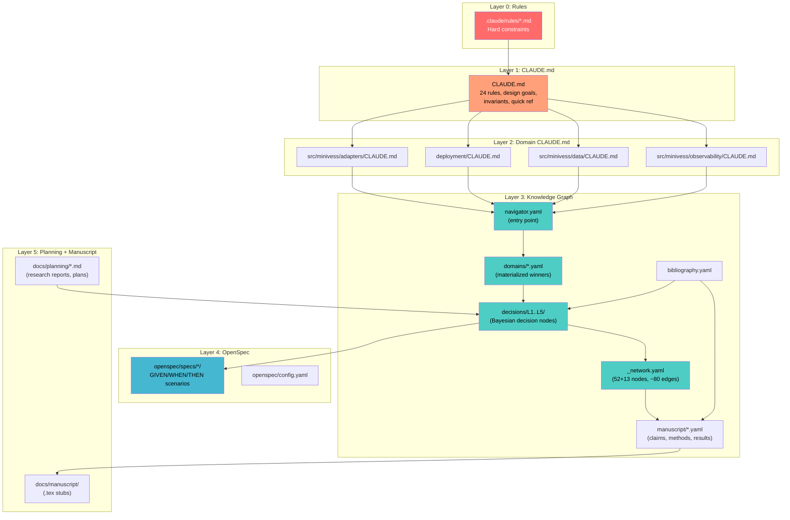
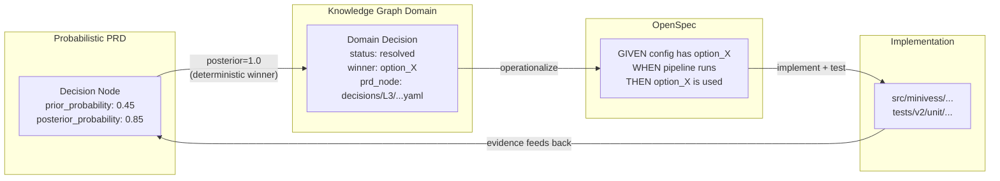

# PR-3: Knowledge Graph + Tooling Refresh — Implementation Plan

**Date**: 2026-03-17
**Branch**: `pr3/kg-tooling-refresh`
**Estimated scope**: 20 KG node YAML files + architecture doc + navigator update + skill upgrade + tests
**TDD skill**: `.claude/skills/self-learning-iterative-coder/SKILL.md`

---

## Motivation

The PRD-to-KG-to-OpenSpec pipeline EXISTS and works, but the integration documentation is
MISSING. The user identified this gap:

> "The Bayesian KG was the high-level vision developed in the probabilistic PRD. KG as the
> deterministic winner probability. The connection between KG, probabilistic PRD, and OpenSpec
> is not documented."

Concretely:
- The PRD has **71 Bayesian decision nodes** with prior probabilities and conditional tables
  (in `knowledge-graph/decisions/` — currently 52 nodes in `_network.yaml`)
- KG domain files (`knowledge-graph/domains/`) materialize "resolved" decisions where
  posterior probability = 1.0 (the deterministic winner)
- OpenSpec (`openspec/specs/`) operationalizes decisions via GIVEN/WHEN/THEN specs
- The manuscript layer (`knowledge-graph/manuscript/`) ties scientific claims to evidence chains
- **`_network.yaml` is NOT empty** — it has 52 nodes and ~80 edges, BUT it lacks PRD-to-KG
  dependency metadata (which domain file consumes which decision node)
- **13 decision nodes** are referenced in PRDs/plans but have no KG YAML file
- **7 existing nodes** are incomplete (config_only without implementation, stubs without content)

This PR closes the gap by creating all missing nodes, fixing incomplete ones, documenting
the 5-layer architecture, and adding structural tests to prevent future drift.

---

## Phase 0: PRD-to-KG-to-OpenSpec Architecture Document

**Deliverable**: Architecture doc explaining the 5-layer knowledge system with Mermaid diagram.
**Output file**: `docs/planning/prd-kg-openspec-architecture.md`

### 5-Layer Knowledge Architecture

```
Layer 0 (L0): .claude/rules/          — Hard constraints (non-negotiable bans)
Layer 1 (L1): CLAUDE.md               — Project-wide rules, design goals, invariants
Layer 2 (L2): domain CLAUDE.md files  — Per-domain architectural context
Layer 3 (L3): knowledge-graph/        — Decision nodes (Bayesian priors/posteriors) + domains
Layer 4 (L4): openspec/               — GIVEN/WHEN/THEN specs operationalizing decisions
Layer 5 (L5): docs/planning/ + manuscript/ — Planning docs, research reports, paper stubs
```

### Mermaid Diagram (to be included in architecture doc)



### Information Flow: PRD to KG to OpenSpec to Code



### Key Concept: Materialization Protocol

**PRD Decision Node** (probabilistic, in `decisions/L1..L5/`):
- Has options with `prior_probability` and `posterior_probability`
- Status: `resolved` | `partial` | `config_only` | `not_started`
- When `posterior_probability` for one option approaches 1.0, the decision is "resolved"

**KG Domain File** (deterministic, in `domains/`):
- Lists decisions with `status: resolved`, `winner: <option_id>`
- Points back to PRD node via `prd_node:` field
- Lists `implementation:` files and `evidence:` docs

**OpenSpec** (behavioral, in `openspec/specs/`):
- GIVEN/WHEN/THEN scenarios derived from resolved KG decisions
- Each scenario maps to a pytest test
- The `openspec/config.yaml` `rules:` array states: "Specs are Layer 4 evidence in the knowledge graph"

**Manuscript Layer** (narrative, in `manuscript/`):
- Claims (C1-C13) linked to KG decision nodes as evidence
- Methods (M0-M12) linked to `decision_nodes:` arrays
- Results (R0-R5) linked to experiments and claims
- Projections map KG changes to downstream .tex file staleness

---

## Task T1: Create 13 Missing KG Decision Node YAML Files

Each node follows the schema in `knowledge-graph/_schema.yaml` and the template in
`.claude/skills/prd-update/templates/decision-node.yaml`. All nodes must be added to
`_network.yaml` with appropriate edges.

### PR-1 Relevant Nodes (Cost + VRAM)

**T1.1** `knowledge-graph/decisions/L5-operations/cost_tracking_strategy.yaml`
- **decision_id**: `cost_tracking_strategy`
- **level**: L5-operations
- **status**: `partial`
- **Options**: `skypilot_native_cost` (sky cost-report), `cloud_billing_api` (GCP billing export),
  `custom_prometheus_metrics`, `infracost`
- **conditional_on**: `gpu_compute` (strong), `iac_tool` (moderate)
- **Domain**: operations
- **Rationale**: SkyPilot provides native cost reporting; GCP billing export gives precise data.
  FinOps is critical for academic labs with limited cloud credits.
- **Related planning doc**: `docs/planning/skypilot-and-finops-complete-report.md`

**T1.2** `knowledge-graph/decisions/L5-operations/budget_enforcement.yaml`
- **decision_id**: `budget_enforcement`
- **level**: L5-operations
- **status**: `not_started`
- **Options**: `skypilot_budget_limits`, `cloud_budget_alerts` (GCP budget alerts),
  `custom_prefect_gate`, `none`
- **conditional_on**: `cost_tracking_strategy` (strong), `gpu_compute` (moderate)
- **Domain**: operations
- **Rationale**: RunPod balance = $11.40; hard budget enforcement prevents accidental spend.

**T1.3** `knowledge-graph/decisions/L4-infrastructure/vram_and_timing_instrumentation.yaml`
- **decision_id**: `vram_and_timing_instrumentation`
- **level**: L4-infrastructure
- **status**: `partial`
- **Options**: `trainer_return_dict` (in-process via trainer.fit return), `nvidia_smi_polling`,
  `pytorch_memory_stats`, `custom_callback`
- **conditional_on**: `gpu_compute` (strong), `experiment_tracker` (moderate)
- **Domain**: infrastructure
- **Implementation evidence**: Commit `3695867` ("in-process VRAM measurement via trainer.fit() return dict")
- **Related**: Model profile YAMLs (`configs/model_profiles/*.yaml`)

### PR-2 Relevant Nodes (Data Quality + Drift)

**T1.4** `knowledge-graph/decisions/L2-architecture/data_quality_orchestration.yaml`
- **decision_id**: `data_quality_orchestration`
- **level**: L2-architecture
- **status**: `partial`
- **Options**: `prefect_data_flow` (quality checks in Data Engineering flow),
  `standalone_quality_pipeline`, `inline_training_checks`
- **conditional_on**: `data_validation_depth` (strong), `container_strategy` (moderate)
- **Domain**: data (add to `knowledge-graph/domains/data.yaml`)
- **Rationale**: Data quality checks must run in the Data Engineering flow (Flow 1) before
  training. The 12-layer validation onion is the architecture; this node is HOW it's orchestrated.

**T1.5** `knowledge-graph/decisions/L3-technology/vascular_data_quality_checks.yaml`
- **decision_id**: `vascular_data_quality_checks`
- **level**: L3-technology
- **status**: `not_started`
- **Options**: `topology_aware_qc` (connected components, Betti numbers, vessel diameter stats),
  `intensity_distribution_qc` (histogram matching, SNR), `geometric_qc` (spacing, orientation),
  `combined_all`
- **conditional_on**: `data_quality_orchestration` (strong), `data_validation_depth` (moderate)
- **Domain**: data
- **Domain overlay**: `knowledge-graph/domains/vascular-segmentation/overlay.yaml`
- **Rationale**: Generic data quality is necessary but insufficient for vascular imaging.
  Vessel-specific checks (connectivity, diameter distribution, branching angles) catch
  domain-specific issues that generic profiling misses.

**T1.6** `knowledge-graph/decisions/L3-technology/inter_rater_agreement_framework.yaml`
- **decision_id**: `inter_rater_agreement_framework`
- **level**: L3-technology
- **status**: `not_started`
- **Options**: `cohens_kappa_sklearn` (voxel-level agreement), `fleiss_kappa_statsmodels`,
  `surface_dice_agreement` (surface-based metric), `topology_agreement` (clDice between raters)
- **conditional_on**: `label_quality_tool` (strong), `data_validation_depth` (moderate)
- **Domain**: data
- **Rationale**: MiniVess has single-rater annotations. External datasets (DeepVess, TubeNet)
  may have multiple raters. IEC 62304 compliance requires inter-rater agreement quantification.

**T1.7** `knowledge-graph/decisions/L5-operations/drift_quality_coupling.yaml`
- **decision_id**: `drift_quality_coupling`
- **level**: L5-operations
- **status**: `partial`
- **Options**: `evidently_plus_whylogs` (drift from Evidently, quality from whylogs),
  `unified_evidently_only`, `custom_coupling_layer`
- **conditional_on**: `drift_monitoring` (strong), `data_profiling` (moderate),
  `retraining_trigger` (moderate)
- **Domain**: operations
- **Implementation evidence**: Commits `83036fb` (Evidently drift reporter), `c3302af` (drift alerting)
- **Rationale**: Drift detection without quality coupling is incomplete. When drift is detected,
  the system must decide: is this distribution shift (retrain) or data quality issue (reject)?

### PR-3 Meta Nodes (KG Self-Description)

**T1.8** `knowledge-graph/decisions/L2-architecture/kg_revision_process.yaml`
- **decision_id**: `kg_revision_process`
- **level**: L2-architecture
- **status**: `partial`
- **Options**: `pre_commit_plus_manual` (knowledge-links hook + periodic full review),
  `ci_automated` (GitHub Actions-based), `agent_driven` (Claude Code auto-review on change)
- **conditional_on**: `config_architecture` (moderate), `agent_architecture` (moderate)
- **Domain**: observability (add to domain as meta-observability)
- **Implementation evidence**: `scripts/review_knowledge.py` (orchestrator),
  `.claude/skills/knowledge-reviewer/SKILL.md`
- **Rationale**: The KG itself needs a revision process. Currently: pre-commit hook
  (`knowledge-links`) + manual `uv run python scripts/review_knowledge.py`. This node
  documents the decision and its evidence.

**T1.9** `knowledge-graph/decisions/L2-architecture/kg_to_code_sync_strategy.yaml`
- **decision_id**: `kg_to_code_sync_strategy`
- **level**: L2-architecture
- **status**: `partial`
- **Options**: `projections_staleness` (projections.yaml dependency map + kg-sync skill),
  `automated_code_gen` (Jinja2 templates generate code from KG), `manual_sync`
- **conditional_on**: `config_architecture` (moderate), `kg_revision_process` (strong)
- **Domain**: observability
- **Implementation evidence**: `knowledge-graph/manuscript/projections.yaml`,
  `.claude/skills/kg-sync/SKILL.md`
- **Rationale**: How do KG changes propagate to code and manuscript? Currently via
  projections.yaml dependency map. This node documents that decision.

**T1.10** `knowledge-graph/decisions/L3-technology/probabilistic_priors_methodology.yaml`
- **decision_id**: `probabilistic_priors_methodology`
- **level**: L3-technology
- **status**: `partial`
- **Options**: `expert_elicitation` (manual prior assignment by domain expert),
  `literature_derived` (priors from benchmark results), `bayesian_update` (posterior from experiments),
  `hybrid_all`
- **conditional_on**: `kg_revision_process` (strong), `observability_depth` (moderate)
- **Domain**: observability
- **Evidence**: `knowledge-graph/_network.yaml` propagation section (Phase 1: requires_review flags),
  manuscript claim C10 ("Phase 1 only: requires_review flags. Phase 2 actual posteriors is future work.")
- **Rationale**: The PRD uses Bayesian priors and posteriors, but the methodology for
  setting/updating them is not documented. This node makes the methodology explicit.
  Currently: hybrid (expert elicitation for priors + literature for updates + experiments
  for posteriors).

**T1.11** `knowledge-graph/decisions/L3-technology/agent_skill_interface_contract.yaml`
- **decision_id**: `agent_skill_interface_contract`
- **level**: L3-technology
- **status**: `partial`
- **Options**: `skill_md_protocol` (SKILL.md + protocols/*.md + state JSON),
  `tool_use_api` (MCP tool schema), `langchain_tool_spec`, `custom_yaml_contract`
- **conditional_on**: `agent_architecture` (strong), `llm_provider_strategy` (moderate)
- **Domain**: observability
- **Implementation evidence**: 14 skills in `.claude/skills/*/SKILL.md`,
  OpenSpec propose/apply/archive skills
- **Rationale**: The repo has 14 agent skills with a consistent interface pattern
  (SKILL.md + protocols/ + templates/ + state/). This node documents the interface contract.

**T1.12** `knowledge-graph/decisions/L5-operations/manuscript_generation_automation.yaml`
- **decision_id**: `manuscript_generation_automation`
- **level**: L5-operations
- **status**: `partial`
- **Options**: `kg_sync_jinja2` (kg-sync skill + Jinja2 templates for .tex),
  `sci_llm_writer` (external sci-llm-writer repo), `manual_latex`, `combined`
- **conditional_on**: `kg_to_code_sync_strategy` (strong), `experiment_tracker` (moderate)
- **Domain**: manuscript (add to domain file)
- **Implementation evidence**: `knowledge-graph/manuscript/projections.yaml` (projection map),
  `.claude/skills/kg-sync/SKILL.md`, `docs/planning/repo-to-manuscript.md`
- **Rationale**: Manuscript .tex files are downstream artifacts of the KG. The automation
  path (kg-sync + templates vs. manual) is a real decision with implementation evidence.

**T1.13** `knowledge-graph/decisions/L4-infrastructure/spec_driven_development_strategy.yaml`
- **decision_id**: `spec_driven_development_strategy`
- **level**: L4-infrastructure
- **status**: `partial`
- **Options**: `openspec_sdd` (OpenSpec CLI + GIVEN/WHEN/THEN), `bdd_behave` (Behave/Gherkin),
  `tdd_only` (pytest-only, no formal specs), `hybrid_openspec_tdd`
- **conditional_on**: `ci_cd_platform` (moderate), `agent_architecture` (moderate)
- **Domain**: infrastructure
- **Implementation evidence**: `openspec/config.yaml`, `openspec/specs/` (3 active specs),
  `.claude/skills/openspec-propose/SKILL.md`
- **Literature**: Piskala (2026, arXiv:2602.00180) SDD taxonomy
- **Rationale**: The repo uses OpenSpec for spec-driven development. This node documents
  the decision and its evidence, including the SDD taxonomy from the literature.

### Summary: 13 New Nodes by Level

| Level | Count | Node IDs |
|-------|-------|----------|
| L2 | 3 | `data_quality_orchestration`, `kg_revision_process`, `kg_to_code_sync_strategy` |
| L3 | 4 | `vascular_data_quality_checks`, `inter_rater_agreement_framework`, `probabilistic_priors_methodology`, `agent_skill_interface_contract` |
| L4 | 2 | `vram_and_timing_instrumentation`, `spec_driven_development_strategy` |
| L5 | 4 | `cost_tracking_strategy`, `budget_enforcement`, `drift_quality_coupling`, `manuscript_generation_automation` |

**After T1**: `_network.yaml` grows from 52 to **65 nodes** (52 existing + 13 new).
The `review_prd_integrity.py` node count check must be updated from 52 to 65.

---

## Task T2: Fix 7 Incomplete Nodes

### T2.1 `data_profiling.yaml` — whylogs integration minimal
- **File**: `knowledge-graph/decisions/L3-technology/data_profiling.yaml`
- **Current state**: `status: config_only`, no `implementation.files`, volatility says "whylogs selected but integration minimal"
- **Fix**: Add `implementation.files` pointing to actual whylogs usage (if any in `src/minivess/data/`),
  or update status honestly. Add `resolution_evidence` with specific evidence. Update `volatility.rationale`
  to describe what "minimal" means concretely (e.g., "pyproject.toml dependency only, no profiling flow").

### T2.2 `label_quality_tool.yaml` — cleanlab not deeply integrated
- **File**: `knowledge-graph/decisions/L3-technology/label_quality_tool.yaml`
- **Current state**: `status: config_only`, volatility says "Tool selected but not deeply integrated"
- **Fix**: Same pattern as T2.1. Add honest `implementation.files` (may be empty if truly not integrated).
  Add specific `resolution_evidence` beyond just "pyproject.toml". If cleanlab is only a dependency
  and not called anywhere, say so explicitly.

### T2.3 `lineage_tracking.yaml` — config_only with no implementation
- **File**: `knowledge-graph/decisions/L3-technology/lineage_tracking.yaml`
- **Current state**: `status: config_only`, evidence says "Marquez in docker-compose"
- **Fix**: Add `implementation.files` pointing to Marquez service in `deployment/docker-compose.yml`.
  Clarify whether OpenLineage integration actually exists in pipeline code or if it's just the
  Docker service. Update `conditional_on` (currently only `data_validation_depth`; should also
  include `container_strategy` per the existing edge in `_network.yaml`).

### T2.4 `data_validation_depth.yaml` — claims 12-layer onion but doesn't enumerate
- **File**: `knowledge-graph/decisions/L2-architecture/data_validation_depth.yaml`
- **Current state**: `status: resolved`, `resolved_option: validation_onion_12_layer`, but
  the 12 layers are never enumerated in the YAML
- **Fix**: Add a `resolution_details` or `description` field enumerating all 12 layers:
  1. Pydantic schema validation (Volume, Annotation types)
  2. File existence + integrity (NIfTI header checks)
  3. Spatial metadata (voxel spacing, orientation, dimensions)
  4. Intensity statistics (min/max/mean, histogram)
  5. Label consistency (unique label values, foreground ratio)
  6. Split integrity (no train/val overlap, fold balance)
  7. Pandera DataFrame validation (metadata table schema)
  8. Great Expectations batch validation (statistical expectations)
  9. whylogs data profiling (distribution baseline)
  10. Evidently drift detection (distribution shift)
  11. OpenLineage lineage (data provenance chain)
  12. Cross-fold consistency (per-fold metric stability)
- Update `implementation.files` and `implementation.tests` to be comprehensive.

### T2.5 `gitops_engine.yaml` — not_started
- **File**: `knowledge-graph/decisions/L4-infrastructure/gitops_engine.yaml`
- **Current state**: `status: not_started`, no `conditional_on`, no evidence
- **Fix**: Add `conditional_on` linking to `container_strategy` (strong) and `ci_cd_platform` (moderate).
  Add `volatility.rationale` explaining that GitOps requires K8s which is not yet in scope
  (Docker Compose is the current deployment model). This is an honest "not_started" that
  documents WHY it's deferred, not just that it is.

### T2.6 `_network.yaml` — add PRD-to-KG dependency metadata
- **File**: `knowledge-graph/_network.yaml`
- **Current state**: Has 52 nodes and ~80 edges plus propagation rules, BUT:
  - No `domain:` field on nodes (which domain file consumes this decision?)
  - No `prd_to_domain_link:` metadata
  - Node count hardcoded to 52 (must update to 65 after T1)
- **Fix**:
  - Add all 13 new nodes from T1 with `id`, `level`, `file` fields
  - Add new edges for the 13 new nodes (estimated 15-20 new edges)
  - Update propagation rules for new dependency relationships
  - Add `domain:` field to each node mapping to the consuming domain file
  - The `review_prd_integrity.py` node count check must be updated

### T2.7 `manuscript.yaml` domain — stubs, no section-level integration
- **File**: `knowledge-graph/domains/manuscript.yaml`
- **Current state**: Has `sections:` with status "bootstrapped" / "bootstrapped_partial",
  `downstream_artifacts:` with "scaffold_only" / "not_yet_generated". No `decisions:` block
  like other domain files. No `prd_node:` references.
- **Fix**: Add a `decisions:` block linking to relevant KG decisions that the manuscript layer
  consumes (e.g., `kg_to_code_sync_strategy`, `manuscript_generation_automation`). Add
  `prd_node:` references. Update `sections:` status fields to be current. Add `metalearning:`
  references. Ensure consistency with `knowledge-graph/manuscript/claims.yaml` (C1-C13 all
  reference `decision_nodes` arrays — verify these all resolve to actual decision files).

---

## Task T3: Populate `_network.yaml` with New Dependency Graph

This is the detailed edge specification for the 13 new nodes. Extends the existing
`_network.yaml` edges section.

### New Edges (T1 nodes to existing network)

```yaml
# ─── PR-1 Relevant: Cost + VRAM ──────────────────────────
# L4 → L5 (infrastructure → operations)
- from: gpu_compute
  to: cost_tracking_strategy
  strength: strong
- from: iac_tool
  to: cost_tracking_strategy
  strength: moderate

- from: cost_tracking_strategy
  to: budget_enforcement
  strength: strong
- from: gpu_compute
  to: budget_enforcement
  strength: moderate

- from: gpu_compute
  to: vram_and_timing_instrumentation
  strength: strong
- from: experiment_tracker
  to: vram_and_timing_instrumentation
  strength: moderate

# ─── PR-2 Relevant: Data Quality + Drift ─────────────────
# L2 → L2 (architecture internal)
- from: data_validation_depth
  to: data_quality_orchestration
  strength: strong
- from: container_strategy
  to: data_quality_orchestration
  strength: moderate

# L2 → L3 (architecture → technology)
- from: data_quality_orchestration
  to: vascular_data_quality_checks
  strength: strong
- from: data_validation_depth
  to: vascular_data_quality_checks
  strength: moderate

- from: label_quality_tool
  to: inter_rater_agreement_framework
  strength: strong
- from: data_validation_depth
  to: inter_rater_agreement_framework
  strength: moderate

# L5 internal (operations)
- from: drift_monitoring
  to: drift_quality_coupling
  strength: strong
- from: data_profiling
  to: drift_quality_coupling
  strength: moderate
- from: retraining_trigger
  to: drift_quality_coupling
  strength: moderate

# ─── PR-3 Meta: KG Self-Description ──────────────────────
# L2 → L2 (architecture internal)
- from: config_architecture
  to: kg_revision_process
  strength: moderate
- from: agent_architecture
  to: kg_revision_process
  strength: moderate

- from: kg_revision_process
  to: kg_to_code_sync_strategy
  strength: strong
- from: config_architecture
  to: kg_to_code_sync_strategy
  strength: moderate

# L2 → L3 (architecture → technology)
- from: kg_revision_process
  to: probabilistic_priors_methodology
  strength: strong
- from: observability_depth
  to: probabilistic_priors_methodology
  strength: moderate

- from: agent_architecture
  to: agent_skill_interface_contract
  strength: strong
- from: llm_provider_strategy
  to: agent_skill_interface_contract
  strength: moderate

# L3/L2 → L4 (technology/architecture → infrastructure)
- from: ci_cd_platform
  to: spec_driven_development_strategy
  strength: moderate
- from: agent_architecture
  to: spec_driven_development_strategy
  strength: moderate

# L2 → L5 (architecture → operations, skip)
- from: kg_to_code_sync_strategy
  to: manuscript_generation_automation
  strength: strong
  skip: true
- from: experiment_tracker
  to: manuscript_generation_automation
  strength: moderate
```

### New Propagation Rules

```yaml
- source: drift_monitoring
  target: drift_quality_coupling
  type: hard
  rationale: "Drift detection method determines coupling strategy"

- source: kg_revision_process
  target: kg_to_code_sync_strategy
  type: hard
  rationale: "KG review process determines how changes propagate to code"

- source: cost_tracking_strategy
  target: budget_enforcement
  type: hard
  rationale: "Cannot enforce budgets without cost visibility"
```

---

## Task T4: Update `navigator.yaml` with 5-Layer Architecture Explanation

**File**: `knowledge-graph/navigator.yaml`

### Changes:

1. Add a `layers:` section explaining the 5-layer architecture:

```yaml
layers:
  L0_rules:
    location: .claude/rules/
    description: "Hard constraints — non-negotiable bans and invariants"
    examples: [no-unauthorized-infra.md, no-state-questions.md]

  L1_project:
    location: CLAUDE.md
    description: "Project-wide rules (24 rules), design goals, quick reference"

  L2_domain_context:
    location: "src/*/CLAUDE.md, deployment/CLAUDE.md"
    description: "Per-domain architectural context for agents"

  L3_knowledge_graph:
    location: knowledge-graph/
    description: >
      Bayesian decision network (65 nodes). PRD decisions with prior/posterior
      probabilities. Domain files materialize resolved decisions (posterior=1.0).
      Navigator routes queries to domains. _network.yaml defines the DAG.
    sublayers:
      decisions: "knowledge-graph/decisions/L1..L5/ — probabilistic decision nodes"
      domains: "knowledge-graph/domains/ — deterministic materialized winners"
      manuscript: "knowledge-graph/manuscript/ — scientific claims linked to evidence"
      network: "knowledge-graph/_network.yaml — DAG topology + propagation rules"

  L4_openspec:
    location: openspec/
    description: >
      GIVEN/WHEN/THEN behavioral specifications derived from resolved KG decisions.
      Operationalizes architecture into testable scenarios.
    workflow: "/opsx:propose → design.md → spec.md → tasks.md → /opsx:apply"

  L5_planning:
    location: docs/planning/
    description: >
      Research reports, implementation plans, literature reviews.
      Evidence source for PRD decision updates. Plans are derivatives;
      user instructions are the source of truth.
```

2. Add a `materialization:` section explaining the PRD-to-KG flow:

```yaml
materialization:
  description: >
    How PRD decisions become KG domain entries and then code.
    The pipeline: PRD (probabilistic) → KG domain (deterministic) → OpenSpec (behavioral) → Code (implementation).
  protocol:
    - step: "1. Decision resolved in PRD"
      detail: "posterior_probability approaches 1.0 for winner option"
      file_pattern: "knowledge-graph/decisions/L{1..5}-*/*.yaml"
    - step: "2. Domain file updated"
      detail: "Domain adds entry with status=resolved, winner=<option_id>, prd_node=<path>"
      file_pattern: "knowledge-graph/domains/*.yaml"
    - step: "3. OpenSpec created (if behavioral)"
      detail: "GIVEN/WHEN/THEN scenarios operationalize the decision"
      file_pattern: "openspec/specs/*/{spec,design}.md"
    - step: "4. Implementation + tests"
      detail: "TDD: failing tests first, then implementation, then verify"
      file_pattern: "src/minivess/**/*.py + tests/v2/**/*.py"
    - step: "5. Evidence feeds back"
      detail: "Experiment results update PRD posteriors via prd-update skill"
      file_pattern: "knowledge-graph/experiments/*.yaml"
```

3. Update `version:` to `"2.0"` and `last_updated:` to `"2026-03-17"`.

4. Add new domain entries for any new decisions that don't fit existing domains.

---

## Task T5: Add Materialization Protocol to `prd-update` Skill

**File**: `.claude/skills/prd-update/SKILL.md`

### Changes:

1. Add a new operation to the "Available Operations" table:

```
| `materialize` | `protocols/materialize.md` | Propagate resolved decision to domain + OpenSpec |
```

2. Create new protocol file: `.claude/skills/prd-update/protocols/materialize.md`

Content should document:
- **When**: A decision node transitions from `partial`/`config_only` to `resolved`
- **Steps**:
  1. Verify `posterior_probability` of winner option is >= 0.80
  2. Update domain file (`knowledge-graph/domains/<domain>.yaml`) with resolved entry
  3. Check if OpenSpec spec exists for this decision; if not, suggest `/opsx:propose`
  4. Update `_network.yaml` propagation rules if this decision affects downstream nodes
  5. Run `knowledge-reviewer` validation
  6. Update `manuscript/claims.yaml` if this decision supports a manuscript claim
- **Invariants**:
  - Domain `prd_node:` must point to the decision file
  - Domain `status:` must be `resolved`
  - Domain `winner:` must match `resolved_option` in the decision file
  - If OpenSpec spec exists, it must reference the decision node

3. Update the "Workflow" section to include materialization as step 3.5.

---

## Task T6: Skills 2.0 Format Upgrade for Key Skills

Upgrade the following skills to a consistent v2.0 format with:
- YAML frontmatter with `name`, `version`, `description`, `allowed-tools`, `argument-hint`
- Clear "When to Activate" section
- Protocol reference table
- Validation rules section

### Skills to upgrade:

**T6.1** `.claude/skills/knowledge-reviewer/SKILL.md` — Already well-structured. Add:
- `version: 2.0.0` in frontmatter
- Cross-reference to new `prd-update/protocols/materialize.md`
- Reference to T8 KG completeness test

**T6.2** `.claude/skills/kg-sync/SKILL.md` — Add:
- `version: 2.0.0` in frontmatter
- Cross-reference to `manuscript/projections.yaml` dependency map
- Reference to materialization protocol

**T6.3** `.claude/skills/prd-update/SKILL.md` — Add:
- `version: 2.0.0` in frontmatter
- New `materialize` operation (T5)
- Update key file paths (currently references `docs/planning/prd/` which may be stale;
  actual files are in `knowledge-graph/`)

---

## Task T7: Issue Creator Skill Eval Harness (#691)

**File**: `.claude/skills/issue-creator/evals/test_issue_creator.py`

### Scope:
Create a pytest-based evaluation harness that validates:

1. **Template compliance**: Generated issue bodies contain all required sections
   (METADATA comment, Summary, Context, Acceptance Criteria)
2. **YAML metadata validity**: `priority`, `domain`, `type` fields are present and valid
3. **Domain routing**: `domain:` value matches `navigator.yaml` keywords
4. **Citation format**: References use author-year format with hyperlinks
5. **No duplicates**: Mock `gh issue list --search` to verify dedup logic

### Test structure:
```python
# tests/v2/unit/test_issue_creator_eval.py
class TestIssueCreatorTemplateCompliance:
    def test_metadata_block_present(self): ...
    def test_required_sections_present(self): ...
    def test_priority_values_valid(self): ...
    def test_domain_values_match_navigator(self): ...

class TestIssueCreatorDomainRouting:
    def test_keyword_to_domain_mapping(self): ...
    def test_unknown_keyword_raises(self): ...
```

---

## Task T8: KG Completeness Test

**File**: `tests/v2/unit/test_kg_completeness.py`

### Purpose:
Structural pytest tests that verify KG integrity as part of the staging test tier.
These tests are the automated equivalent of running `scripts/review_prd_integrity.py`
but integrated into the test suite.

### Tests (8-12 tests):

```python
"""KG completeness structural tests.

These tests verify that the knowledge graph is internally consistent
and that all domains reference valid PRD decision nodes.
"""
from __future__ import annotations

# Test 1: All domain decisions have prd_node references
def test_all_domain_decisions_have_prd_node_refs():
    """Every decision in a domain/*.yaml file must have a prd_node: field
    pointing to an existing knowledge-graph/decisions/ file."""

# Test 2: All prd_node references resolve to existing files
def test_all_prd_node_refs_resolve():
    """Every prd_node: value in domain files must point to an existing YAML file."""

# Test 3: Network node count matches expected
def test_network_node_count():
    """_network.yaml must have exactly 65 nodes (52 original + 13 new)."""

# Test 4: All decision files are referenced in _network.yaml
def test_all_decision_files_in_network():
    """Every .yaml file in decisions/ must have a corresponding node in _network.yaml."""

# Test 5: DAG is acyclic
def test_network_dag_acyclic():
    """The decision network must be a DAG (no cycles)."""

# Test 6: Probability sums are valid
def test_option_probability_sums():
    """All prior_probability arrays in decision files must sum to ~1.0."""

# Test 7: Resolved decisions have winners
def test_resolved_decisions_have_winners():
    """Every decision with status=resolved must have a resolved_option field."""

# Test 8: Navigator domains cover all decision levels
def test_navigator_covers_all_levels():
    """Navigator.yaml domains must collectively reference decisions from all 5 levels."""

# Test 9: Manuscript claims reference valid decision nodes
def test_manuscript_claims_reference_valid_nodes():
    """Every decision_nodes entry in claims.yaml must be a valid decision_id."""

# Test 10: OpenSpec config lists valid spec directories
def test_openspec_spec_directories_exist():
    """Every directory in openspec/config.yaml spec_directories must exist on disk."""

# Test 11: Domain files have last_reviewed dates
def test_domain_files_have_review_dates():
    """Every domain/*.yaml file must have a last_reviewed date."""

# Test 12: New nodes (T1) have conditional_on references
def test_new_nodes_have_conditional_on():
    """All 13 new decision nodes must have at least one conditional_on parent."""
```

### Marker: `@pytest.mark.staging` — these run in the fast staging tier.

---

## Task T9: CLAUDE.md Trim Redundancy

**Goal**: Extract redundant content from CLAUDE.md into domain CLAUDE.md files, reducing
CLAUDE.md size while maintaining the same information surface area.

### Candidates for extraction:

1. **Cloud architecture table** (CLAUDE.md lines ~60-80) — already fully documented in
   `knowledge-graph/domains/cloud.yaml`. Replace with a 2-line pointer:
   ```
   Cloud architecture: see `knowledge-graph/domains/cloud.yaml`.
   Two providers: RunPod (env) + GCP (staging+prod). No others without authorization.
   ```

2. **Three-Environment Model table** — partially redundant with `cloud.yaml` `environments:` section.
   Keep the table in CLAUDE.md (it's the quick reference) but add a "Details:" link.

3. **SkyPilot section** — already in `cloud.yaml` `invariants:` and `infrastructure.yaml`.
   Keep the 1-line invariant in CLAUDE.md, move the 5-line explanation to a domain file.

4. **Docker details** — already in `deployment/CLAUDE.md` and `infrastructure.yaml`.
   Keep the invariant in CLAUDE.md, move implementation details.

### Constraints:
- CLAUDE.md must remain self-contained for agents that don't read domain files
- The 24 rules are non-negotiable and stay in CLAUDE.md
- Quick Reference section stays
- Test Tiers section stays
- Only move EXPLANATORY text, not RULES

### Estimated reduction: ~30-50 lines (from ~300 to ~250-270 lines).

---

## Execution Order and Dependencies

```
Phase 0 ──────────────────────────────────
  T0: Architecture doc with Mermaid (no code changes, doc only)

Phase 1 (KG content) ────────────────────
  T1: Create 13 new decision node YAMLs
  T2: Fix 7 incomplete nodes
  T3: Populate _network.yaml with new edges
    └─ depends on T1 (new node IDs must exist before edges)

Phase 2 (Integration) ───────────────────
  T4: Update navigator.yaml
    └─ depends on T1 (new nodes referenced in layers section)
  T5: Add materialization protocol to prd-update skill
    └─ depends on T0 (architecture doc defines the protocol)
  T6: Skills 2.0 format upgrade
    └─ depends on T5 (prd-update gets new operation)

Phase 3 (Verification) ──────────────────
  T7: Issue Creator eval harness
    └─ independent (can run in parallel with T8)
  T8: KG completeness tests
    └─ depends on T1, T2, T3 (tests validate new nodes)
  T9: CLAUDE.md trim
    └─ depends on T4 (navigator update provides the pointers)
```

### TDD Approach per Task

| Task | TDD Applicable? | Test Location |
|------|-----------------|---------------|
| T0 | No (doc only) | N/A |
| T1 | Yes (structural) | `test_kg_completeness.py::test_network_node_count` |
| T2 | Yes (structural) | `test_kg_completeness.py::test_resolved_decisions_have_winners` |
| T3 | Yes (structural) | `test_kg_completeness.py::test_network_dag_acyclic` |
| T4 | Yes (structural) | `test_kg_completeness.py::test_navigator_covers_all_levels` |
| T5 | No (skill doc) | Manual: run `/prd-update materialize` on a resolved node |
| T6 | No (skill doc) | Manual: verify YAML frontmatter in SKILL.md files |
| T7 | Yes (eval harness) | `test_issue_creator_eval.py` (self-testing) |
| T8 | Yes (tests ARE the deliverable) | `test_kg_completeness.py` |
| T9 | Yes (structural) | Existing knowledge-links pre-commit hook validates cross-refs |

### Estimated Test Count: 12 structural tests (T8) + 5 eval tests (T7) = **17 tests**.

---

## Validation Checklist (Post-Implementation)

```bash
# 1. Run KG completeness tests
uv run pytest tests/v2/unit/test_kg_completeness.py -v

# 2. Run knowledge reviewer (full mode)
uv run python scripts/review_knowledge.py --full

# 3. Run PRD integrity auditor (updated node count)
uv run python scripts/review_prd_integrity.py

# 4. Run pre-commit hooks (knowledge-links)
uv run pre-commit run knowledge-links --all-files

# 5. Run staging test tier
make test-staging

# 6. Lint + typecheck
uv run ruff check src/ tests/ && uv run mypy src/
```

---

## Files Created/Modified Summary

### New Files (16)

| File | Task |
|------|------|
| `docs/planning/prd-kg-openspec-architecture.md` | T0 |
| `knowledge-graph/decisions/L5-operations/cost_tracking_strategy.yaml` | T1.1 |
| `knowledge-graph/decisions/L5-operations/budget_enforcement.yaml` | T1.2 |
| `knowledge-graph/decisions/L4-infrastructure/vram_and_timing_instrumentation.yaml` | T1.3 |
| `knowledge-graph/decisions/L2-architecture/data_quality_orchestration.yaml` | T1.4 |
| `knowledge-graph/decisions/L3-technology/vascular_data_quality_checks.yaml` | T1.5 |
| `knowledge-graph/decisions/L3-technology/inter_rater_agreement_framework.yaml` | T1.6 |
| `knowledge-graph/decisions/L5-operations/drift_quality_coupling.yaml` | T1.7 |
| `knowledge-graph/decisions/L2-architecture/kg_revision_process.yaml` | T1.8 |
| `knowledge-graph/decisions/L2-architecture/kg_to_code_sync_strategy.yaml` | T1.9 |
| `knowledge-graph/decisions/L3-technology/probabilistic_priors_methodology.yaml` | T1.10 |
| `knowledge-graph/decisions/L3-technology/agent_skill_interface_contract.yaml` | T1.11 |
| `knowledge-graph/decisions/L5-operations/manuscript_generation_automation.yaml` | T1.12 |
| `knowledge-graph/decisions/L4-infrastructure/spec_driven_development_strategy.yaml` | T1.13 |
| `.claude/skills/prd-update/protocols/materialize.md` | T5 |
| `tests/v2/unit/test_kg_completeness.py` | T8 |

### Modified Files (12)

| File | Task |
|------|------|
| `knowledge-graph/decisions/L3-technology/data_profiling.yaml` | T2.1 |
| `knowledge-graph/decisions/L3-technology/label_quality_tool.yaml` | T2.2 |
| `knowledge-graph/decisions/L3-technology/lineage_tracking.yaml` | T2.3 |
| `knowledge-graph/decisions/L2-architecture/data_validation_depth.yaml` | T2.4 |
| `knowledge-graph/decisions/L4-infrastructure/gitops_engine.yaml` | T2.5 |
| `knowledge-graph/_network.yaml` | T2.6, T3 |
| `knowledge-graph/domains/manuscript.yaml` | T2.7 |
| `knowledge-graph/navigator.yaml` | T4 |
| `.claude/skills/prd-update/SKILL.md` | T5, T6.3 |
| `.claude/skills/knowledge-reviewer/SKILL.md` | T6.1 |
| `.claude/skills/kg-sync/SKILL.md` | T6.2 |
| `scripts/review_prd_integrity.py` | T8 (update node count 52 → 65) |
| `CLAUDE.md` | T9 |

### Possibly Modified (if eval harness created)

| File | Task |
|------|------|
| `tests/v2/unit/test_issue_creator_eval.py` | T7 |

---

## Risk Assessment

| Risk | Mitigation |
|------|------------|
| `_network.yaml` grows complex (65 nodes, ~100 edges) | DAG acyclicity test (T8) catches cycles; level ordering check catches upward edges |
| New nodes break `review_prd_integrity.py` node count | Update count from 52 to 65 as part of T3 |
| Probability sums drift from 1.0 in new nodes | Probability sum test (T8) catches this |
| Skills 2.0 format breaks existing skill invocation | Format upgrade is additive (new frontmatter fields), not breaking |
| CLAUDE.md trim removes information agents need | Only move EXPLANATORY text, keep all RULES; test with knowledge-links hook |
| 13 new nodes lack bibliography references | Pre-commit citation check catches missing `citation_key` references |

---

## Non-Goals (Explicitly Out of Scope)

- **Ralph-loop execution** — user explicitly excluded (local work only)
- **Phase 2 Bayesian posterior propagation** — remains future work (manuscript claim C10 acknowledges this)
- **New OpenSpec specs** — T5 adds the materialization protocol but does not create new specs
- **GitHub Actions CI** — remains DISABLED per CLAUDE.md Rule #21
- **Cloud provider changes** — no RunPod/GCP modifications
- **Model or training changes** — purely knowledge infrastructure work
