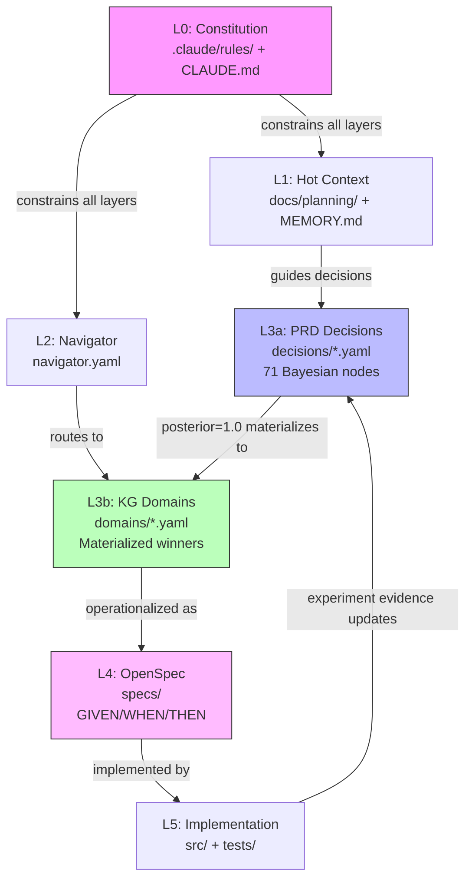
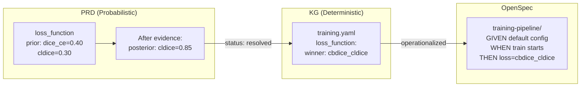
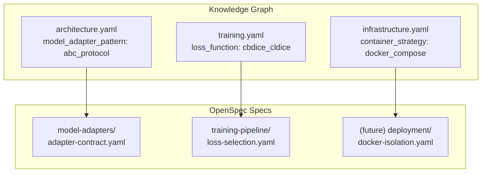

# PRD - Knowledge Graph - OpenSpec Architecture

## Overview

This document describes the 6-layer knowledge architecture that connects the
Probabilistic PRD (Bayesian decision network), Knowledge Graph (materialized
decisions), and OpenSpec (testable specifications).

**Problem**: The PRD, KG, and OpenSpec were created independently. The connection
between them is not documented, leading to drift between probabilistic decisions
(PRD), their deterministic materializations (KG), and their testable specs (OpenSpec).

**Solution**: A layered architecture where information flows downward (PRD -> KG -> OpenSpec -> Code)
and evidence flows upward (experiments -> KG posteriors -> PRD updates).

## 6-Layer Architecture

```
L0: .claude/rules/ + CLAUDE.md         -- Constitution (invariant rules)
L1: docs/planning/ + MEMORY.md         -- Hot Context (current work)
L2: knowledge-graph/navigator.yaml     -- Navigator (domain routing)
L3: knowledge-graph/decisions/*.yaml   -- Evidence (what was decided, why)
     + knowledge-graph/domains/*.yaml  -- Materialized winners
L4: openspec/specs/                    -- Specifications (GIVEN/WHEN/THEN)
L5: src/ + tests/                      -- Implementation (actual code)
```

### Layer Relationships (Mermaid)



## PRD -> KG Materialization Protocol

The PRD contains 71 Bayesian decision nodes across 5 levels (L1-L5). Each node
has candidate options with prior probabilities and (optionally) posterior
probabilities updated by evidence.

**Materialization rule**: When a decision node reaches `status: resolved` with
`posterior_probability >= 0.80` for the winning option, the KG domain file
records the deterministic winner. The KG is "the deterministic winner probability"
-- it only stores decisions that have been made, not probabilistic speculation.



### Status -> KG Mapping

| PRD Status | KG Representation | OpenSpec? |
|-----------|-------------------|-----------|
| `resolved` (posterior >= 0.80) | `winner:` field in domain YAML | Yes -- testable scenario |
| `partial` (no clear winner) | `candidates:` list in domain YAML | No -- decision pending |
| `config_only` (tool selected, not integrated) | `winner:` with note | Optional |
| `not_started` (unexplored) | `candidates:` or omitted | No |

## KG -> OpenSpec Operationalization

OpenSpec specs are the testable manifestation of KG decisions. Each spec
file corresponds to one or more KG domain entries and contains GIVEN/WHEN/THEN
scenarios that verify the decision is correctly implemented.



## _network.yaml: The Dependency Graph

The `knowledge-graph/_network.yaml` file encodes the Bayesian dependency
structure between PRD decision nodes. This serves three purposes:

1. **Topological ordering**: Decisions at lower levels depend on decisions at higher levels
2. **Belief propagation**: When a parent node changes, child nodes are flagged for review
3. **PRD -> KG traceability**: Each node references its decision YAML file and maps to KG domain entries

### Network Topology

```mermaid
graph TD
    subgraph L1 ["L1: Research Goals (7 nodes)"]
        PP[project_purpose]
        IT[impact_target]
        MA[monai_alignment]
        MP[model_philosophy]
        CP[compliance_posture]
        RL[reproducibility_level]
        PRT[portfolio_role_target]
    end
    subgraph L2 ["L2: Architecture (10 nodes)"]
        MAP[model_adapter_pattern]
        ES[ensemble_strategy]
        UF[uncertainty_framework]
        CA[config_architecture]
        SA[serving_architecture]
        XS[xai_strategy]
        DVD[data_validation_depth]
        AA[agent_architecture]
        OD[observability_depth]
        AP[api_protocol]
    end
    subgraph L3 ["L3: Technology (20 nodes)"]
        P3D[primary_3d_model]
        FM[foundation_model]
        LF[loss_function]
        PM[primary_metrics]
        TM[topology_metrics]
        ET[experiment_tracker]
        HE[hpo_engine]
        DV[data_versioning]
        AL[augmentation_library]
        CM[calibration_method]
    end

    MA --> MAP
    MP --> ES
    MP --> UF
    CP --> DVD
    IT --> XS
    RL --> CA
    PP --> OD
    PRT --> AA

    MAP --> P3D
    MAP --> FM
    ES --> CM
    UF --> CM
    CA --> ET
    CA --> HE
    XS --> XVT[xai_voxel_tool]
    XS --> XMT[xai_meta_tool]
    DVD --> DV
    AA --> LLT[llm_tracing]
    OD --> ET
```



## Propagation: Change Tracking

When a PRD node is updated (e.g., new evidence changes posterior probabilities),
the `propagation:` section in `_network.yaml` defines which downstream nodes
need review:

| Type | Behavior | Example |
|------|----------|---------|
| `hard` | Target MUST be reviewed | `container_strategy` -> `ci_cd_platform` |
| `soft` | Target SHOULD be reviewed | `loss_function` -> `primary_metrics` |
| `signal` | Log only, no YAML flag | `container_strategy` -> `secrets_management` |

## File Map

| Layer | Key Files | Purpose |
|-------|-----------|---------|
| L0 | `CLAUDE.md`, `.claude/rules/*.md` | Invariant rules |
| L1 | `docs/planning/*.md`, `MEMORY.md` | Current work context |
| L2 | `knowledge-graph/navigator.yaml` | Domain routing |
| L3a | `knowledge-graph/decisions/L*/*.yaml` | Bayesian decision nodes |
| L3b | `knowledge-graph/domains/*.yaml` | Materialized winners |
| L3c | `knowledge-graph/_network.yaml` | Dependency graph + propagation |
| L3d | `knowledge-graph/_schema.yaml` | Decision node schema |
| L4 | `openspec/specs/*/` | GIVEN/WHEN/THEN specs |
| L5 | `src/`, `tests/` | Implementation + verification |

## Cross-References

- **PRD Skill**: `.claude/skills/prd-update/SKILL.md` -- add/update decision nodes
- **KG Sync Skill**: `.claude/skills/kg-sync/SKILL.md` -- sync KG with repo state
- **OpenSpec Propose**: `/opsx:propose` -- create new specs from KG decisions
- **Issue Creator**: `.claude/skills/issue-creator/SKILL.md` -- create issues from PRD updates
