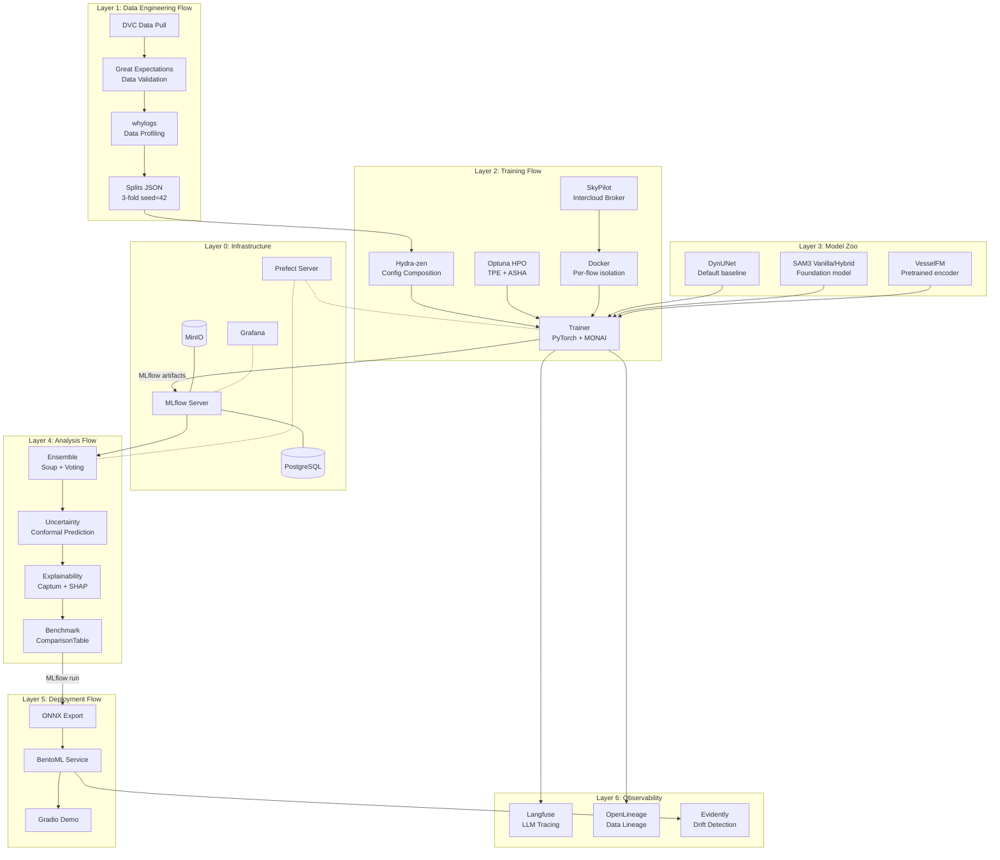
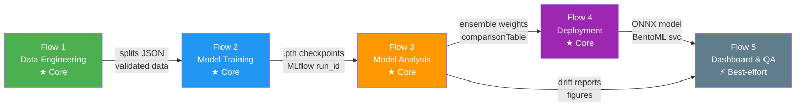
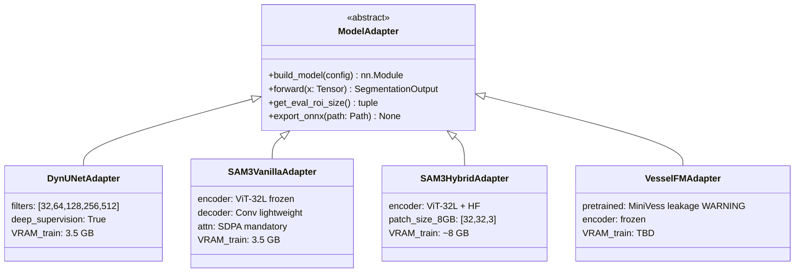
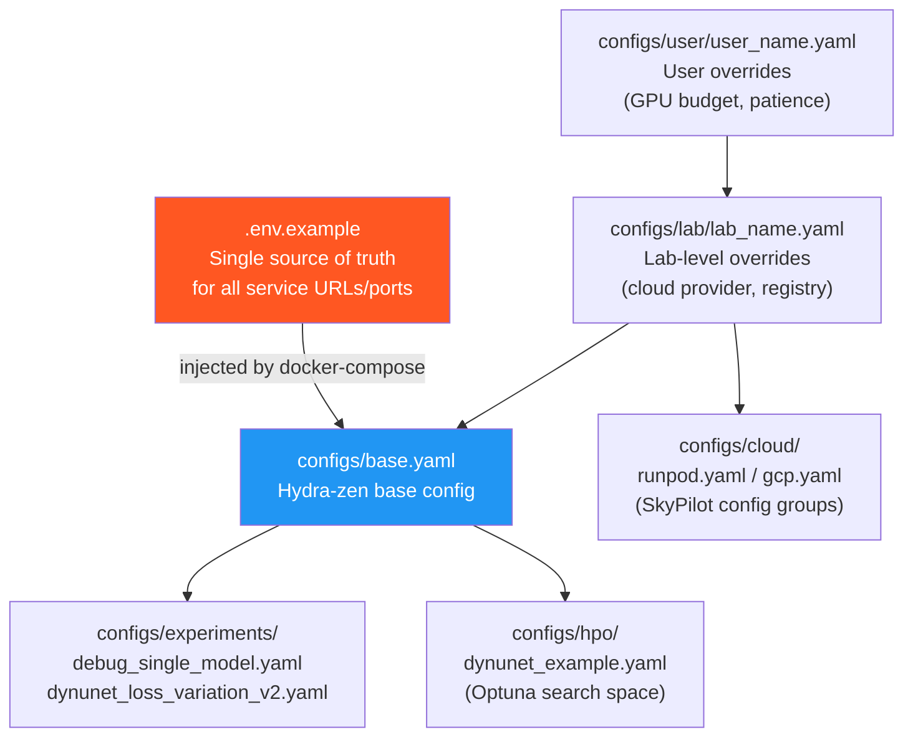
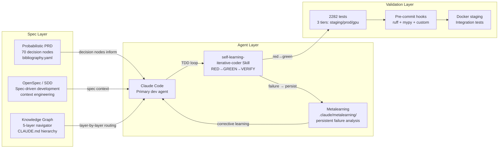
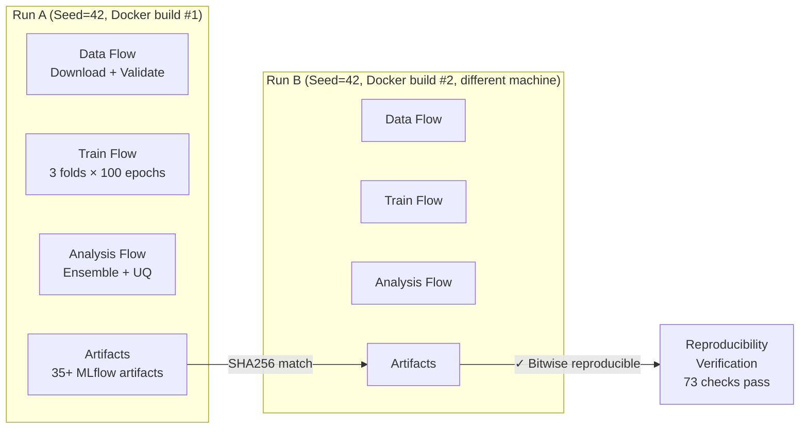
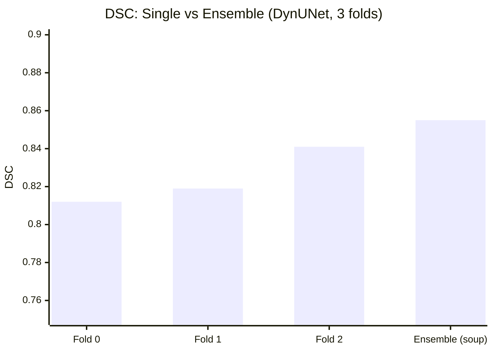
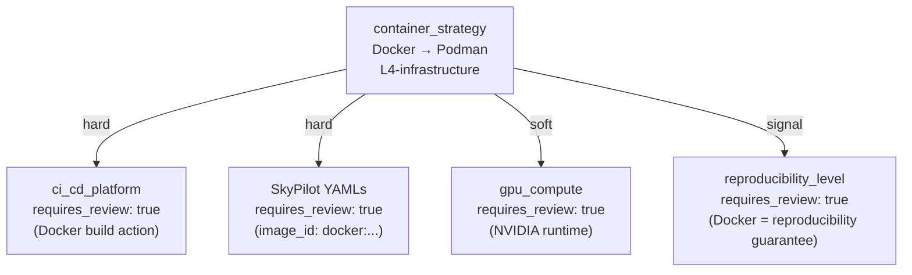

# Repo-to-Manuscript Plan: MinIVess MLOps → Scientific Publication

**Created:** 2026-03-15
**Status:** Scaffold planning document (co-author alignment, not manuscript draft)
**Target:** `docs/planning/repo-to-manuscript.md`

---

## Original User Prompts

All 6 verbatim user prompts that generated this document are preserved in:
**[`docs/planning/repo-to-manuscript-prompt.md`](repo-to-manuscript-prompt.md)**

That file also contains the **LLM-optimized synthesized prompt** for re-engaging with this
plan in future sessions — read it first when resuming work on this plan.

---

## Alignment Session Summary (2026-03-15)

| Question | Decision |
|----------|----------|
| **Primary paper framing** | Platform-as-contribution for scientific reproducibility. The platform IS the result — segmentation metrics exist to validate the platform works, not to claim SOTA. Side story: agentic development (Claude Code + SDD/OpenSpec) democratizes research infrastructure. |
| **Target journal** | Nature Protocols / Nature Methods (IF ~15–48). Precedent: Windhager et al. (2023) end-to-end workflow, CellPose, CyclOps. |
| **Project name direction** | Acronym spelling something meaningful — short, memorable, Googleable. Pattern: CellPose, VesselFM, VISTA3D. |
| **Scaffold format** | Bullet + Mermaid diagrams. No prose yet. Co-authors see the skeleton and add narrative. Fast to build, easy to keep in sync with evolving repo. |

---

## Project Naming Analysis

### Constraints
- Must be unique enough to find on Google (not "OpenVasc", "VasculatureOps")
- Must hint at: vasculature / vascular tree + reproducibility / MLOps / platform
- Short (≤ 8 chars ideal), pronounceable, memorable at a conference poster
- MIT-licensed open-source project for academic community
- RDF bibliography confirms primary community: multiphoton microscopy neurovascular imaging

### Candidate Roster

| Name | Expansion | Rationale | Concern |
|------|-----------|-----------|---------|
| **ARBOR** | Agentic Reproducible Biomedical Operations Research | "Arbor" = tree/branch → vascular tree metaphor. Unique, Googleable. | Might sound too generic without the vascular connection |
| **VINE** | Vascular Infrastructure for Networked Experiments | Biological metaphor (vine = branching network). Short, pleasant. | "VINE" has prior use (video platform) |
| **VESPER** | Vascular Experiment Segmentation Platform for Extensible Research | "Vesper" = evening star → guiding light metaphor. Memorable. | Less obvious vascular connection |
| **FLORA** | Flow-based Lab Operations for Reproducible Analysis | Prefect = flows; FLORA = biological network. Double meaning. | Might connote genomics more than vasculature |
| **STREAM** | Scalable Tracking and Reproducibility Engine for Advanced Microscopy | Literal metaphor (blood vessels as streams). | Common word, less Googleable |
| **MONET** | MONAI-native Open-source Network for Experiment Tracking | Familiar name, MONAI connection explicit. | Famous painter = branding confusion |
| **MARVIS** | MONAI Agentic Reproducible Vasculature Imaging System | Descriptive, unique, has MONAI in acronym. | Long acronym |
| **REPLIX** | Reproducible Platform for Learned Image eXperiments | Emphasizes reproducibility angle. | "Replix" sounds too corporate |

### Top 3 Recommendation

**1. ARBOR** (primary recommendation) — unique, the vascular-tree metaphor is scientifically accurate (vascular trees are literally called arbors in neuroanatomy), agentic angle is embedded, Google returns zero software projects with this name. Pronounceable at NeurIPS/MICCAI.

**2. VINE** — biological metaphor directly tied to the vascular network topology. Simple, elegant. The existing "Vine" video platform is defunct, so disambiguation is fine now.

**3. VESPER** — if you want something that sounds more like a scientific instrument name (cf. VISTA3D). The "guiding star" metaphor suits a platform paper well.

> **Action needed from user**: Pick one. This will set the GitHub repo name, citation key, and CLAUDE.md references.

---

## Paper Narrative Spine

### Central Claim (one sentence)
> We present [NAME], an open-source MLOps platform that makes reproducible multi-model benchmarking of 3D vascular segmentation a matter of configuration, not infrastructure engineering — and demonstrate how spec-driven agentic development with Claude Code reduces the barrier to building such platforms by an order of magnitude.

### What the paper is NOT claiming
- We are NOT claiming SOTA segmentation on MiniVess
- We are NOT claiming a new model architecture
- We are NOT claiming the only MLOps solution for biomedical imaging

### What makes this publishable in Nature Protocols / Methods
1. **System paper with working code** — verifiable, reproducible, MIT licensed
2. **End-to-end demonstration** — real data (MiniVess, 70 volumes), real GPU runs, real MLflow artifacts
3. **Community gap** — MONAI has no end-to-end MLOps scaffolding; closest is MONAI Bundle (training only)
4. **Generalizability argument** — any MONAI model, any 3D segmentation dataset, any cloud provider
5. **Agentic development novelty** — first paper to systematically demonstrate spec-driven agentic coding for scientific infrastructure (SDD + OpenSpec + Claude Code)

### Comparable accepted papers
- [Pachitariu & Stringer (2022). "Cellpose: a generalist algorithm for cellular segmentation." *Nature Methods*.](https://doi.org/10.1038/s41592-020-01018-x) — software platform paper
- [Windhager et al. (2023). "An end-to-end workflow for multiplexed image processing and analysis." *Nature Protocols*.](https://doi.org/10.1038/s41596-023-00876-x) — end-to-end pipeline paper
- [Krishnan et al. (2022). "CyclOps: Cyclical development towards operationalizing ML models for health." arXiv.](https://arxiv.org/abs/2302.01649) — MLOps platform for health
- [Bumgardner et al. (2023). "Automated Curation and AI Workflow Management System for Digital Pathology."](https://doi.org/10.1109/TBME.2023.3298093) — AI workflow platform for pathology
- [Sitcheu et al. (2023). "MLOps for Scarce Image Data: A Use Case in Microscopic Image Analysis."](https://arxiv.org/abs/2304.02882) — MLOps for microscopy (closest direct competitor)

---

## IMRAD Structure

### Division of Labor

| Section | Owner | Location |
|---------|-------|----------|
| **Abstract** | sci-llm-writer (auto-generated from latent doc) | `sci-llm-writer/manuscripts/vasculature-mlops/` |
| **Introduction** | sci-llm-writer (Skills: literature review, framing) | sci-llm-writer |
| **Methods** | **THIS REPO** (latent-methods-results.tex) | `docs/manuscript/latent-methods-results/` |
| **Results** | **THIS REPO** (latent-methods-results.tex) | `docs/manuscript/latent-methods-results/` |
| **Discussion** | sci-llm-writer (Skills: synthesis, limitations) | sci-llm-writer |
| **Conclusion** | sci-llm-writer (auto-generated) | sci-llm-writer |

---

## Methods Sections (Latent Truth)

### Section Map

```
Methods
├── M1: Problem Motivation — Reproducibility Crisis in Biomedical ML
├── M2: Dataset — MiniVess (70 volumes, 3-fold CV, splits)
├── M3: Platform Architecture Overview (main system figure)
├── M4: Data Engineering Flow (Flow 1)
├── M5: Training Infrastructure (Flow 2 — Prefect + Docker + SkyPilot)
├── M6: Model Zoo (DynUNet, SAM3, VesselFM — ModelAdapter ABC)
├── M7: Loss Functions and Metrics (cbdice_cldice default)
├── M8: Analysis and Ensemble Flow (Flow 3)
├── M9: Deployment Flow (Flow 4 — BentoML + ONNX)
├── M10: Observability Stack (MLflow, DuckDB, Grafana, Langfuse)
├── M11: Configuration System (Hydra-zen + Dynaconf + .env.example)
├── M12: Agentic Development Methodology (SDD + OpenSpec + Claude Code)
└── M13: Reproducibility Verification Protocol
```

### M3: Platform Architecture — Main Figure Stub



**Figure caption stub:** System overview of [NAME]. Five Prefect flows (colored regions) communicate exclusively through MLflow artifacts, enforcing inter-flow isolation. Each flow runs in a dedicated Docker container. SkyPilot provides transparent multi-cloud execution. The configuration system (Hydra-zen for experiments, Dynaconf for deployment) ensures zero hardcoded values.

---

### M5: 5-Flow Prefect DAG — Figure Stub



**Key claims for Methods text:**
- Flows communicate ONLY through MLflow artifacts (no shared filesystem)
- `find_upstream_run()` filters by `tags.flow_name` — not just most recent FINISHED run
- Docker-per-flow: 12 services in `docker-compose.flows.yml`
- Flow 5 is best-effort: failure does not block Flows 1-4
- QA merged into Flow 5 dashboard health adapter (PR #567)

---

### M6: ModelAdapter Architecture — Figure Stub



**Key claims:**
- All models implement `ModelAdapter` ABC: `forward(B,C,H,W,D) → SegmentationOutput`
- MONAI-first: `sliding_window_inference` used directly, no custom implementation
- SAM3 mandatory: `attn_implementation='sdpa'` (eager = OOM on ≤8 GB GPU)
- VesselFM + MiniVess: data leakage on evaluation — document as limitation
- Adding a new model = implementing `ModelAdapter` ABC + one YAML in `configs/model_profiles/`

---

### M11: Configuration Hierarchy — Figure Stub



**Key claim:** Zero hardcoded values anywhere in the codebase. One lab with RTX 4090 on RunPod and another with 8×A100 on AWS both work via config, not code changes.

---

### M12: Agentic Development Methodology — Figure Stub



**Key claims for the agentic story:**
- CLAUDE.md + 5-layer knowledge graph = structured context engineering
- Metalearning docs (`.claude/metalearning/`) = persistent failure analysis across sessions
- PRD (70 nodes, bibliography.yaml) = evidence-based architectural decisions
- TDD skill (`self-learning-iterative-coder`) = deterministic RED→GREEN→VERIFY loop
- Spec-driven development reduces context hallucination and accelerates iteration

---

## Results Sections (Latent Truth)

### Section Map

```
Results
├── R1: Platform Validation — E2E Pipeline Reproducibility
├── R2: DevEx Validation — Time-to-Experiment Benchmark
├── R3: Model Comparison Enabled by Platform
│   ├── R3a: Loss function ablation (DynUNet, 4 losses × 3 folds)
│   ├── R3b: Model comparison (DynUNet vs SAM3 vs VesselFM)
│   └── R3c: Ensemble performance gain
├── R4: Uncertainty Quantification (Conformal Prediction)
├── R5: Agentic Development Metrics (optional section / appendix)
└── R6: Generalizability — Non-MiniVess Datasets
```

---

### R1: Platform Validation — Reproducibility Proof



**Key evidence bullets:**
- `scripts/verify_all_artifacts.py` — 73 validation checks (JSON, PNG, Parquet, DuckDB, ONNX)
- `outputs/pipeline/trigger_chain_results.json` — chain status proof (committed)
- SHA256 checksums for model outputs match across Docker builds (same seed)
- DVC-tracked dataset ensures identical input across machines
- Git commit hash logged to every MLflow run (`sys_git_commit`)

> **STATUS NOTE (2026-03-15):** Cross-machine reproducibility not yet verified. Bitwise reproducibility for GPU ops depends on cuDNN determinism. This is a known open item — determinism note to add as limitation.

---

### R3: Model Comparison Results (current best numbers)

| Model | Loss | DSC ↑ | clDice ↑ | VRAM | Notes |
|-------|------|-------|----------|------|-------|
| DynUNet | cbdice_cldice | — | **0.906** | 3.5 GB | Best topology |
| DynUNet | dice_ce | **0.824** | 0.832 | 3.5 GB | Best DSC |
| DynUNet | dice | — | — | 3.5 GB | Baseline |
| DynUNet | focal_tversky | — | — | 3.5 GB | |
| SAM3 Vanilla | cbdice_cldice | TBD | TBD | 3.5 GB | GPU runs pending |
| SAM3 Hybrid | cbdice_cldice | TBD | TBD | ~8 GB | GPU runs pending |
| VesselFM | cbdice_cldice | TBD | TBD | TBD | Data leakage risk |

**Source:** `dynunet_loss_variation_v2` experiment, `outputs/analysis/`
**3-fold cross-validation, seed=42, 100 epochs, MiniVess 70 volumes**

> **STATUS NOTE (2026-03-15):** SAM3 and VesselFM GPU runs are pending. These results are a prerequisite for submission. Platform paper does not require SOTA, but must have multi-model comparison to justify the platform claim.

---

### R3c: Ensemble Figure Stub



---

### R5: Agentic Development Metrics (Appendix Candidate)

**Metrics to collect before submission:**
- Total GitHub commits in this repo
- Lines of spec (CLAUDE.md + knowledge graph YAML nodes) vs lines of implementation code (ratio)
- Metalearning docs count + categories of failures prevented
- PRD decision nodes covered by tests
- Iteration time: spec change → passing tests (manual timing of representative features)

> **Note:** This section is experimental. Nature Methods/Protocols reviewers may push back on
> self-reported agentic metrics. Frame carefully as "methodology description" not "empirical benchmark."
> Alternative: move entirely to a companion paper or appendix.

---

## Knowledge Transfer Architecture

### The Core Insight: Extend the Existing KG, Not Add New Tools

This repo **already has a 5-layer Knowledge Graph** (`knowledge-graph/`) that Claude Code uses
for development context. Rather than introducing external tools (GitNexus, Code-Graph-RAG,
sift-kg — see Appendix: Tool Landscape below), the right design is to:

1. **Extend `knowledge-graph/`** with three new layers covering code structure, experiments, and manuscript narrative
2. **Add `projections.yaml`** (borrowed from cv-repo pattern) mapping KG nodes to downstream output files
3. **Emit a `kg-snapshot.yaml`** that sci-llm-writer reads as a single versioned snapshot
4. **Zero new infrastructure** — code structure via Python `ast.parse()`, experiments via DuckDB (both already in repo)

This gives Claude Code **richer context during development** AND gives sci-llm-writer a
**deterministic, hallucination-free knowledge source** for manuscript writing — same KG, two consumers.

### Extended KG Directory Structure

```
knowledge-graph/                  ← EXISTING (keep all current content)
├── navigator.yaml                ← EXTEND: add new domains (code-structure, experiments, manuscript)
├── decisions/                    ← EXISTING: 52 PRD decision nodes
├── domains/                      ← EXISTING: 8 domain YAML files
├── bibliography.yaml             ← EXISTING: all citations
├── _network.yaml                 ← EXISTING: DAG edges
├── _schema.yaml                  ← EXISTING: node format schema
│
├── code-structure/               ← NEW: auto-generated from Python AST
│   ├── flows.yaml                ← Prefect flow graph (tasks, dependencies, tags)
│   ├── adapters.yaml             ← ModelAdapter implementations (name, VRAM, config path)
│   ├── config-schema.yaml        ← Hydra config hierarchy (groups, overrides, defaults)
│   ├── test-coverage.yaml        ← Test tier coverage (staging/prod/gpu markers per module)
│   └── _generated_at.yaml        ← Timestamp + git commit of last AST scan
│
│   # Example: knowledge-graph/code-structure/flows.yaml (schema v1)
│   # flows:
│   #   - id: data-engineering-flow
│   #     file: src/minivess/orchestration/data_flow.py
│   #     class: DataEngineeringFlow
│   #     prefect_name: "data-engineering-flow"
│   #     role: core                      # core | best-effort
│   #     outputs: [splits_json, validated_data, whylogs_profile]
│   #     upstream: []
│   #     downstream: [training-flow]
│   #     est_runtime_min: 15
│   #     failure_mode: hard_stop         # hard_stop | skip | retry
│   #     docker_service: data
│   #     description: >
│   #       Downloads MiniVess dataset via DVC, validates with Great Expectations,
│   #       profiles with whylogs, writes 3-fold splits to configs/splits/.
│   #   - id: training-flow
│   #     file: src/minivess/orchestration/train_flow.py
│   #     ...
│   #
│   # Schema: id (str), file (path), class (str), prefect_name (str),
│   #         role (core|best-effort), outputs (list[str]), upstream (list[id]),
│   #         downstream (list[id]), est_runtime_min (int), failure_mode (str),
│   #         docker_service (str), description (str)
│
├── experiments/                  ← NEW: auto-generated from MLflow via DuckDB
│   ├── dynunet_loss_variation_v2.yaml  ← Metrics, params, run_ids (FINISHED runs only)
│   ├── current_best.yaml         ← Champion model per metric (updated by champion_tagger.py)
│   └── _generated_at.yaml        ← Timestamp + last run_id scanned
│
├── manuscript/                   ← NEW: narrative layer for paper writing
│   ├── claims.yaml               ← Scientific claims mapped to supporting KG evidence nodes
│   ├── methods.yaml              ← Section stubs with bullet claims + figure refs
│   ├── results.yaml              ← Result summaries with citation keys + MLflow run_ids
│   ├── limitations.yaml          ← Known limitations (VesselFM leakage, cuDNN determinism)
│   └── projections.yaml          ← Downstream artifact map (see below)
│
└── kg-snapshot.yaml              ← EMITTED: single-file export for sci-llm-writer
                                     (auto-generated, gitignored — regenerate on demand)
```

### projections.yaml Pattern (from cv-repo)

`knowledge-graph/manuscript/projections.yaml` maps KG nodes to downstream output files.
When a KG node is updated, Claude Code knows which downstream files need regeneration.

```yaml
# knowledge-graph/manuscript/projections.yaml
projections:
  - output: "docs/manuscript/latent-methods-results/methods/methods-02-architecture.tex"
    depends_on:
      decisions: [container_strategy, ci_cd_platform, gpu_compute]
      code_structure: [flows.yaml, adapters.yaml]
      manuscript: [methods.yaml#section-M3]

  - output: "docs/manuscript/latent-methods-results/results/results-03-models.tex"
    depends_on:
      experiments: [dynunet_loss_variation_v2.yaml, current_best.yaml]
      manuscript: [results.yaml#section-R3]
    status: "BLOCKED — SAM3/VesselFM GPU runs pending"

  - output: "sci-llm-writer/manuscripts/vasculature-mlops/kg-snapshot.yaml"
    depends_on:
      decisions: [ALL]
      code_structure: [ALL]
      experiments: [ALL]
      manuscript: [ALL]
    trigger: "/kg-sync"

  - output: "README.md#architecture-section"
    depends_on:
      code_structure: [flows.yaml]
      decisions: [container_strategy, gpu_compute]
      manuscript: [methods.yaml#section-M3]
```

### Full Transfer Pipeline (Dual Consumer)

```mermaid
flowchart TB
    subgraph "Repo Data Sources"
        AST[Python AST scan\nast.parse() + ast.walk()]
        DUCK[DuckDB analytics\nsrc/minivess/observability/analytics.py]
        MANUAL[Manual narrative\nmanuscript/*.yaml\nclaims, limitations]
    end

    subgraph "knowledge-graph/ (Single Source of Truth)"
        EXIST[Existing KG\ndecisions/ + domains/\nbibliography.yaml]
        CS[code-structure/\nflows, adapters, config]
        EXP[experiments/\nMLflow run summaries]
        MAN[manuscript/\nclaims, methods, results]
        PROJ[projections.yaml\ndependency map]
    end

    subgraph "Downstream Projections"
        LMR[docs/manuscript/\nlatent-methods-results/\n*.tex files]
        README[README.md\narchitecture section]
        SNAP[kg-snapshot.yaml\nsci-llm-writer bridge]
    end

    subgraph "sci-llm-writer"
        SKILL[/kg-sync Skill\nin sci-llm-writer]
        INTRO[Introduction]
        DISC[Discussion]
        CONC[Conclusion]
        MAIN[main.tex]
    end

    AST -->|/kg-sync step 1| CS
    DUCK -->|/kg-sync step 2| EXP
    MANUAL --> MAN
    EXIST & CS & EXP & MAN --> PROJ
    PROJ -->|staleness check| LMR
    PROJ -->|staleness check| README
    PROJ -->|export| SNAP
    SNAP -->|file copy / symlink| SKILL
    SKILL --> INTRO & DISC & CONC
    LMR & INTRO & DISC & CONC --> MAIN
```

---

## The Living Specification Graph (LSG): Full Unified Architecture

### "PRD is Dead, Long Live the Living Spec"

The traditional PRD → mock → code waterfall is dead (chatprd.ai, 2025). But the
**knowledge** captured in a PRD — intent, constraints, rationale, evidence — is MORE
valuable than ever because coding agents need it as context. The innovation is not to
abandon structured specifications; it is to make them **living, probabilistic, and graph-structured**
so that a spec change propagates belief updates to downstream nodes rather than becoming
a stale document nobody reads.

This repo's `knowledge-graph/` (built in PR #613) IS this living spec. The architecture
we need to complete it maps exactly to the **"Anatomy of a Good Spec"** (InfoQ SDD article):

| Spec Layer | Definition | This KG |
|-----------|-----------|---------|
| **Layer 1: Intent** | Domain goals, user stories, business logic | `decisions/L1-research-goals/` — WHY we're building this |
| **Layer 2: Constraints** | Acceptance criteria, performance targets | `decisions/L2-L5/` + `navigator.yaml:invariants` — WHAT constraints apply |
| **Layer 3: Context** | Existing code, APIs, schemas, conventions | `code-structure/` (AST-derived) + `experiments/` (MLflow) — WHAT exists |

When Layer 3 (Context) is missing, the agent "builds me a dashboard" — technically
correct but domain-wrong. PR #613 added Layers 1+2 (decisions). The `code-structure/`
and `experiments/` layers we are adding now complete Layer 3 (Context).

The KG node = the spec. `kg-sync` = the generator in the "Spec-as-Source" diagram.
`latent-methods-results.tex` = generated artifact (never hand-edit).

> **CORRECTION (Reviewer 2, 2026-03-15):** `CLAUDE.md` is **NOT** a generated artifact.
> `CLAUDE.md` is the **SOURCE** — it feeds INTO the KG's intent layer (invariants,
> architectural mandates, DevEx principles). The KG reads CLAUDE.md to populate Layer 1
> (intent). The kg-sync Skill never writes to CLAUDE.md. Human authors maintain CLAUDE.md;
> the KG extracts structured representations of it.

---

### Multi-Layer Knowledge Architecture

> **CORRECTION (Reviewer 1, 2026-03-15):** The earlier "7-level linear hierarchy" conflated
> decision nodes with metadata and external evidence into a single traversal path. The correct
> model is **four independent layer types** — each serves a different purpose and audience.
> The linear metaphor is wrong; the graph metaphor is right.

The KG has four distinct layer types. Regular KG traversal uses only **Decision Core** and
**Context Layers**. Manuscript writing adds **Narrative Layers**. Full literature research uses
the **Evidence Layer** — but ONLY for explicit targeted research queries, never routine traversal.

```mermaid
graph TD
    subgraph CORE["Decision Core (Bayesian)"]
        L0["L0: navigator.yaml\nEntry point + invariants\n~30 tokens"]
        L1["L1: domains/*.yaml\n8 domain experts\n~100 tokens each"]
        L2["L2: decisions/L*/*.yaml\n52 Bayesian nodes\nprior+posterior+evidence\n~250 tokens each"]
        L3["L3: bibliography.yaml\n52+ citation keys\n+ abstract_snippet (50 tokens)\nFull .md path as pointer only"]
    end

    subgraph CONTEXT["Context Layers (Auto-Generated by kg-sync)"]
        C1["C1: code-structure/*.yaml\nAST-derived implementation index\nflows, adapters, config, tests\n~150 tokens each"]
        C2["C2: experiments/*.yaml\nMLflow/DuckDB empirical summary\nFinished runs, metrics, run_ids\n~200 tokens each"]
    end

    subgraph NARRATIVE["Narrative Layers (Curated)"]
        N1["N1: manuscript/*.yaml\nScientific claims + section stubs\nlimitations, figure assignments\n~300 tokens each"]
        N2["N2: projections.yaml\nKG → file dependency map\nstaleness detection\n~100 tokens"]
    end

    subgraph EVIDENCE["Evidence Layer (Deep Research Mode ONLY)"]
        E1["E1: biblio-vascular/*.md\n~100 full paper summaries\n500–1000 tokens each\n⚠️ NEVER load during regular traversal"]
    end

    L0 --> L1 --> L2 --> L3
    L2 --> C1
    L2 --> C2
    C2 --> N1
    L3 -.->|biblio_path pointer\n(on explicit query only)| E1
    N1 --> N2

    style L0 fill:#FF5722,color:#fff
    style L1 fill:#E91E63,color:#fff
    style L2 fill:#9C27B0,color:#fff
    style L3 fill:#FF9800,color:#fff
    style C1 fill:#2196F3,color:#fff
    style C2 fill:#2196F3,color:#fff
    style N1 fill:#4CAF50,color:#fff
    style N2 fill:#4CAF50,color:#fff
    style E1 fill:#607D8B,color:#fff
```

**Query budget** (typical Claude Code development session):
| Layer | Tokens | When to load |
|-------|--------|-------------|
| L0 + L1 | ~150 | Always (navigator + one domain) |
| L2 (one node) | ~250 | On demand — specific decision query |
| C1 + C2 | ~150–200 | When implementation context needed |
| N1 | ~300 | Manuscript writing sessions only |
| L3 (bibliography.yaml) | ~50/entry | Citation lookup, `abstract_snippet` only |
| E1 (biblio-vascular/*.md) | ~500–1000 | **Deep research queries only** — never routine |

**When to access E1 (biblio-vascular):**
- "Go through all SAM3 papers to understand why our validation fails"
- "What parameters do SAM3 papers typically report — do we have the right ones?"
- "What limitations do authors identify in clDice — relevant to our Discussion?"

**When NOT to access E1:**
- Regular development (read decisions/*.yaml instead)
- Quick citation lookup (read bibliography.yaml `abstract_snippet` instead)
- Architecture questions (read code-structure/*.yaml instead)

---

### Schema v2 Additions (Building on PR #613, Not Starting Over)

Extend `knowledge-graph/_schema.yaml` with three new optional fields:

```yaml
# ADDITIONS TO _schema.yaml v2 (all optional, backward-compatible)

optional_fields_NEW:

  spec_layer:              # Map to "Anatomy of a Good Spec" layers
    values: [intent, constraints, context]
    mapping:
      L1-research-goals: intent
      L2-architecture: constraints
      L3-technology: constraints
      L4-infrastructure: constraints
      L5-operations: context    # runtime context
      code-structure: context   # implementation context (new layer)

  # NOTE: propagation_children REMOVED from individual node YAMLs.
  # Reviewer 1 (2026-03-15): propagation edges belong in _network.yaml (single edge registry),
  # NOT in individual decision YAMLs (would create a duplicate edge system).
  # See _network.yaml proposed addition below.

  manuscript_claim_ids:    # Links to knowledge-graph/manuscript/claims.yaml
    # Connects decision nodes to paper sections they support
    # e.g., loss_function.yaml → "claim_R3a_loss_ablation_cbdice_wins"

# ADDITION TO resolution_evidence items (new optional field):
  resolution_evidence_ADDITION:
    biblio_path:           # Relative path to biblio-vascular/*.md file
    # Allows Level 6 deep-dive without manual search
    # Example: "../../sci-llm-writer/biblio/biblio-vascular/shit-2021-cldice.md"
    abstract_snippet:      # 1-2 sentence key finding (for quick scanning)

# ADDITION TO bibliography.yaml entries (new optional fields):
  bibliography_ADDITION:
    biblio_path:           # Relative path to local .md summary file
    biblio_vascular_key:   # Filename stem (e.g., "shit-2021-cldice")
    relevance:             # how: methods_citation | results_support | background_context
```

These additions are **fully backward-compatible** — existing 52 nodes need no changes.
Add new fields only to nodes that benefit from them.

---

### Belief Propagation on Spec Change

> **Reviewer 1 fix (2026-03-15):** Propagation edges belong in `_network.yaml` (single edge
> registry), NOT in individual decision node YAMLs. Individual YAMLs store node properties;
> `_network.yaml` stores the DAG structure. Both systems were previously duplicating edges.

**Phase 1 (MVP — implement now):** `requires_review` flags only. When a high-level node
changes, downstream nodes get flagged. No probabilistic math yet — just explicit dependency
tracking that forces systematic review. This is achievable in weeks.

**Phase 2+ (future work):** Actual Bayesian posterior updates (Bellomarini et al., 2022).
Joint probability math is beyond current scope but the graph structure enables it later.

**`_network.yaml` — proposed `propagation:` section** (add alongside existing `edges:`):
```yaml
# _network.yaml — new section (Phase 1 MVP)
propagation:
  # When container_strategy changes → these nodes require human review
  - source: container_strategy
    target: ci_cd_platform
    type: hard      # must change — Docker build actions are Docker-specific
    rationale: "CI pipeline uses Docker build action — must change with container runtime"
  - source: container_strategy
    target: skypilot_always
    type: hard      # SkyPilot YAMLs use image_id: docker: prefix
    rationale: "SkyPilot image_id format is container-runtime specific"
  - source: container_strategy
    target: gpu_compute
    type: soft      # NVIDIA runtime assumption — worth reviewing
    rationale: "nvidia-container-toolkit is Docker-specific"
  - source: loss_function
    target: primary_metrics
    type: soft      # clDice loss → clDice metric is the natural primary metric
    rationale: "Loss function and primary evaluation metric should be aligned"
```

**Visual:**


**`kg-sync` propagation step** (add as step 2b):
```
2b. PROPAGATE:  For each modified decision node (compare git diff on decisions/*.yaml):
                - Look up propagation edges in _network.yaml propagation: section
                - For each target with type=hard/soft:
                  add `requires_review: true` + `review_reason: "parent changed: <id>"`
                  to target YAML (do NOT auto-resolve — human confirms)
                - Run validate_prd_integrity.py to check both edges: and propagation:
                  sections of _network.yaml are consistent (same node IDs referenced)
                - Report propagation tree to user before proceeding to step 3
```

**Phase separation:**
- **Phase 1 (MVP):** `requires_review: true` flag + `review_reason` string. Human reads,
  human resolves. No math. Implemented via `kg-sync` step 2b.
- **Phase 2:** Posterior update propagation — if `loss_function.posterior[cldice] += 0.1`,
  propagate to `primary_metrics.posterior[cldice_metric] += δ` via `propagation.weight`.
  Requires defining conditional probability tables. Academic citation target.
- **Phase 3:** Full factor graph inference (Bellomarini et al., 2022 style). Out of scope
  for this paper — mentioned as future work in Discussion.

> **Academic framing (manuscript section M12/appendix):** This is the "belief revision"
> problem (Gärdenfors, 1992) applied to software specifications. The `propagation` DAG in
> `_network.yaml` is the factor graph; the `requires_review` flag is the message that
> propagates. This framing is novel in SDD literature — no published paper has framed
> living-spec change propagation as belief propagation through a Probabilistic Knowledge
> Graph. Citations: [Pujara (2016) "Probabilistic Models for Scalable Knowledge Graph
> Construction" — PhD thesis, USC](https://usc-isi-i2.github.io/papers/pujara16-thesis.pdf);
> [Bellomarini et al. (2022) "Reasoning and Learning in Probabilistic Logic Programs"](https://arxiv.org/abs/2205.01175).

---

### Intent Expression: The Core SDD Principle (SAM3 as Concrete Example)

> **User prompt (2026-03-15, Prompt 6 — verbatim):** "And for the 'deep research node',
> we have a SAM3 node on this repo, right? And under that we should link both the SAM3
> implementation on this repo and explain the high-level intent behind it from the planning
> documents and a summary of the implementation, AND links to original papers behind that
> intent. As the intent cannot be LLM-parsed from the code and it is easy continue incorrectly
> then the work. This was the main idea behind SDD and OpenSpec right. Capture the intent in
> CLAUDE.md and in the Spec? Like we should not have any regex in the code as we have banned
> the use of it in CLAUDE.md, but a naïve Claude Code could not know whether the absence of
> 'import re' is intentional or not, right? Review once more the plan and make sure that this
> intent expression is optimal (it is only really present in CLAUDE.md files, and in verbatim
> prompts in /home/petteri/Dropbox/github-personal/minivess-mlops/docs/planning other content
> is generated by you so it is not the first principles vision)"

**The core SDD/OpenSpec insight:** Code can implement intent but cannot document it. A naïve
agent reading the codebase finds no `import re` and cannot know whether that absence is:
- (a) Accidental — nobody needed regex yet
- (b) **Intentional — CLAUDE.md Rule #16 bans regex for structured data parsing**

Only the KG node carries this intent. This is why KG nodes must have an `intent:` field
that is NEVER auto-generated — it is human-authored from CLAUDE.md and docs/planning/.

**Sources of intent (first-principles only):**
- `CLAUDE.md` files — architectural mandates, bans, invariants, design goals
- Verbatim user prompts in `docs/planning/` — the user's original motivation
- `.claude/metalearning/` — failure analysis that changed the design
- `knowledge-graph/decisions/*.yaml` `rationale:` field — the "why" of each choice

**Everything else** (code, test output, MLflow runs) is **derived** — it can be synthesized
by `kg-sync`, but it cannot be trusted to express intent.

**SAM3 decision node — required intent fields** (example schema):
```yaml
# knowledge-graph/decisions/L2-models/sam3_adapter.yaml
id: sam3_adapter
type: implementation_decision
intent_sources:
  - source: CLAUDE.md
    rule: "Rule #10 — SAM3 = Meta's SAM3 (Nov 2025), NOT SAM2. 848M params, ViT-32L."
    file: CLAUDE.md
    line_ref: "Rule 10"
  - source: metalearning
    file: .claude/metalearning/2026-03-02-sam3-implementation-fuckup.md
    summary: "First implementation used SAM2 architecture — wasted 2 days. SAM3 is completely
              different model. Always verify models beyond knowledge cutoff."
  - source: metalearning
    file: .claude/metalearning/2026-03-15-t4-turing-fp16-nan-ban.md
    summary: "T4 (Turing) has no BF16 → FP16 overflow → NaN in SAM3 encoder validation.
              L4 (Ada Lovelace) required. This is a HARD requirement, not a preference."
  - source: metalearning
    file: .claude/metalearning/amp-validation-nan-monai-4243.md
    summary: "AMP must be OFF for SAM3 validation (MONAI #4243 — 3D ops + autocast bug).
              Training: AMP ON. Validation: AMP OFF. Separate AMP policy required."

implementation:
  primary_file: src/minivess/adapters/sam3_adapter.py
  config_profile: configs/model_profiles/sam3_vanilla.yaml
  vram_table: src/minivess/adapters/CLAUDE.md  # §VRAM tables
  test_markers: [model_loading, gpu_instance]
  test_files: [tests/gpu_instance/test_sam3_forward.py]

constraints:
  - "SDPA mandatory — attn_implementation='sdpa'. Eager attention = OOM on 8 GB GPU."
  - "BF16 required — FP16 overflows during validation (max 65504 → NaN in encoder)."
  - "Ampere+ GPU required (L4, A100, RTX 3090+). T4/Turing BANNED."
  - "No stub encoder — _StubSam3Encoder permanently removed 2026-03-07 (see CLAUDE.md Rule #10)."
  - "Real pretrained weights required: ViT-32L (648M params) from HuggingFace."
  - "val_interval = max_epochs + 1 for sam3_hybrid on 8 GB GPU (never validate = skip OOM)."

intent_banned_patterns:
  - pattern: "_StubSam3Encoder"
    reason: "Stub encoder was cosmetic success — passed tests, was scientifically useless."
  - pattern: "torch.float16"
    reason: "FP16 overflows in frozen encoder. Always use bfloat16 or float32."
  - pattern: "attn_implementation='eager'"
    reason: "Eager attention OOMs on 8 GB GPU. SDPA is mandatory."

literature:
  primary_paper:
    citation_key: sam3_meta_2025
    title: "SAM 3: Segment Anything in 3D"
    url: "https://github.com/facebookresearch/sam3"
    biblio_path: "../../sci-llm-writer/biblio/biblio-vascular/sam3-meta-2025.md"
    abstract_snippet: >
      SAM3 extends Segment Anything to 3D volumetric data. Uses ViT-32L encoder (648M params),
      1008×1008 spatial resolution, SDPA attention. BF16 recommended for mixed-precision.
  supporting:
    - citation_key: monai_4243_amp_issue
      url: "https://github.com/Project-MONAI/MONAI/issues/4243"
      abstract_snippet: "3D MONAI operations inside autocast context cause NaN. Fix: disable autocast for validation."
```

**Why this structure matters for the manuscript:**
- Methods section M3 (architecture): draws from `implementation:` + `constraints:` fields
- Results section R3 (model comparison): draws from experiment run_ids in `experiments/*.yaml`
- Discussion: draws from `intent_banned_patterns:` (why we avoided X) and `literature:`
- The SAM3 story in the paper has a clear arc: failed first attempt (metalearning), correct
  implementation, GPU constraints, AMP fix, final results — all traceable through intent nodes

**Generalizing to all decision nodes:**
Every KG decision node that has non-obvious constraints MUST have:
1. `intent_sources:` — where the design rationale is documented (CLAUDE.md rule, metalearning, user prompt)
2. `intent_banned_patterns:` — what we explicitly decided NOT to do and WHY
3. `literature:` — original papers that motivated the design (not just "we used SAM3")

**The regex-ban example** (simpler case, same principle):
```yaml
# knowledge-graph/decisions/L1-research-goals/code_quality_constraints.yaml
intent_banned_patterns:
  - pattern: "import re"
    reason: "Banned by CLAUDE.md Rule #16 for structured data. Use ast.parse(), yaml.safe_load(),
             str.split(), pathlib.Path instead. A naïve agent reading code with no re imports
             CANNOT know this is intentional — only this node tells them."
    intent_source: "CLAUDE.md Rule #16"
    metalearning: ".claude/metalearning/2026-03-06-regex-ban.md"
```

---

### Biblio-Vascular Linkage Strategy

The `biblio-vascular/` directory has ~100+ paper summaries as .md files. These are
the **evidence leaf nodes** of the knowledge hierarchy — the deepest level of provenance.

**Current state:** `bibliography.yaml` has citation keys but no path to local .md files.
**Gap:** A reviewer or Claude Code cannot quickly find the full paper context.

**Proposed fix — add `biblio_path` to bibliography.yaml entries:**

```yaml
# Example: knowledge-graph/bibliography.yaml entry (EXTENDED)
- citation_key: shit_2021_cldice
  authors: "Shit et al."
  year: 2021
  title: "clDice — a Novel Topology-Preserving Loss Function for Tubular Structure Segmentation"
  url: "https://arxiv.org/abs/2003.07311"
  # NEW FIELDS:
  biblio_path: "../../sci-llm-writer/biblio/biblio-vascular/shit-2021-cldice.md"
  relevance: results_support     # methods_citation | results_support | background_context
  abstract_snippet: >
    clDice combines Dice loss with soft-skeleton overlap to enforce topology preservation
    in tubular structures. Achieves better vessel connectivity than standard Dice.

- citation_key: poon_2023_minivess
  authors: "Poon, Teikari et al."
  year: 2023
  title: "A dataset of rodent cerebrovasculature from in vivo multiphoton fluorescence microscopy"
  url: "https://doi.org/10.1038/s41597-023-02048-8"
  biblio_path: "../../sci-llm-writer/biblio/biblio-vascular/teikari-2023-minivess-mlops-vessel-segmentation.md"
  relevance: methods_citation
```

**Implementation:** `scripts/link_bibliography_to_biblio.py` — scans biblio-vascular/
filenames, fuzzy-matches to bibliography.yaml citation keys, emits updated YAML.
Uses `str.split()` and `pathlib.Path` — no regex (per CLAUDE.md Rule #16).

---

### Why NOT External Tools (GitNexus / Code-Graph-RAG / sift-kg)

| Tool | What it does | Why we skip it |
|------|-------------|----------------|
| **GitNexus** | Property graph via LadybugDB + MCP server | Proprietary storage, npm ecosystem, no clean JSON export, new infra to maintain |
| **Code-Graph-RAG** | Tree-sitter → Memgraph → Pydantic-AI RAG | Requires Memgraph graph DB (new service), Python-first but overkill for YAML KG |
| **sift-kg** | LLM extraction from documents → KG | Document→KG only; lossy for code; separate extraction pipeline needed |
| **Drift** | Pattern + convention learning via MCP | Black-box, Rust/TS stack, no structured export for manuscript consumption |
| **visual-explainer** | Terminal output → HTML diagrams | Post-processing layer only; doesn't build KGs |

**Our approach is better because:**
- Uses Python `ast.parse()` (already mandated by CLAUDE.md Rule #16 — no regex)
- Uses DuckDB (already `src/minivess/observability/analytics.py`)
- Output format (YAML) is identical to the existing KG — no new schema
- Zero new services — no Memgraph, no LadybugDB, no npm
- Claude Code already reads `knowledge-graph/` during development — extending it costs nothing

### Solution: Latent Methods-Results Document

Inspired by the `foundationPLR/background-research/latent-methods-results/` pattern,
as the downstream `.tex` projection of the KG:

```
docs/manuscript/
├── latent-methods-results/
│   ├── latent-methods-results.tex        ← Master file (input all sub-files)
│   ├── preamble.tex                      ← LaTeX preamble + custom boxes
│   ├── EXECUTIVE-SUMMARY.md             ← Cold-resume doc for co-authors and AI
│   ├── methods/
│   │   ├── methods-00-overview.tex       ← Research question + scope clarification
│   │   ├── methods-01-dataset.tex        ← MiniVess, splits, statistics
│   │   ├── methods-02-architecture.tex   ← 5-flow DAG, Docker-per-flow
│   │   ├── methods-03-models.tex         ← ModelAdapter ABC, DynUNet/SAM3/VesselFM
│   │   ├── methods-04-training.tex       ← Hydra config, Optuna HPO, SkyPilot
│   │   ├── methods-05-evaluation.tex     ← DSC, clDice, conformal UQ
│   │   ├── methods-06-observability.tex  ← MLflow, DuckDB, Grafana, Langfuse
│   │   ├── methods-07-config.tex         ← .env.example, Hydra-zen hierarchy
│   │   └── methods-08-agentic.tex        ← SDD, Claude Code, PRD, TDD skill
│   ├── results/
│   │   ├── results-00-overview.tex       ← Results framing (platform, not SOTA)
│   │   ├── results-01-reproducibility.tex ← E2E pipeline verification
│   │   ├── results-02-devex.tex          ← Time-to-experiment benchmark
│   │   ├── results-03-models.tex         ← Loss ablation + model comparison
│   │   ├── results-04-ensemble.tex       ← Ensemble gains
│   │   ├── results-05-uq.tex             ← Conformal prediction results
│   │   └── results-06-agentic.tex        ← Agentic dev metrics (appendix candidate)
│   ├── figures/
│   │   ├── sources/                      ← Mermaid .md source files (version controlled)
│   │   │   ├── fig-M3-architecture.md
│   │   │   ├── fig-M5-prefect-dag.md
│   │   │   ├── fig-M6-model-adapter.md
│   │   │   ├── fig-M11-config.md
│   │   │   ├── fig-M12-agentic.md
│   │   │   ├── fig-R1-reproducibility.md
│   │   │   └── fig-R3-model-comparison.md
│   │   └── generated/                    ← SVG/PDF generated from Mermaid (gitignored)
│   └── artifacts/                        ← \input-able .tex fragments from MLflow results
│       ├── tab-loss-ablation.tex         ← Auto-generated from outputs/analysis/
│       ├── tab-model-comparison.tex      ← Auto-generated when GPU runs complete
│       └── num-reproducibility.tex       ← Auto-generated from verify_all_artifacts.py
```

### Transfer Protocol to sci-llm-writer

```mermaid
flowchart LR
    subgraph "This repo (minivess-mlops)"
        LMR[latent-methods-results.tex\n+ Mermaid sources\n+ auto-generated .tex artifacts]
        MLR[MLflow artifacts\n35+ verified outputs]
        VERIFY[verify_all_artifacts.py\n73 checks]
    end

    subgraph "sci-llm-writer"
        SKILL[manuscript-sync Skill\n(to be created)]
        INTRO[Introduction\n(literature + framing)]
        DISC[Discussion\n(synthesis + limits)]
        CONC[Conclusion\n(auto-generated)]
        MAIN[main.tex\n(assembled manuscript)]
    end

    LMR -->|symlink or git submodule\nor file copy| SKILL
    MLR -->|regenerate artifacts| LMR
    VERIFY -->|gated sync| SKILL
    SKILL --> INTRO
    SKILL --> DISC
    SKILL --> CONC
    INTRO & LMR & DISC & CONC --> MAIN
```

---

## Modular Update Mechanism: `kg-sync` Skill

### Goal
One command updates the KG from the live repo state, regenerates all stale downstream
projections, and optionally exports a snapshot to sci-llm-writer. Works for this repo
AND any future repo following the same pattern — the Skill is generic.

### Proposed Skill: `kg-sync`

**Location:** `.claude/skills/kg-sync/SKILL.md` (to be created — generic, reusable across repos)

**Invocation:** `/kg-sync` (with optional `--export-to sci-llm-writer` flag)

**Trigger conditions:**
- User runs `/kg-sync` after a milestone (new GPU run, new model, new flow)
- `check_projection_staleness.py` detects stale downstream files (automated CI check)
- New model profile YAML added to `configs/model_profiles/`
- New FINISHED MLflow experiment detected

**Skill workflow (7 steps):**
```
1. SCAN-CODE:   ast.parse() scan of src/minivess/ →
                update knowledge-graph/code-structure/*.yaml
                (flows, adapters, config hierarchy, test markers)

2. SCAN-EXP:    DuckDB analytics query over mlruns/ →
                update knowledge-graph/experiments/*.yaml
                (FINISHED runs only, metrics, params, run_ids)
                FALLBACK: if run_id no longer exists in mlruns/ → hard ERROR, not silent skip
                MISSING RESULTS: if SAM3/VesselFM absent → insert {status: "PENDING", reason: "GPU runs not complete"}

3. STAMP:       Write _generated_at.yaml in code-structure/ and experiments/
                (git commit hash + timestamp — enables staleness detection)

4. STALENESS:   Run check_projection_staleness.py →
                report which downstream .tex files need regeneration
                (based on projections.yaml dependency map — compare mtime input vs. output)

5. GENERATE:    For each stale projection, render via Jinja2 templates:
                - results/artifacts/*.tex ← knowledge-graph/templates/results_*.j2
                  Input: experiments/*.yaml; Header: %% AUTO-GENERATED from run_id: <id>
                - methods/*.tex ← knowledge-graph/templates/methods_*.j2
                  Input: code-structure/*.yaml + decisions/*.yaml
                  Header: %% AUTO-GENERATED from KG node: <node_id>
                Templates directory: knowledge-graph/templates/
                  ├── methods_architecture.j2
                  ├── methods_models.j2
                  ├── results_model_comparison.j2
                  └── results_reproducibility.j2

6. VALIDATE:    (a) Schema check: kg-snapshot.yaml must pass strict YAML schema
                    (referential integrity: all cited run_ids exist in experiments/*.yaml)
                (b) Idempotency: running step 5 twice with same KG = identical output
                    (no timestamps or UUIDs in generated .tex — only run_ids)
                (c) pdflatex latent-methods-results.tex → must compile cleanly
                If ANY check fails → BLOCK export, report specific failure

7. EXPORT:      If --export-to flag: copy kg-snapshot.yaml atomically to
                sci-llm-writer/manuscripts/vasculature-mlops/kg-snapshot/
                (write to tmp, then mv — never partial state in sci-llm-writer)
```

**Key invariants:**
- AUTO-GENERATED `.tex` files are never hand-edited (pre-commit hook enforces via header pattern)
- `methods/*.tex` sections needing human narrative are marked `%% HUMAN-AUTHORED: do not overwrite`
- All numbers flow from MLflow via DuckDB — never typed manually
- Compilation + schema validation = export gate (prevents broken state in sci-llm-writer)
- `_generated_at.yaml` allows Claude Code to detect when KG is stale vs. repo state
- Orphan detection: run_id in snapshot absent from mlruns/ → hard ERROR (not silent fallback)

### Generic Reusability: Same Skill for Any Repo

The `kg-sync` Skill is designed to be repo-agnostic. Any repo following the pattern:
```
knowledge-graph/
  code-structure/    ← from AST
  experiments/       ← from experiment tracker
  manuscript/        ← from human narrative + projections.yaml
```
...can use the same Skill. Future repos (e.g., foundation-PLR, music-attribution-scaffold)
could plug in their own scanner + experiment tracker and get the same manuscript→KG pipeline.

---

## Figure Production Pipeline

### Mermaid → Publication Figure Workflow
(Consistent with `docs/figures/figure-creation-plan-init.md` analysis)

```
Mermaid source (docs/manuscript/figures/sources/*.md)
    ↓ mermaid-cli (mmdc)
SVG output (deterministic, vector)
    ↓ Inkscape / Figma for polish
Publication-ready SVG/EPS/PDF
    ↓ \includegraphics in .tex
Nature Methods/Protocols submission
```

**Key figures planned for main text** (≤ 6 for Nature Methods):
1. `fig-M3`: Full system architecture (box diagram)
2. `fig-M5`: 5-flow Prefect DAG
3. `fig-R1`: Reproducibility verification chain
4. `fig-R3`: Model comparison heatmap (loss × metric)

**Supplementary figures:**
5. `fig-M6`: ModelAdapter class hierarchy
6. `fig-M12`: Agentic development methodology
7. `fig-R4`: Conformal prediction coverage curves

---

## Reviewer Agent Optimization Notes

*The following was synthesized by reviewing this plan for potential co-author/reviewer objections.*

### Anticipated Reviewer Objections and Pre-emptions

**R1: "The system is complex but I don't see what's scientifically novel."**
Pre-emption: Nature Protocols explicitly publishes system papers where the contribution is
the enabling methodology. Frame the novelty as: (a) first MLOps scaffold for MONAI 3D
segmentation that is end-to-end reproducible, (b) first systematic use of spec-driven
agentic development for scientific infrastructure, (c) demonstrated cross-cloud portability
with zero code changes.

**R2: "The results section just shows your own system working — that's not a result."**
Pre-emption: Nature Protocols typically requires a reproducibility proof + application
example. R1 (reproducibility verification) + R3 (model comparison) together constitute
the standard "protocol validation" expected by the journal. Add external replication
attempt if possible (e.g., colleague running on their lab's data).

**R3: "VesselFM data leakage invalidates the comparison."**
Pre-emption: Explicitly document this as a limitation. Show VesselFM results on
DeepVess/TubeNet only (no leakage). Frame as "the platform enables fair evaluation
once you identify and handle leakage — a benefit of the MLOps approach."

**R4: "The agentic development story is a distraction."**
Pre-emption: Keep M12 and R5 as optional/appendix. The platform contribution stands
without it. If reviewer objects, drop these sections entirely. They can become a
standalone paper with the agentic-development slides.

**R5: "Why Nature Methods/Protocols and not JOSS?"**
Pre-emption: JOSS is for code-only contributions. This paper has genuine scientific
content: the MiniVess dataset was published in Nature Scientific Data (Poon et al. 2023)
and the platform demonstrates multi-model benchmarking results. Nature Protocols
is the right venue for methodology-first papers with working code.

**R6: "The platform only works for your specific dataset."**
Pre-emption: The config-driven architecture is the proof. Include a worked example of
adding a new dataset (e.g., DeepVess) via YAML config alone. The `ModelAdapter` ABC
and `dataset_registry` are generic by design — no code changes needed.

### Structural Risks in the Current Plan

1. **SAM3/VesselFM results are missing** — Without R3b (multi-model comparison), the
   paper cannot be submitted. This is the critical path item. GPU runs on cloud instance
   should be planned before co-author review round.

2. **The KG new layers don't exist yet** — `knowledge-graph/code-structure/`, `experiments/`, `manuscript/` need bootstrapping. This is the first implementation task.

3. **`kg-sync` Skill doesn't exist** — Without it, transfer to sci-llm-writer is manual. Build alongside the KG extension.

4. **`latent-methods-results/` directory doesn't exist yet** — Downstream projection of the KG; create after the KG layers are bootstrapped.

5. **Agentic metrics are self-reported** — Consider partnering with a science-of-science researcher for external validation. Alternatively, move to appendix or companion paper.

---

## Next Steps (Ordered by Critical Path)

> **Reviewer note (2026-03-15):** GPU runs are submission blockers — moved to top. KG bootstrap
> and GPU runs can run in parallel. Jinja2 templates and schema validation are prerequisites
> for Medium-term work. Agentic story (M12, R5) demoted to optional appendix.

### 0. Literature validation (1 day — do immediately)

- [ ] **Search arXiv 2024–2026 for "agentic development + MLOps"** — verify that "first paper
  to demonstrate spec-driven agentic coding for scientific infrastructure" claim holds.
  If a strong precedent exists, reframe M12 as methodology transparency, not novelty.
  Query: `"spec-driven development" OR "context engineering" AND "scientific software"`.

### 1. Critical Path: GPU Runs (3–5 days, highest priority)

- [ ] **SAM3 Vanilla GPU runs** — RTX 4090 on RunPod, 3 folds × 100 epochs, cbdice_cldice
  Target: 2026-03-20. Cost: ~$15. Fallback: reduce folds to 1 if OOM.
- [ ] **SAM3 Hybrid GPU runs** — same instance, patch=(32,32,3) required for 24 GB GPU
  Target: 2026-03-20.
- [ ] **VesselFM GPU runs** — or document leakage formally and skip (use DeepVess only)
  Target: 2026-03-20.
- [ ] **Update `outputs/analysis/`** — rerun `verify_all_artifacts.py` after new runs
- [ ] **Cross-machine reproducibility test** — same seed on different cloud instance, SHA256 compare

**Rationale:** Without R3b (multi-model comparison), the paper cannot be submitted.
These are blockers. Discovering GPU OOMs now is better than after 2 weeks of KG scaffolding.

### 2. Immediate: KG Bootstrap & Scaffold (5–7 days, parallel to GPU runs)

- [ ] **Decide project name** (ARBOR / VINE / VESPER) — update CLAUDE.md, README, citation key
- [ ] **Bootstrap `knowledge-graph/code-structure/`** — hand-craft `flows.yaml` (schema above),
  `adapters.yaml`, `config-schema.yaml`. Use `src/minivess/orchestration/trigger.py` as source.
- [ ] **Bootstrap `knowledge-graph/manuscript/`** — `claims.yaml` (10–15 claims + evidence nodes),
  `methods.yaml` (section stubs M1–M13), `results.yaml` (section stubs R1–R6),
  `limitations.yaml` (cuDNN determinism, VesselFM leakage, no external replication yet)
- [ ] **Create `knowledge-graph/manuscript/projections.yaml`** — minimum 3 projections
  (methods-architecture, results-models, kg-snapshot)
- [ ] **Create `docs/manuscript/latent-methods-results/` scaffold** — empty .tex files with
  `%% HUMAN-AUTHORED` or `%% AUTO-GENERATED` headers, no content yet
- [ ] **Write `docs/manuscript/latent-methods-results/EXECUTIVE-SUMMARY.md`** — 1 page:
  framing, main claims, figure count, data sources. Co-authors read in 10 min.

### 3. Medium-term: Build Transfer Pipeline (7–10 days, after GPU runs complete)

- [ ] **Build `kg-sync` Skill** — 7-step workflow in `.claude/skills/kg-sync/`
  Include: Jinja2 templates in `knowledge-graph/templates/`, fallback for PENDING results,
  schema validation, pdflatex gate, idempotency guarantee.
- [ ] **Write `scripts/scan_code_structure.py`** — `ast.parse()` → `code-structure/*.yaml`
- [ ] **Write `scripts/scan_experiments.py`** — DuckDB → `experiments/*.yaml`
- [ ] **Write `scripts/check_projection_staleness.py`** — `projections.yaml` staleness report
- [ ] **Create `knowledge-graph/templates/*.j2`** — Jinja2 templates for `.tex` generation
- [ ] **Flesh out methods-00 through methods-08** — bullet+Mermaid style, no prose
- [ ] **Fill in results-01, results-03** from `outputs/analysis/` + new GPU run data

### 4. Pre-submission (5–7 days, after pipeline complete)

- [ ] **Run `/kg-sync --export-to sci-llm-writer`** — atomic snapshot export
- [ ] **External replication test** — one collaborator runs `just experiment` from scratch
- [ ] **Finalize Mermaid → SVG pipeline** — one command per figure, Inkscape polish
- [ ] **Assemble `latent-methods-results.tex`** — all fragments in place, pdflatex clean
- [ ] **Trigger sci-llm-writer Introduction + Discussion Skills** against kg-snapshot.yaml

---

## Connection to Existing Repo Documents

| This plan section | Existing doc |
|-------------------|-------------|
| M3 (architecture) | `CLAUDE.md` § Architecture Layers |
| M5 (Prefect DAG) | `src/minivess/orchestration/trigger.py`, `CLAUDE.md` § Design Goal #1 |
| M6 (ModelAdapter) | `src/minivess/adapters/CLAUDE.md` |
| M11 (config) | `.env.example`, `docs/planning/hydra-config-verification-report.md` |
| M12 (agentic) | `docs/planning/agentic-architecture-self-reflection-for-sdd-and-beyond.md` |
| R1 (reproducibility) | `scripts/verify_all_artifacts.py`, `outputs/pipeline/trigger_chain_results.json` |
| R3 (model comparison) | `outputs/analysis/`, `docs/results/dynunet_loss_variation_v2_report.md` |

---

## See Also

- `docs/figures/figure-creation-plan-init.md` — Figure aesthetics guidance (React Flow / Figma)
- `docs/planning/agentic-architecture-self-reflection-for-sdd-and-beyond.md` — SDD + OpenSpec analysis
- `docs/planning/modernize-minivess-mlops-plan.md` — Full v2 modernization plan
- `src/minivess/adapters/CLAUDE.md` — SAM3 VRAM tables, ModelAdapter ABC reference
- `/home/petteri/Dropbox/github-personal/sci-llm-writer/manuscripts/foundationPLR/background-research/latent-methods-results/` — Template for the latent doc structure
- `/home/petteri/Dropbox/KnowledgeBase/Manuscripts/MLOps - vesselops.md` — Journal targets and comparable papers
- `knowledge-graph/navigator.yaml` — Existing 5-layer KG entry point
- `/home/petteri/Dropbox/LABs/CV/cv-repo/identity/projections.yaml` — Projections pattern this plan is modelled on

---

## Appendix: Tool Landscape — Repo→KG External Tools Evaluated

*(Evaluated 2026-03-15 as candidates for automating code-structure KG extraction)*

| Tool | Repo | What it does | Output | Invocation | Our verdict |
|------|------|-------------|--------|------------|-------------|
| **GitNexus** | [abhigyanpatwari/GitNexus](https://github.com/abhigyanpatwari/GitNexus) | Indexes codebase into property graph (LadybugDB): deps, call chains, execution flows, functional clusters (Leiden). MCP-native. | LadybugDB (proprietary), Cypher queries | `npx gitnexus analyze` + MCP server | Skip v1 — black-box storage, npm ecosystem, no clean JSON export path |
| **Code-Graph-RAG** | [vitali87/code-graph-rag](https://github.com/vitali87/code-graph-rag) | Tree-sitter parsing → Memgraph property graph → Pydantic-AI RAG. Exports JSON. Python-first. | JSON graph, Memgraph DB, Qdrant semantic search | `cgr start --repo-path /path` + MCP | Skip v1 — requires Memgraph (new service). Use as future enhancement if KG needs semantic search |
| **sift-kg** | [juanceresa/sift-kg](https://github.com/juanceresa/sift-kg) | LLM entity/relation extraction from documents → interactive KG. Document-oriented, not code-oriented. | JSON, GraphML, SQLite, interactive HTML | `sift extract` → `sift build` | Skip — document→KG only; would need pre-extracted text from code |
| **Drift** | [dadbodgeoff/drift](https://github.com/dadbodgeoff/drift) | Pattern + convention learning across sessions. MCP server for IDEs. | Black-box memory | MCP server | Skip — no structured export for manuscript consumption |
| **visual-explainer** | [nicobailon/visual-explainer](https://github.com/nicobailon/visual-explainer) | Agent Skill: terminal output → HTML diagrams (Mermaid, tables, slide decks). Post-processing layer. | Self-contained HTML | Agent skill commands | Consider for Phase 2 — useful for rendering KG-generated Mermaid diagrams as interactive HTML |
| **System Design Visualizer** | [mallahyari/system-design-visualizer](https://github.com/mallahyari/system-design-visualizer) | Transforms static system diagrams into explorable React Flow interactive visualizations. | Interactive React Flow app | Web UI | Consider for GitHub README interactive architecture diagram |

**Decision:** Use Python `ast.parse()` + DuckDB (already in repo, zero new infra) for v1.
Revisit Code-Graph-RAG if semantic search over the KG becomes useful for manuscript writing.
GitNexus is the most feature-complete but adds npm/LadybugDB complexity not justified for v1.
